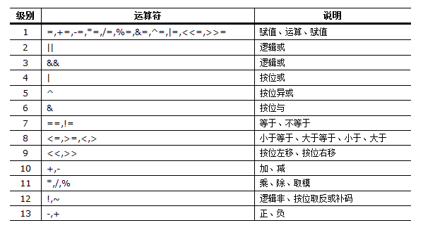

# 命令实例
[TOC]

### 1、显示两个目录中不同的文件

```shell
#-r或--recursive 　比较子目录中的文件。
#-q或--brief 　仅显示有无差异，不显示详细的信息。
diff -r -q directory1 direcotory2
```

## 2、打补丁

```shell
#比较两个文件不同，并生产补丁
diff -ruN log2013.log log2014.log > patch.log
#打补丁
patch log2013.log patch.log
```

## 3、找出两个文件相同的记录

```shell
$ sort a b |uniq -d
#如果a文件或b文件本身就含有重复的列，这个命令就不准了

$ awk 'FNR==NR{a[$0];next}($0 in a)' a b
#NR处理一行记录，编号就会加1，同时处理两个文件会将这两个文件当成一个合并后的文件处理，既NR会一直累加下去。而FNR则是处理一行记录，编号也会加1，但是，处理到第二个文件时，编号重新计数。
#处理a文件时，FNR是等于NR的，条件为真，执行a[$0],next表达式，意思是将每条记录存放到a数组作为下标（无元素），next是跳出。执行过程以此类推，直到处理b件时，FNR不等于NR（FNR重新计数是1，NR继续加1是7），条件为假，不执行后面a[$0],next表达式，直接执行($0 in a)表达式，这句意思是处理b文件第一条继续判断是否在a数组中，如果在则打印这条记录，以此类推。

$ awk 'ARGIND==1{a[$0]=1}ARGIND==2&&a[$0]==1' a b
$ awk 'FILENAME=="a"{a[$0]=1}FILENAME=="b"&&a[$0]==1' a b
#说明：ARGIND内置变量，处理文件标识符，第一个文件为1，第二个文件为2。FILENAME也是内置变量，表示输入文件的名字
```

### 4、找不同的记录

```shell
 $ awk 'FNR==NR{a[$0];next}!($0 in a)' a b
 $ sort a b |uniq -u
```

### 5、对文件的某一列进行统计

```shell
1）统计文件中第一列出现次数最多的10个值
思路：对第一列进行去重，并输出出现的次数
方法1：$ awk '{a[$1]++}END{for(i in a)print a[i],i|"sort -k1 -nr|head -n10"}' access.log
方法2：$ awk '{print $1}' access.log |sort |uniq -c |sort -k1 -nr |head -n10
#说明：a[$1]++ 创建数组a，以第一列作为下标，使用运算符++作为数组元素，元素初始值为0。处理一个IP时，下标是IP，元素加1，处理第二个IP时，下标是IP，元素加1，如果这个IP已经存在，则元素再加1，也就是这个IP出现了两次，元素结果是2，以此类推。因此可以实现去重，统计出现次数。

扩展：统计文件中第一列出现次数大于100次的值
$ awk '{a[$1]++}END{for(i in a){if(a[i]>100)print i,a[i]}}' access.log
```

### 6、**将c文件中第一列放到到d文件中的第三列**

```shell
$ awk '{getline f<"c";print $0,f}' d

#替换第二列
$ awk '{getline f<"c";gsub($2,f,$2)}1' d
#替换第二列的two
$ awk '{getline f<"c";gsub("two",f,$2)}1' d

# awk getline用法：输出重定向需用到getline函数。getline从标准输入、管道或者当前正在处理的文件之外的其他输入文件获得输入。它负责从输入获得下一行的内容，并给NF,NR和FNR等内建变量赋值。如果得到一条记录，getline函数返回1，如果到达文件的末尾就返回0，如果出现错误，例如打开文件失败，就返回-1。

#getline语法：getline var，变量var包含了特定行的内容。

#awk getline从整体上来说，用法说明：

#    当其左右无重定向符|或<时：getline作用于当前文件，读入当前文件的第一行给其后跟的变量var或$0（无变量），应该注意到，由于awk在处理getline之前已经读入了一行，所以getline得到的返回结果是隔行的。
#    当其左右有重定向符|或<时：getline则作用于定向输入文件，由于该文件是刚打开，并没有被awk读入一行，只是getline读入，那么getline返回的是该文件的第一行，而不是隔行。
```

### 7、**删除重复行，顺序不变**

```shell
$ awk '!a[$0]++' file

#先排序再去重，破坏了源文件的顺序
$ sort file | uniq
```


## uniq

```
uniq(选项)(参数)
```

### 选项 

```
-c或——count：在每列旁边显示该行重复出现的次数；
-d或--repeated：仅显示重复出现的行列；
-f<栏位>或--skip-fields=<栏位>：忽略比较指定的栏位；
-s<字符位置>或--skip-chars=<字符位置>：忽略比较指定的字符；
-u或——unique：仅显示出一次的行列；
-w<字符位置>或--check-chars=<字符位置>：指定要比较的字符。
```

### 参数 

- 输入文件：指定要去除的重复行文件。如果不指定此项，则从标准读取数据；
- 输出文件：指定要去除重复行后的内容要写入的输出文件。如果不指定此选项，则将内容显示到标准输出设备（显示终端）。

### 实例 

删除重复行：

```
uniq file.txt
sort file.txt | uniq
sort -u file.txt
```

只显示单一行：

```
uniq -u file.txt
sort file.txt | uniq -u
```

统计各行在文件中出现的次数：

```
sort file.txt | uniq -c
```

在文件中找出重复的行：

```
sort file.txt | uniq -d
```


## sort命令

命令既可以从特定的文件，也可以从stdin中获取输入。

### 语法 

```
sort(选项)(参数)
```

### 选项 

```
-b：忽略每行前面开始出的空格字符；
-c：检查文件是否已经按照顺序排序；
-d：排序时，处理英文字母、数字及空格字符外，忽略其他的字符；
-f：排序时，将小写字母视为大写字母；
-i：排序时，除了040至176之间的ASCII字符外，忽略其他的字符；
-m：将几个排序号的文件进行合并；
-M：将前面3个字母依照月份的缩写进行排序；
-n：依照数值的大小排序；
-o<输出文件>：将排序后的结果存入制定的文件；
-r：以相反的顺序来排序；
-t<分隔字符>：指定排序时所用的栏位分隔字符；
+<起始栏位>-<结束栏位>：以指定的栏位来排序，范围由起始栏位到结束栏位的前一栏位。
```

### 参数 

文件：指定待排序的文件列表。

### 实例 

sort将文件/文本的每一行作为一个单位，相互比较，比较原则是从首字符向后，依次按[ASCII](http://zh.wikipedia.org/zh/ASCII)码值进行比较，最后将他们按升序输出。

```
[root@mail text]# cat sort.txt
aaa:10:1.1
ccc:30:3.3
ddd:40:4.4
bbb:20:2.2
eee:50:5.5
eee:50:5.5

[root@mail text]# sort sort.txt
aaa:10:1.1
bbb:20:2.2
ccc:30:3.3
ddd:40:4.4
eee:50:5.5
eee:50:5.5
```

忽略相同行使用-u选项或者[uniq](http://man.linuxde.net/uniq)：

```
[root@mail text]# cat sort.txt
aaa:10:1.1
ccc:30:3.3
ddd:40:4.4
bbb:20:2.2
eee:50:5.5
eee:50:5.5

[root@mail text]# sort -u sort.txt
aaa:10:1.1
bbb:20:2.2
ccc:30:3.3
ddd:40:4.4
eee:50:5.5

或者

[root@mail text]# uniq sort.txt
aaa:10:1.1
ccc:30:3.3
ddd:40:4.4
bbb:20:2.2
eee:50:5.5
```

sort的-n、-r、-k、-t选项的使用：

```
[root@mail text]# cat sort.txt
AAA:BB:CC
aaa:30:1.6
ccc:50:3.3
ddd:20:4.2
bbb:10:2.5
eee:40:5.4
eee:60:5.1

#将BB列按照数字从小到大顺序排列：
[root@mail text]# sort -nk 2 -t: sort.txt
AAA:BB:CC
bbb:10:2.5
ddd:20:4.2
aaa:30:1.6
eee:40:5.4
ccc:50:3.3
eee:60:5.1

#将CC列数字从大到小顺序排列：
[root@mail text]# sort -nrk 3 -t: sort.txt
eee:40:5.4
eee:60:5.1
ddd:20:4.2
ccc:50:3.3
bbb:10:2.5
aaa:30:1.6
AAA:BB:CC

# -n是按照数字大小排序，-r是以相反顺序，-k是指定需要爱排序的栏位，-t指定栏位分隔符为冒号
```

**-k选项的具体语法格式：**

-k选项的语法格式：

```
FStart.CStart Modifie,FEnd.CEnd Modifier
-------Start--------,-------End--------
 FStart.CStart 选项  ,  FEnd.CEnd 选项
```

这个语法格式可以被其中的逗号`,`分为两大部分，**Start**部分和**End**部分。Start部分也由三部分组成，其中的Modifier部分就是我们之前说过的类似n和r的选项部分。我们重点说说`Start`部分的`FStart`和`C.Start`。`C.Start`也是可以省略的，省略的话就表示从本域的开头部分开始。`FStart.CStart`，其中`FStart`就是表示使用的域，而`CStart`则表示在`FStart`域中从第几个字符开始算“排序首字符”。同理，在End部分中，你可以设定`FEnd.CEnd`，如果你省略`.CEnd`，则表示结尾到“域尾”，即本域的最后一个字符。或者，如果你将CEnd设定为0(零)，也是表示结尾到“域尾”。

从公司英文名称的第二个字母开始进行排序：

```
$ sort -t ' ' -k 1.2 facebook.txt
baidu 100 5000
sohu 100 4500
google 110 5000
guge 50 3000
```

使用了`-k 1.2`，表示对第一个域的第二个字符开始到本域的最后一个字符为止的字符串进行排序。你会发现baidu因为第二个字母是a而名列榜首。sohu和 google第二个字符都是o，但sohu的h在google的o前面，所以两者分别排在第二和第三。guge只能屈居第四了。

只针对公司英文名称的第二个字母进行排序，如果相同的按照员工工资进行降序排序：

```
$ sort -t ' ' -k 1.2,1.2 -nrk 3,3 facebook.txt
baidu 100 5000
google 110 5000
sohu 100 4500
guge 50 3000
```

由于只对第二个字母进行排序，所以我们使用了`-k 1.2,1.2`的表示方式，表示我们“只”对第二个字母进行排序。（如果你问“我使用`-k 1.2`怎么不行？”，当然不行，因为你省略了End部分，这就意味着你将对从第二个字母起到本域最后一个字符为止的字符串进行排序）。对于员工工资进行排 序，我们也使用了`-k 3,3`，这是最准确的表述，表示我们“只”对本域进行排序，因为如果你省略了后面的3，就变成了我们“对第3个域开始到最后一个域位置的内容进行排序” 了。

## du

du -sh : 查看当前目录总共占的容量。而不单独列出各子项占用的容量 

 du -lh --max-depth=1 : 查看当前目录下一级子文件和子目录占用的磁盘容量。

du -ah --max-depth=1     这个是我想要的结果  a表示显示目录下所有的文件和文件夹（不含子目录），h表示以人类能看懂的方式，max-depth表示目录的深度。 

free -g # 查看内存使用量和交换区使用量 

df -h # 查看各分区使用情况 

## find

对find参数-prune的理解

 (PS:对find参数-prune的理解

 -prune就像一个判断语 句,当发现-prune前面的表达式math时,执行到-prune之后就会输出一个1结果,

如果shell的话,  可以使用echo $?来看结果,如果-prune后面跟的是-o选项,用c语言的语法来讲的话就是1 || -print,所以明显可以看到  当-prune前面的 表达式成立的话,就不会执行-o后面的内容了,如果不成立,即0 || -print,那么将打印输出, 

 另外需要注意的是-path路径不能加入 结尾的/,  

比如路径/vobs/gliethttp/signature,不能写成/vobs/gliethttp/signature/,这是硬性规定

  find /vobs/tmp/ -path /vobs/tmp/signature -a -print

 如果find .那么后面-path的必须使用相对路径./gliethttp 

除 find中.之外,其他所有查找,比如find tmp或者find /vobs等,-path都必须使用绝对路径 )  

 显示除hid_uart开头的所有目录或文件,以及名为 signature的目录或文件之外的所有文件 

 find . −namehiduart∗−o−namesignature -prune -o -print  

显示除当前目录./signature之外的所有文件  

find . -path ./signature -prune -o -print  

只打印当前目录下的./signature目录  

find . -path ./signature -prune -a -print  

打印除.svn下的所有.c文件  

find . -name .svn -prune -o -iname '*.c' -a -print  

或者使用-path参数 

 find . -path ./.svn -prune -o -print 


ls *.js | xargs ls -al 

命令解释：

1. 首先，`ls *.js`的输出为`a.js b.js c.js`。
2. 通过管道，将`a.js b.js c.js`作为`xargs`的输入参数。
3. `xargs`命令收到输入参数后，对参数进行解析，以空格/换行作为分隔符，拆分成多个参数，这里变成`a.js`、`b.js`、`c.js`。
4. `xargs`将拆分后的参数，传递给后续的命令，作为后续命令的参数，也就是说，组成这样的命令`ls -al a.js b.js c.js`。


1. `-print0`：告诉`find`命令，在输出文件名之后，跟上`NULL`字符，而不是换行符；
2. `-0`：告诉`xargs`，以`NULL`作为参数分隔符；

```
find . -name '*.css' -print0 | xargs -0 -t ls -al
```

`-t`参数，在执行后面的命令前，先将命令打印出来 

例子如下，将所有的`.js`结尾的文件，都加上`.backup`后缀。`-I '{}'`表示将后面命令行的`{}`替换成前面解析出来的参数。

```
ls *.js | xargs -t -I '{}' mv {} {}.backup
```

xargs结合sed替换：      

find . -name "*.txt" -print0 | xargs -0 sed -i 's/aaa/bbb/g'  

xargs结合grep： 

find . -name '*.txt' -type f -print0 |xargs -0 grep -n 'aaa'  

  #“-n”输出行号 


# awk

**获取文件行数**

wc -l demo.txt| awk 'BEGIN{FS=" "}{print $1}'


## awk命令格式和选项 

**语法形式**

```
awk [options] 'script' var=value file(s)
awk [options] -f scriptfile var=value file(s)
```

**常用命令选项**

- ==**-F fs**   fs指定输入分隔符，fs可以是字符串或正则表达式，如-F:==
- ==**-v var=value**   赋值一个用户定义变量，将外部变量传递给awk==
- **-f scripfile**  从脚本文件中读取awk命令
- **-m[fr] val**   对val值设置内在限制，-mf选项限制分配给val的最大块数目；-mr选项限制记录的最大数目。这两个功能是Bell实验室版awk的扩展功能，在标准awk中不适用。

## awk模式和操作 

awk脚本是由模式和操作组成的。

### 模式 

模式可以是以下任意一个：

- /正则表达式/：使用通配符的扩展集。
- 关系表达式：使用运算符进行操作，可以是字符串或数字的比较测试。
- 模式匹配表达式：用运算符`~`（匹配）和`~!`（不匹配）。
- BEGIN语句块、pattern语句块、END语句块：参见[awk的工作原理](http://man.linuxde.net/awk#awk%E7%9A%84%E5%B7%A5%E4%BD%9C%E5%8E%9F%E7%90%86)

### 操作

操作由一个或多个命令、函数、表达式组成，之间由换行符或分号隔开，并位于大括号内，主要部分是：

- [变量](http://man.linuxde.net/awk#awk%E5%86%85%E7%BD%AE%E5%8F%98%E9%87%8F%EF%BC%88%E9%A2%84%E5%AE%9A%E4%B9%89%E5%8F%98%E9%87%8F%EF%BC%89)或[数组](http://man.linuxde.net/awk#%E6%95%B0%E7%BB%84%E5%BA%94%E7%94%A8)赋值
- [输出命令](http://man.linuxde.net/awk#awk%E9%AB%98%E7%BA%A7%E8%BE%93%E5%85%A5%E8%BE%93%E5%87%BA)
- [内置函数](http://man.linuxde.net/awk#%E5%86%85%E7%BD%AE%E5%87%BD%E6%95%B0)
- [控制流语句](http://man.linuxde.net/awk#%E6%B5%81%E7%A8%8B%E6%8E%A7%E5%88%B6%E8%AF%AD%E5%8F%A5)

## awk脚本基本结构 

```
awk 'BEGIN{ print "start" } pattern{ commands } END{ print "end" }' file
```

一个awk脚本通常由：BEGIN语句块、能够使用模式匹配的通用语句块、END语句块3部分组成，这三个部分是可选的。任意一个部分都可以不出现在脚本中，脚本通常是被**单引号**或**双引号**中，例如：

```
awk 'BEGIN{ i=0 } { i++ } END{ print i }' filename
awk "BEGIN{ i=0 } { i++ } END{ print i }" filename
```

### awk的工作原理 

```
awk 'BEGIN{ commands } pattern{ commands } END{ commands }'
```

- 第一步：执行`BEGIN{ commands }`语句块中的语句；
- 第二步：从文件或标准输入(stdin)读取一行，然后执行`pattern{ commands }`语句块，它逐行扫描文件，从第一行到最后一行重复这个过程，直到文件全部被读取完毕。
- 第三步：当读至输入流末尾时，执行`END{ commands }`语句块。

**BEGIN语句块**在awk开始从输入流中读取行**之前**被执行，这是一个可选的语句块，比如变量初始化、打印输出表格的表头等语句通常可以写在BEGIN语句块中。

**END语句块**在awk从输入流中读取完所有的行**之后**即被执行，比如打印所有行的分析结果这类信息汇总都是在END语句块中完成，它也是一个可选语句块。

**pattern语句块**中的通用命令是最重要的部分，它也是可选的。如果没有提供pattern语句块，则默认执行`{ print }`，即打印每一个读取到的行，awk读取的每一行都会执行该语句块。

**示例**

```
echo -e "A line 1nA line 2" | awk 'BEGIN{ print "Start" } { print } END{ print "End" }'
Start
A line 1
A line 2
End
```

==当使用不带参数的`print`时，它就打印当前行，当`print`的参数是以逗号进行分隔时，打印时则以空格作为定界符。在awk的print语句块中双引号是被当作拼接符使用，==例如：

```
echo | awk '{ var1="v1"; var2="v2"; var3="v3"; print var1,var2,var3; }' 
v1 v2 v3
```

双引号拼接使用：

```
echo | awk '{ var1="v1"; var2="v2"; var3="v3"; print var1"="var2"="var3; }'
v1=v2=v3
```

{ }类似一个循环体，会对文件中的每一行进行迭代，通常变量初始化语句（如：i=0）以及打印文件头部的语句放入BEGIN语句块中，将打印的结果等语句放在END语句块中。

## awk内置变量（预定义变量） 

说明：[A][N][P][G]表示第一个支持变量的工具，[A]=awk、[N]=nawk、[P]=POSIXawk、[G]=gawk

```
$n 当前记录的第n个字段，比如n为1表示第一个字段，n为2表示第二个字段。 
$0 这个变量包含执行过程中当前行的文本内容。
[N] ARGC 命令行参数的数目。
[G] ARGIND 命令行中当前文件的位置（从0开始算）。
[N] ARGV 包含命令行参数的数组。
[G] CONVFMT 数字转换格式（默认值为%.6g）。
[P] ENVIRON 环境变量关联数组。
[N] ERRNO 最后一个系统错误的描述。
[G] FIELDWIDTHS 字段宽度列表（用空格键分隔）。
[A] FILENAME 当前输入文件的名。
[P] FNR 同NR，但相对于当前文件。
[A] FS 字段分隔符（默认是任何空格）。
[G] IGNORECASE 如果为真，则进行忽略大小写的匹配。
[A] NF 表示字段数，在执行过程中对应于当前的字段数。
[A] NR 表示记录数，在执行过程中对应于当前的行号。
[A] OFMT 数字的输出格式（默认值是%.6g）。
[A] OFS 输出字段分隔符（默认值是一个空格）。
[A] ORS 输出记录分隔符（默认值是一个换行符）。
[A] RS 记录分隔符（默认是一个换行符）。
[N] RSTART 由match函数所匹配的字符串的第一个位置。
[N] RLENGTH 由match函数所匹配的字符串的长度。
[N] SUBSEP 数组下标分隔符（默认值是34）。
```

### 重点

==[A] NR 表示记录数，在执行过程中对应于当前的行号。==

==[P] FNR 同NR，但相对于当前文件。==

==[A] FS 字段分隔符（默认是任何空格）。==

==[A] OFS 输出字段分隔符（默认值是一个空格）。==

==[A] RS 记录分隔符（默认是一个换行符）。==

==[A] ORS 输出记录分隔符（默认值是一个换行符）。==

==[A] NF 表示字段数，在执行过程中对应于当前的字段数。==

**示例**

```
echo -e "line1 f2 f3nline2 f4 f5nline3 f6 f7" | awk '{print "Line No:"NR", No of fields:"NF, "$0="$0, "$1="$1, "$2="$2, "$3="$3}' 
Line No:1, No of fields:3 $0=line1 f2 f3 $1=line1 $2=f2 $3=f3
Line No:2, No of fields:3 $0=line2 f4 f5 $1=line2 $2=f4 $3=f5
Line No:3, No of fields:3 $0=line3 f6 f7 $1=line3 $2=f6 $3=f7
```

==使用`print $NF`可以打印出一行中的最后一个字段，使用`$(NF-1)`则是打印倒数第二个字段==，其他以此类推：

```
echo -e "line1 f2 f3n line2 f4 f5" | awk '{print $NF}'
f3
f5
```

```
echo -e "line1 f2 f3n line2 f4 f5" | awk '{print $(NF-1)}'
f2
f4
```

打印每一行的第二和第三个字段：

```
awk '{ print $2,$3 }' filename
```

统计文件中的行数：

```
awk 'END{ print NR }' filename
```

以上命令只使用了END语句块，在读入每一行的时，awk会将NR更新为对应的行号，当到达最后一行NR的值就是最后一行的行号，所以END语句块中的NR就是文件的行数。

一个每一行中第一个字段值累加的例子：

```
seq 5 | awk 'BEGIN{ sum=0; print "总和：" } { print $1"+"; sum+=$1 } END{ print "等于"; print sum }' 
总和：
1+
2+
3+
4+
5+
等于
15
```

## 将外部变量值传递给awk

==借助**-v选项**，可以将外部值（并非来自stdin）传递给awk：==

```
VAR=10000
echo | awk -v VARIABLE=$VAR '{ print VARIABLE }'
```

==另一种传递外部变量方法：==

```
var1="aaa"
var2="bbb"
echo | awk '{ print v1,v2 }' v1=$var1 v2=$var2
```

==当输入来自于文件时使用：==

```
awk '{ print v1,v2 }' v1=$var1 v2=$var2 filename
```

==以上方法中，变量之间用空格分隔作为awk的命令行参数跟随在BEGIN、{}和END语句块之后。==

## awk运算与判断

作为一种程序设计语言所应具有的特点之一，awk支持多种运算，这些运算与C语言提供的基本相同。awk还提供了一系列内置的运算函数（如log、sqr、cos、sin等）和一些用于对字符串进行操作（运算）的函数（如length、substr等等）。这些函数的引用大大的提高了awk的运算功能。作为对条件转移指令的一部分，关系判断是每种程序设计语言都具备的功能，awk也不例外，awk中允许进行多种测试，作为样式匹配，还提供了模式匹配表达式~（匹配）和~!（不匹配）。作为对测试的一种扩充，awk也支持用逻辑运算符。

### 算术运算符 

| 运算符 | 描述                       |
| ------ | -------------------------- |
| + -    | 加，减                     |
| * / &  | 乘，除与求余               |
| + - !  | 一元加，减和逻辑非         |
| ^ ***  | 求幂                       |
| ++ --  | 增加或减少，作为前缀或后缀 |

例：

```
awk 'BEGIN{a="b";print a++,++a;}'
0 2
```

注意：所有用作算术运算符进行操作，操作数自动转为数值，所有非数值都变为0

### 赋值运算符 

| 运算符                  | 描述     |
| ----------------------- | -------- |
| = += -= *= /= %= ^= **= | 赋值语句 |

例：

```
a+=5; 等价于：a=a+5; 其它同类
```

### 逻辑运算符 

| 运算符 | 描述   |
| ------ | ------ |
| \|\|   | 逻辑或 |
| &&     | 逻辑与 |

例：

```
awk 'BEGIN{a=1;b=2;print (a>5 && b<=2),(a>5 || b<=2);}'
0 1
```

### 正则运算符 

| 运算符 | 描述                             |
| ------ | -------------------------------- |
| ~ ~!   | 匹配正则表达式和不匹配正则表达式 |

**==例：（注意）==**

```
awk 'BEGIN{a="100testa";if(a ~ /^100*/){print "ok";}}'
ok
```

### 关系运算符 

| 运算符          | 描述       |
| --------------- | ---------- |
| < <= > >= != == | 关系运算符 |

例：

```
awk 'BEGIN{a=11;if(a >= 9){print "ok";}}'
ok
```

==注意：> < 可以作为字符串比较，也可以用作数值比较，关键看操作数如果是字符串就会转换为字符串比较。两个都为数字才转为数值比较。字符串比较：按照ASCII码顺序比较。==

### 其它运算符 

| 运算符 | 描述                 |
| ------ | -------------------- |
| $      | 字段引用             |
| 空格   | 字符串连接符         |
| ?:     | C条件表达式          |
| in     | 数组中是否存在某键值 |

例：

```
awk 'BEGIN{a="b";print a=="b"?"ok":"err";}'
ok
```

```
awk 'BEGIN{a="b";arr[0]="b";arr[1]="c";print (a in arr);}'
0
```

```
awk 'BEGIN{a="b";arr[0]="b";arr["b"]="c";print (a in arr);}'
1
```

### 运算级优先级表 


级别越高越优先

## awk高级输入输出 

### 读取下一条记录 

==awk中`next`语句使用：在循环逐行匹配，如果遇到next，就会跳过当前行，直接忽略下面语句。而进行下一行匹配。net语句一般用于多行合并==：

```
cat text.txt
a
b
c
d
e

awk 'NR%2==1{next}{print NR,$0;}' text.txt
2 b
4 d
```

当记录行号除以2余1，就跳过当前行。下面的`print NR,$0`也不会执行。下一行开始，程序有开始判断`NR%2`值。这个时候记录行号是`：2` ，就会执行下面语句块：`'print NR,$0'`

分析发现需要将包含有“web”行进行跳过，然后需要将内容与下面行合并为一行：

```
cat text.txt
web01[192.168.2.100]
httpd            ok
tomcat               ok
sendmail               ok
web02[192.168.2.101]
httpd            ok
postfix               ok
web03[192.168.2.102]
mysqld            ok
httpd               ok
0
awk '/^web/{T=$0;next;}{print T":t"$0;}' test.txt
web01[192.168.2.100]:   httpd            ok
web01[192.168.2.100]:   tomcat               ok
web01[192.168.2.100]:   sendmail               ok
web02[192.168.2.101]:   httpd            ok
web02[192.168.2.101]:   postfix               ok
web03[192.168.2.102]:   mysqld            ok
web03[192.168.2.102]:   httpd               ok
```

### 简单地读取一条记录 

`awk getline`用法：输出重定向需用到`getline函数`。getline从标准输入、管道或者当前正在处理的文件之外的其他输入文件获得输入。它负责从输入获得下一行的内容，并给NF,NR和FNR等内建变量赋值。如果得到一条记录，getline函数返回1，如果到达文件的末尾就返回0，如果出现错误，例如打开文件失败，就返回-1。

getline语法：getline var，变量var包含了特定行的内容。

awk getline从整体上来说，用法说明：

- **当其左右无重定向符|或<时：**getline作用于当前文件，读入当前文件的第一行给其后跟的变量`var`或`$0`（无变量），应该注意到，由于awk在处理getline之前已经读入了一行，所以getline得到的返回结果是隔行的。
- **当其左右有重定向符|或<时：**getline则作用于定向输入文件，由于该文件是刚打开，并没有被awk读入一行，只是getline读入，那么getline返回的是该文件的第一行，而不是隔行。

**示例：**

执行linux的`date`命令，并通过管道输出给`getline`，然后再把输出赋值给自定义变量out，并打印它：

```
awk 'BEGIN{ "date" | getline out; print out }' test
```

执行shell的date命令，并通过管道输出给getline，然后getline从管道中读取并将输入赋值给out，[split](http://man.linuxde.net/split)函数把变量out转化成数组mon，然后打印数组mon的第二个元素：

```
awk 'BEGIN{ "date" | getline out; split(out,mon); print mon[2] }' test
```

命令[ls](http://man.linuxde.net/ls)的输出传递给geline作为输入，循环使getline从ls的输出中读取一行，并把它打印到屏幕。这里没有输入文件，因为BEGIN块在打开输入文件前执行，所以可以忽略输入文件。

```
awk 'BEGIN{ while( "ls" | getline) print }'
```

### 关闭文件 

awk中允许在程序中关闭一个输入或输出文件，方法是使用awk的close语句。

```
close("filename")
```

filename可以是getline打开的文件，也可以是stdin，包含文件名的变量或者getline使用的确切命令。或一个输出文件，可以是stdout，包含文件名的变量或使用管道的确切命令。

### 输出到一个文件 

awk中允许用如下方式将结果输出到一个文件：

```
echo | awk '{printf("hello word!n") > "datafile"}'
或
echo | awk '{printf("hello word!n") >> "datafile"}'
```

## 设置字段定界符 

默认的字段定界符是空格，可以使用`-F "定界符"` 明确指定一个定界符：

```
awk -F: '{ print $NF }' /etc/passwd
或
awk 'BEGIN{ FS=":" } { print $NF }' /etc/passwd
```

在`BEGIN语句块`中则可以用`OFS=“定界符”`设置输出字段的定界符。

## 流程控制语句 

在linux awk的while、do-while和for语句中允许使用break,continue语句来控制流程走向，也允许使用[exit](http://man.linuxde.net/exit)这样的语句来退出。break中断当前正在执行的循环并跳到循环外执行下一条语句。if 是流程选择用法。awk中，流程控制语句，语法结构，与c语言类型。有了这些语句，其实很多shell程序都可以交给awk，而且性能是非常快的。下面是各个语句用法。

### 条件判断语句 

```
if(表达式)
  语句1
else
  语句2
```

格式中语句1可以是多个语句，为了方便判断和阅读，最好将多个语句用{}括起来。awk分枝结构允许嵌套，其格式为：

```
if(表达式)
  {语句1}
else if(表达式)
  {语句2}
else
  {语句3}
```

示例：

```
awk 'BEGIN{
test=100;
if(test>90){
  print "very good";
  }
  else if(test>60){
    print "good";
  }
  else{
    print "no pass";
  }
}'

very good
```

每条命令语句后面可以用`;`**分号**结尾。

### 循环语句 

#### while语句 

```
while(表达式)
  {语句}
```

示例：

```
awk 'BEGIN{
test=100;
total=0;
while(i<=test){
  total+=i;
  i++;
}
print total;
}'
5050
```

#### for循环 

for循环有两种格式：

格式1：

```
for(变量 in 数组)
  {语句}
```

示例：

```
awk 'BEGIN{
for(k in ENVIRON){
  print k"="ENVIRON[k];
}

}'
TERM=linux
G_BROKEN_FILENAMES=1
SHLVL=1
pwd=/root/text
...
logname=root
HOME=/root
SSH_CLIENT=192.168.1.21 53087 22
```

注：ENVIRON是awk常量，是子典型数组。

格式2：

```
for(变量;条件;表达式)
  {语句}
```

示例：

```
awk 'BEGIN{
total=0;
for(i=0;i<=100;i++){
  total+=i;
}
print total;
}'
5050
```

#### do循环 

```
do
{语句} while(条件)
```

例子：

```
awk 'BEGIN{ 
total=0;
i=0;
do {total+=i;i++;} while(i<=100)
  print total;
}'
5050
```

### 其他语句 

- **break** 当 break 语句用于 while 或 for 语句时，导致退出程序循环。
- **continue** 当 continue 语句用于 while 或 for 语句时，使程序循环移动到下一个迭代。
- **next** 能能够导致读入下一个输入行，并返回到脚本的顶部。这可以避免对当前输入行执行其他的操作过程。
- **exit** 语句使主输入循环退出并将控制转移到END,如果END存在的话。如果没有定义END规则，或在END中应用exit语句，则终止脚本的执行。

## 数组应用 

数组是awk的灵魂，处理文本中最不能少的就是它的数组处理。因为数组索引（下标）可以是数字和字符串在awk中数组叫做关联数组(associative arrays)。awk 中的数组不必提前声明，也不必声明大小。数组元素用0或空字符串来初始化，这根据上下文而定。

### 数组的定义 

数字做数组索引（下标）：

```
Array[1]="sun"
Array[2]="kai"
```

字符串做数组索引（下标）：

```
Array["first"]="www"
Array["last"]="name"
Array["birth"]="1987"
```

使用中`print Array[1]`会打印出sun；使用`print Array[2]`会打印出kai；使用`print["birth"]`会得到1987。

**读取数组的值**

```
{ for(item in array) {print array[item]}; }       #输出的顺序是随机的
{ for(i=1;i<=len;i++) {print array[i]}; }         #Len是数组的长度
```

### 数组相关函数 

**得到数组长度：**

```
awk 'BEGIN{info="it is a test";lens=split(info,tA," ");print length(tA),lens;}'
4 4
```

==length返回字符串以及数组长度，split进行分割字符串为数组，也会返回分割得到数组长度。==

```
awk 'BEGIN{info="it is a test";split(info,tA," ");print asort(tA);}'
4
```

==asort对数组进行排序，返回数组长度。==

**输出数组内容（无序，有序输出）：**

```
awk 'BEGIN{info="it is a test";split(info,tA," ");for(k in tA){print k,tA[k];}}'
4 test
1 it
2 is
3 a 
```

==`for…in`输出，因为数组是关联数组，默认是无序的。所以通过`for…in`得到是无序的数组。如果需要得到有序数组，需要通过下标获得。==

```
awk 'BEGIN{info="it is a test";tlen=split(info,tA," ");for(k=1;k<=tlen;k++){print k,tA[k];}}'
1 it
2 is
3 a
4 test

```

==注意：数组下标是从1开始，与C数组不一样。==

**判断键值存在以及删除键值：**

```
#错误的判断方法：
awk 'BEGIN{tB["a"]="a1";tB["b"]="b1";if(tB["c"]!="1"){print "no found";};for(k in tB){print k,tB[k];}}' 
no found
a a1
b b1
c
```

==以上出现奇怪问题，`tB[“c”]`没有定义，但是循环时候，发现已经存在该键值，它的值为空，这里需要注意，awk数组是关联数组，只要通过数组引用它的key，就会自动创建改序列。==

```
#正确判断方法：
awk 'BEGIN{tB["a"]="a1";tB["b"]="b1";if( "c" in tB){print "ok";};for(k in tB){print k,tB[k];}}'  
a a1
b b1
```

==`if(key in array)`通过这种方法判断数组中是否包含`key`键值。==

```
#删除键值：
[chengmo@localhost ~]$ awk 'BEGIN{tB["a"]="a1";tB["b"]="b1";delete tB["a"];for(k in tB){print k,tB[k];}}'                     
b b1
```

==`delete array[key]`可以删除，对应数组`key`的，序列值。==

### 二维、多维数组使用

awk的多维数组在本质上是一维数组，更确切一点，awk在存储上并不支持多维数组。awk提供了逻辑上模拟二维数组的访问方式。例如，`array[2,4]=1`这样的访问是允许的。awk使用一个特殊的字符串`SUBSEP(�34)`作为分割字段，在上面的例子中，关联数组array存储的键值实际上是2�344。

==类似一维数组的成员测试，多维数组可以使用`if ( (i,j) in array)`这样的语法，但是下标必须放置在圆括号中。类似一维数组的循环访问，多维数组使用`for ( item in array )`这样的语法遍历数组。与一维数组不同的是，多维数组必须使用`split()`函数来访问单独的下标分量。==

```
awk 'BEGIN{
for(i=1;i<=9;i++){
  for(j=1;j<=9;j++){
    tarr[i,j]=i*j; print i,"*",j,"=",tarr[i,j];
  }
}
}'
1 * 1 = 1
1 * 2 = 2
1 * 3 = 3
1 * 4 = 4
1 * 5 = 5
1 * 6 = 6 
...
9 * 6 = 54
9 * 7 = 63
9 * 8 = 72
9 * 9 = 81
```

可以通过`array[k,k2]`引用获得数组内容。

==另一种方法：==

```
awk 'BEGIN{
for(i=1;i<=9;i++){
  for(j=1;j<=9;j++){
    tarr[i,j]=i*j;
  }
}
for(m in tarr){
  split(m,tarr2,SUBSEP); print tarr2[1],"*",tarr2[2],"=",tarr[m];
}
}'
```

## 内置函数 

awk内置函数，主要分以下3种类似：算数函数、字符串函数、其它一般函数、时间函数。

### 算术函数 

| 格式                                           | 描述                                                         |
| ---------------------------------------------- | ------------------------------------------------------------ |
| atan2( y, x )                                  | 返回 y/x 的反正切。                                          |
| cos( x )                                       | 返回 x 的余弦；x 是弧度。                                    |
| sin( x )                                       | 返回 x 的正弦；x 是弧度。                                    |
| exp( x )                                       | 返回 x 幂函数。                                              |
| log( x )                                       | 返回 x 的自然对数。                                          |
| sqrt( x )                                      | 返回 x 平方根。                                              |
| int( x )                                       | 返回 x 的截断至整数的值。                                    |
| rand( )                                        | 返回任意数字 n，其中 0 <= n < 1。                            |
| srand( [[expr](http://man.linuxde.net/expr)] ) | 将 rand 函数的种子值设置为 Expr 参数的值，或如果省略 Expr 参数则使用某天的时间。返回先前的种子值。 |

举例说明：

```
awk 'BEGIN{OFMT="%.3f";fs=sin(1);fe=exp(10);fl=log(10);fi=int(3.1415);print fs,fe,fl,fi;}'
0.841 22026.466 2.303 3
```

OFMT 设置输出数据格式是保留3位小数。

获得随机数：

```
awk 'BEGIN{srand();fr=int(100*rand());print fr;}'
78
awk 'BEGIN{srand();fr=int(100*rand());print fr;}'
31
awk 'BEGIN{srand();fr=int(100*rand());print fr;}'
41 
```

### 字符串函数 

| 格式                                | 描述                                                         |
| ----------------------------------- | ------------------------------------------------------------ |
| gsub( Ere, Repl, [ In ] )           | 除了正则表达式所有具体值被替代这点，它和 sub 函数完全一样地执行。 |
| sub( Ere, Repl, [ In ] )            | 用 Repl 参数指定的字符串替换 In 参数指定的字符串中的由 Ere 参数指定的扩展正则表达式的第一个具体值。sub 函数返回替换的数量。出现在 Repl 参数指定的字符串中的 &（和符号）由 In 参数指定的与 Ere 参数的指定的扩展正则表达式匹配的字符串替换。如果未指定 In 参数，缺省值是整个记录（$0 记录变量）。 |
| index( String1, String2 )           | 在由 String1 参数指定的字符串（其中有出现 String2 指定的参数）中，返回位置，从 1 开始编号。如果 String2 参数不在 String1 参数中出现，则返回 0（零）。 |
| length [(String)]                   | 返回 String 参数指定的字符串的长度（字符形式）。如果未给出 String 参数，则返回整个记录的长度（$0 记录变量）。 |
| blength [(String)]                  | 返回 String 参数指定的字符串的长度（以字节为单位）。如果未给出 String 参数，则返回整个记录的长度（$0 记录变量）。 |
| substr( String, M, [ N ] )          | 返回具有 N 参数指定的字符数量子串。子串从 String 参数指定的字符串取得，其字符以 M 参数指定的位置开始。M 参数指定为将 String 参数中的第一个字符作为编号 1。如果未指定 N 参数，则子串的长度将是 M 参数指定的位置到 String 参数的末尾 的长度。 |
| match( String, Ere )                | 在 String 参数指定的字符串（Ere 参数指定的扩展正则表达式出现在其中）中返回位置（字符形式），从 1 开始编号，或如果 Ere 参数不出现，则返回 0（零）。RSTART 特殊变量设置为返回值。RLENGTH 特殊变量设置为匹配的字符串的长度，或如果未找到任何匹配，则设置为 -1（负一）。 |
| split( String, A, [Ere] )           | 将 String 参数指定的参数分割为数组元素 A[1], A[2], . . ., A[n]，并返回 n 变量的值。此分隔可以通过 Ere 参数指定的扩展正则表达式进行，或用当前字段分隔符（FS 特殊变量）来进行（如果没有给出 Ere 参数）。除非上下文指明特定的元素还应具有一个数字值，否则 A 数组中的元素用字符串值来创建。 |
| tolower( String )                   | 返回 String 参数指定的字符串，字符串中每个大写字符将更改为小写。大写和小写的映射由当前语言环境的 LC_CTYPE 范畴定义。 |
| toupper( String )                   | 返回 String 参数指定的字符串，字符串中每个小写字符将更改为大写。大写和小写的映射由当前语言环境的 LC_CTYPE 范畴定义。 |
| sprintf(Format, Expr, Expr, . . . ) | 根据 Format 参数指定的 printf 子例程格式字符串来格式化 Expr 参数指定的表达式并返回最后生成的字符串。 |

注：Ere都可以是正则表达式。

==**gsub,sub使用**==

```
awk 'BEGIN{info="this is a test2010test!";gsub(/[0-9]+/,"!",info);print info}'
this is a test!test!
```

在 info中查找满足正则表达式，`/[0-9]+/ `用`””`替换，并且替换后的值，赋值给info 未给info值，默认是`$0`

==**查找字符串（index使用）**==

```
awk 'BEGIN{info="this is a test2010test!";print index(info,"test")?"ok":"no found";}'
ok
```

未找到，返回0

**正则表达式匹配查找(match使用）**

```
awk 'BEGIN{info="this is a test2010test!";print match(info,/[0-9]+/)?"ok":"no found";}'
ok
```

**截取字符串(substr使用）**

```
[wangsl@centos5 ~]$ awk 'BEGIN{info="this is a test2010test!";print substr(info,4,10);}'
s is a tes
```

从第 4个 字符开始，截取10个长度字符串

**字符串分割（split使用）**

```
awk 'BEGIN{info="this is a test";split(info,tA," ");print length(tA);for(k in tA){print k,tA[k];}}'
4
4 test
1 this
2 is
3 a
```

分割info，动态创建数组tA，这里比较有意思，`awk for …in`循环，是一个无序的循环。 并不是从数组下标1…n ，因此使用时候需要注意。

**格式化字符串输出（sprintf使用）**

格式化字符串格式：

其中格式化字符串包括两部分内容：一部分是正常字符，这些字符将按原样输出; 另一部分是格式化规定字符，以`"%"`开始，后跟一个或几个规定字符,用来确定输出内容格式。

| 格式 | 描述                          |
| ---- | ----------------------------- |
| %d   | 十进制有符号整数              |
| %u   | 十进制无符号整数              |
| %f   | 浮点数                        |
| %s   | 字符串                        |
| %c   | 单个字符                      |
| %p   | 指针的值                      |
| %e   | 指数形式的浮点数              |
| %x   | %X 无符号以十六进制表示的整数 |
| %o   | 无符号以八进制表示的整数      |
| %g   | 自动选择合适的表示法          |

```
awk 'BEGIN{n1=124.113;n2=-1.224;n3=1.2345; printf("%.2f,%.2u,%.2g,%X,%on",n1,n2,n3,n1,n1);}'
124.11,18446744073709551615,1.2,7C,174
```

### 一般函数 

| 格式                                              | 描述                                                         |
| ------------------------------------------------- | ------------------------------------------------------------ |
| close( Expression )                               | 用同一个带字符串值的 Expression 参数来关闭由 print 或 printf 语句打开的或调用 getline 函数打开的文件或管道。如果文件或管道成功关闭，则返回 0；其它情况下返回非零值。如果打算写一个文件，并稍后在同一个程序中读取文件，则 close 语句是必需的。 |
| system([command](http://man.linuxde.net/command)) | 执行 Command 参数指定的命令，并返回退出状态。等同于 system 子例程。 |
| Expression \| getline [ Variable ]                | 从来自 Expression 参数指定的命令的输出中通过管道传送的流中读取一个输入记录，并将该记录的值指定给 Variable 参数指定的变量。如果当前未打开将 Expression 参数的值作为其命令名称的流，则创建流。创建的流等同于调用 popen 子例程，此时 Command 参数取 Expression 参数的值且 Mode 参数设置为一个是 r 的值。只要流保留打开且 Expression 参数求得同一个字符串，则对 getline 函数的每次后续调用读取另一个记录。如果未指定 Variable 参数，则 $0 记录变量和 NF 特殊变量设置为从流读取的记录。 |
| getline [ Variable ] < Expression                 | 从 Expression 参数指定的文件读取输入的下一个记录，并将 Variable 参数指定的变量设置为该记录的值。只要流保留打开且 Expression 参数对同一个字符串求值，则对 getline 函数的每次后续调用读取另一个记录。如果未指定 Variable 参数，则 $0 记录变量和 NF 特殊变量设置为从流读取的记录。 |
| getline [ Variable ]                              | 将 Variable 参数指定的变量设置为从当前输入文件读取的下一个输入记录。如果未指定 Variable 参数，则 $0 记录变量设置为该记录的值，还将设置 NF、NR 和 FNR 特殊变量。 |

**打开外部文件（close用法）**

```
awk 'BEGIN{while("cat /etc/passwd"|getline){print $0;};close("/etc/passwd");}'
root:x:0:0:root:/root:/bin/bash
bin:x:1:1:bin:/bin:/sbin/nologin
daemon:x:2:2:daemon:/sbin:/sbin/nologin
```

**逐行读取外部文件(getline使用方法）**

```
awk 'BEGIN{while(getline < "/etc/passwd"){print $0;};close("/etc/passwd");}'
root:x:0:0:root:/root:/bin/bash
bin:x:1:1:bin:/bin:/sbin/nologin
daemon:x:2:2:daemon:/sbin:/sbin/nologin
```

```
awk 'BEGIN{print "Enter your name:";getline name;print name;}'
Enter your name:
chengmo
chengmo
```

 **调用外部应用程序(system使用方法）**

```
awk 'BEGIN{b=system("ls -al");print b;}'
total 42092
drwxr-xr-x 14 chengmo chengmo     4096 09-30 17:47 .
drwxr-xr-x 95 root   root       4096 10-08 14:01 ..
```

b返回值，是执行结果。

### 时间函数 

| 格式                                                         | 描述                                                         |
| ------------------------------------------------------------ | ------------------------------------------------------------ |
| 函数名                                                       | 说明                                                         |
| mktime( YYYY MM [dd](http://man.linuxde.net/dd) HH MM [ss](http://man.linuxde.net/ss)[ DST]) | 生成时间格式                                                 |
| strftime([format [, timestamp]])                             | 格式化时间输出，将时间戳转为时间字符串 具体格式，见下表.     |
| systime()                                                    | 得到时间戳,返回从1970年1月1日开始到当前时间(不计闰年)的整秒数 |

**建指定时间(mktime使用）**

```
awk 'BEGIN{tstamp=mktime("2001 01 01 12 12 12");print strftime("%c",tstamp);}'
2001年01月01日 星期一 12时12分12秒
```

```
awk 'BEGIN{tstamp1=mktime("2001 01 01 12 12 12");tstamp2=mktime("2001 02 01 0 0 0");print tstamp2-tstamp1;}'
2634468
```

求2个时间段中间时间差，介绍了strftime使用方法

```
awk 'BEGIN{tstamp1=mktime("2001 01 01 12 12 12");tstamp2=systime();print tstamp2-tstamp1;}' 
308201392
```

**strftime日期和时间格式说明符**

| 格式                           | 描述                                                     |
| ------------------------------ | -------------------------------------------------------- |
| %a                             | 星期几的缩写(Sun)                                        |
| %A                             | 星期几的完整写法(Sunday)                                 |
| %b                             | 月名的缩写(Oct)                                          |
| %B                             | 月名的完整写法(October)                                  |
| %c                             | 本地日期和时间                                           |
| %d                             | 十进制日期                                               |
| %D                             | 日期 08/20/99                                            |
| %e                             | 日期，如果只有一位会补上一个空格                         |
| %H                             | 用十进制表示24小时格式的小时                             |
| %I                             | 用十进制表示12小时格式的小时                             |
| %j                             | 从1月1日起一年中的第几天                                 |
| %m                             | 十进制表示的月份                                         |
| %M                             | 十进制表示的分钟                                         |
| %p                             | 12小时表示法(AM/PM)                                      |
| %S                             | 十进制表示的秒                                           |
| %U                             | 十进制表示的一年中的第几个星期(星期天作为一个星期的开始) |
| %[w](http://man.linuxde.net/w) | 十进制表示的星期几(星期天是0)                            |
| %W                             | 十进制表示的一年中的第几个星期(星期一作为一个星期的开始) |
| %x                             | 重新设置本地日期(08/20/99)                               |
| %X                             | 重新设置本地时间(12：00：00)                             |
| %y                             | 两位数字表示的年(99)                                     |
| %Y                             | 当前月份                                                 |
| %Z                             | 时区(PDT)                                                |
| %%                             | 百分号(%)                                                |


awk：

| 运算符 | 描述                 |
| ------ | -------------------- |
| $      | 字段引用             |
| 空格   | 字符串连接符         |
| ?:     | C条件表达式          |
| in     | 数组中是否存在某键值 |

例：

awk 'BEGIN{a="b";print a=="b"?"ok":"err";}' ok

awk 'BEGIN{a="b";arr[0]="b";arr[1]="c";print (a in arr);}' 0

awk 'BEGIN{a="b";arr[0]="b";arr["b"]="c";print (a in arr);}' 1

awk getline用法：输出重定向需用到getline函数。getline从标准输入、管道或者当前正在处理的文件之外的其他输入文件获得输入。它负责从输入获得下一行的内容，并给NF,NR和FNR等内建变量赋值。如果得到一条记录，getline函数返回1，如果到达文件的末尾就返回0，如果出现错误，例如打开文件失败，就返回-1。

## [linux awk命令详解](https://www.cnblogs.com/xudong-bupt/p/3721210.html) 		

原文链接 : <http://blog.chinaunix.net/uid-23302288-id-3785105.html>

 

**awk是行处理器**: 相比较屏幕处理的优点，在处理庞大文件时不会出现内存溢出或是处理缓慢的问题，通常用来格式化文本信息

**awk处理过程:** 依次对每一行进行处理，然后输出

**awk命令形式:**

awk [-F|-f|-v] ‘BEGIN{} //{command1; command2} END{}’ file

 [-F|-f|-v]   大参数，-F指定分隔符，-f调用脚本，-v定义变量 var=value

'  '          引用代码块

BEGIN   初始化代码块，在对每一行进行处理之前，初始化代码，主要是引用全局变量，设置FS分隔符

//           匹配代码块，可以是字符串或正则表达式

{}           命令代码块，包含一条或多条命令

；          多条命令使用分号分隔

END      结尾代码块，在对每一行进行处理之后再执行的代码块，主要是进行最终计算或输出结尾摘要信息

 

**特殊要点:**

$0           表示整个当前行

$1           每行第一个字段

NF          字段数量变量

NR          每行的记录号，多文件记录递增

FNR        与NR类似，不过多文件记录不递增，每个文件都从1开始

\t            制表符

\n           换行符

FS          BEGIN时定义分隔符

RS       输入的记录分隔符， 默认为换行符(即文本是按一行一行输入)

~            匹配，与==相比不是精确比较

!~           不匹配，不精确比较

==         等于，必须全部相等，精确比较

!=           不等于，精确比较

&&　     逻辑与

||             逻辑或

\+            匹配时表示1个或1个以上

/[0-9][0-9]+/   两个或两个以上数字

/[0-9][0-9]*/    一个或一个以上数字

FILENAME 文件名

OFS      输出字段分隔符， 默认也是空格，可以改为制表符等

ORS        输出的记录分隔符，默认为换行符,即处理结果也是一行一行输出到屏幕

-F'[:#/]'   定义三个分隔符

 

**print & $0**

print 是awk打印指定内容的主要命令

awk '{print}'  /etc/passwd   ==   awk '{print $0}'  /etc/passwd  

awk '{print " "}' /etc/passwd                                           //不输出passwd的内容，而是输出相同个数的空行，进一步解释了awk是一行一行处理文本

awk '{print "a"}'   /etc/passwd                                        //输出相同个数的a行，一行只有一个a字母

awk -F":" '{print $1}'  /etc/passwd 

awk -F: '{print $1; print $2}'   /etc/passwd                   //将每一行的前二个字段，分行输出，进一步理解一行一行处理文本

awk  -F: '{print $1,$3,$6}' OFS="\t" /etc/passwd        //输出字段1,3,6，以制表符作为分隔符

 

**-f指定脚本文件**

awk -f script.awk  file

BEGIN{

FS=":"

}

{print $1}               //效果与awk -F":" '{print $1}'相同,只是分隔符使用FS在代码自身中指定

 

awk 'BEGIN{X=0} /^$/{ X+=1 } END{print "I find",X,"blank lines."}' test 

I find 4 blank lines.

 ls -l|awk 'BEGIN{sum=0} !/^d/{sum+=$5} END{print "total size is",sum}'                    //计算文件大小

total size is 17487

 

**-F指定分隔符**

$1 指指定分隔符后，第一个字段，$3第三个字段， \t是制表符

一个或多个连续的空格或制表符看做一个定界符，即多个空格看做一个空格

awk -F":" '{print $1}'  /etc/passwd

awk -F":" '{print $1 $3}'  /etc/passwd                       //$1与$3相连输出，不分隔

awk -F":" '{print $1,$3}'  /etc/passwd                       //多了一个逗号，$1与$3使用空格分隔

awk -F":" '{print $1 " " $3}'  /etc/passwd                  //$1与$3之间手动添加空格分隔

awk -F":" '{print "Username:" $1 "\t\t Uid:" $3 }' /etc/passwd       //自定义输出  

awk -F: '{print NF}' /etc/passwd                                //显示每行有多少字段

awk -F: '{print $NF}' /etc/passwd                              //将每行第NF个字段的值打印出来

 awk -F: 'NF==4 {print }' /etc/passwd                       //显示只有4个字段的行

awk -F: 'NF>2{print $0}' /etc/passwd                       //显示每行字段数量大于2的行

awk '{print NR,$0}' /etc/passwd                                 //输出每行的行号

awk -F: '{print NR,NF,$NF,"\t",$0}' /etc/passwd      //依次打印行号，字段数，最后字段值，制表符，每行内容

awk -F: 'NR==5{print}'  /etc/passwd                         //显示第5行

awk -F: 'NR==5 || NR==6{print}'  /etc/passwd       //显示第5行和第6行

route -n|awk 'NR!=1{print}'                                       //不显示第一行

 

**//匹配代码块**

**//纯字符匹配   !//纯字符不匹配**   **~//字段值匹配    !~//字段值不匹配   ~/a1|a2/字段值匹配a1或a2**   

awk '/mysql/' /etc/passwd

awk '/mysql/{print }' /etc/passwd

awk '/mysql/{print $0}' /etc/passwd                   //三条指令结果一样

awk '!/mysql/{print $0}' /etc/passwd                  //输出不匹配mysql的行

awk '/mysql|mail/{print}' /etc/passwd

awk '!/mysql|mail/{print}' /etc/passwd

awk -F: '/mail/,/mysql/{print}' /etc/passwd         //区间匹配

awk '/[2][7][7]*/{print $0}' /etc/passwd               //匹配包含27为数字开头的行，如27，277，2777...

awk -F: '$1~/mail/{print $1}' /etc/passwd           //$1匹配指定内容才显示

awk -F: '{if($1~/mail/) print $1}' /etc/passwd     //与上面相同

awk -F: '$1!~/mail/{print $1}' /etc/passwd          //不匹配

awk -F: '$1!~/mail|mysql/{print $1}' /etc/passwd        

 

**IF语句**

**必须用在{}中，且比较内容用()扩起来**

awk -F: '{if($1~/mail/) print $1}' /etc/passwd                                       //简写

awk -F: '{if($1~/mail/) {print $1}}'  /etc/passwd                                   //全写

awk -F: '{if($1~/mail/) {print $1} else {print $2}}' /etc/passwd            //if...else...

 

 

**条件表达式**

**==   !=   >   >=**  

awk -F":" '$1=="mysql"{print $3}' /etc/passwd  

awk -F":" '{if($1=="mysql") print $3}' /etc/passwd          //与上面相同 

awk -F":" '$1!="mysql"{print $3}' /etc/passwd                 //不等于

awk -F":" '$3>1000{print $3}' /etc/passwd                      //大于

awk -F":" '$3>=100{print $3}' /etc/passwd                     //大于等于

awk -F":" '$3<1{print $3}' /etc/passwd                            //小于

awk -F":" '$3<=1{print $3}' /etc/passwd                         //小于等于

 

**逻辑运算符**

**&&　||** 

awk -F: '$1~/mail/ && $3>8 {print }' /etc/passwd         //逻辑与，$1匹配mail，并且$3>8

awk -F: '{if($1~/mail/ && $3>8) print }' /etc/passwd

awk -F: '$1~/mail/ || $3>1000 {print }' /etc/passwd       //逻辑或

awk -F: '{if($1~/mail/ || $3>1000) print }' /etc/passwd 

 

**数值运算**

awk -F: '$3 > 100' /etc/passwd    

awk -F: '$3 > 100 || $3 < 5' /etc/passwd  

awk -F: '$3+$4 > 200' /etc/passwd

awk -F: '/mysql|mail/{print $3+10}' /etc/passwd                    //第三个字段加10打印 

awk -F: '/mysql/{print $3-$4}' /etc/passwd                             //减法

awk -F: '/mysql/{print $3*$4}' /etc/passwd                             //求乘积

awk '/MemFree/{print $2/1024}' /proc/meminfo                  //除法

awk '/MemFree/{print int($2/1024)}' /proc/meminfo           //取整

 

**输出分隔符OFS**

awk '$6 ~ /FIN/ || NR==1 {print NR,$4,$5,$6}' OFS="\t" netstat.txt

awk '$6 ~ /WAIT/ || NR==1 {print NR,$4,$5,$6}' OFS="\t" netstat.txt        

//输出字段6匹配WAIT的行，其中输出每行行号，字段4，5,6，并使用制表符分割字段

 

**输出处理结果到文件**

①在命令代码块中直接输出    route -n|awk 'NR!=1{print > "./fs"}'   

②使用重定向进行输出           route -n|awk 'NR!=1{print}'  > ./fs

 

**格式化输出**

netstat -anp|awk '{printf "%-8s %-8s %-10s\n",$1,$2,$3}' 

printf表示格式输出

%格式化输出分隔符

-8长度为8个字符

s表示字符串类型

打印每行前三个字段，指定第一个字段输出字符串类型(长度为8)，第二个字段输出字符串类型(长度为8),

第三个字段输出字符串类型(长度为10)

netstat -anp|awk '$6=="LISTEN" || NR==1 {printf "%-10s %-10s %-10s \n",$1,$2,$3}'

netstat -anp|awk '$6=="LISTEN" || NR==1 {printf "%-3s %-10s %-10s %-10s \n",NR,$1,$2,$3}'

 

**IF语句**

awk -F: '{if($3>100) print "large"; else print "small"}' /etc/passwd

small

small

small

large

small

small

awk -F: 'BEGIN{A=0;B=0} {if($3>100) {A++; print "large"} else {B++; print "small"}} END{print A,"\t",B}' /etc/passwd 

                                                                                                                   //ID大于100,A加1，否则B加1

awk -F: '{if($3<100) next; else print}' /etc/passwd                         //小于100跳过，否则显示

awk -F: 'BEGIN{i=1} {if(i<NF) print NR,NF,i++ }' /etc/passwd   

awk -F: 'BEGIN{i=1} {if(i<NF) {print NR,NF} i++ }' /etc/passwd

另一种形式

awk -F: '{print ($3>100 ? "yes":"no")}'  /etc/passwd 

awk -F: '{print ($3>100 ? $3":\tyes":$3":\tno")}'  /etc/passwd

 

**while语句**

awk -F: 'BEGIN{i=1} {while(i<NF) print NF,$i,i++}' /etc/passwd 

7 root 1

7 x 2

7 0 3

7 0 4

7 root 5

7 /root 6

 

**数组**

netstat -anp|awk 'NR!=1{a[$6]++} END{for (i in a) print i,"\t",a[i]}'

netstat -anp|awk 'NR!=1{a[$6]++} END{for (i in a) printf "%-20s %-10s %-5s \n", i,"\t",a[i]}'

9523                               1     

9929                               1     

LISTEN                            6     

7903                               1     

3038/cupsd                   1     

7913                               1     

10837                             1     

9833                               1     

 

**应用1**

awk -F: '{print NF}' helloworld.sh                                                       //输出文件每行有多少字段

awk -F: '{print $1,$2,$3,$4,$5}' helloworld.sh                                 //输出前5个字段

awk -F: '{print $1,$2,$3,$4,$5}' OFS='\t' helloworld.sh                 //输出前5个字段并使用制表符分隔输出

awk -F: '{print NR,$1,$2,$3,$4,$5}' OFS='\t' helloworld.sh           //制表符分隔输出前5个字段，并打印行号

 

**应用2**

awk -F'[:#]' '{print NF}'  helloworld.sh                                                  //指定多个分隔符: #，输出每行多少字段

awk -F'[:#]' '{print $1,$2,$3,$4,$5,$6,$7}' OFS='\t' helloworld.sh   //制表符分隔输出多字段

 

**应用3**

awk -F'[:#/]' '{print NF}' helloworld.sh                                               //指定三个分隔符，并输出每行字段数

awk -F'[:#/]' '{print $1,$2,$3,$4,$5,$6,$7,$8,$9,$10,$11,$12}' helloworld.sh     //制表符分隔输出多字段

 

**应用4**

计算/home目录下，普通文件的大小，使用KB作为单位

ls -l|awk 'BEGIN{sum=0} !/^d/{sum+=$5} END{print "total size is:",sum/1024,"KB"}'

ls -l|awk 'BEGIN{sum=0} !/^d/{sum+=$5} END{print "total size is:",int(sum/1024),"KB"}'         //int是取整的意思

 

**应用5**

统计netstat -anp 状态为LISTEN和CONNECT的连接数量分别是多少

netstat -anp|awk '$6~/LISTEN|CONNECTED/{sum[$6]++} END{for (i in sum) printf "%-10s %-6s %-3s \n", i," ",sum[i]}'

 

**应用6**

统计/home目录下不同用户的普通文件的总数是多少？

ls -l|awk 'NR!=1 && !/^d/{sum[$3]++} END{for (i in sum) printf "%-6s %-5s %-3s \n",i," ",sum[i]}'   

mysql        199 

root           374 

统计/home目录下不同用户的普通文件的大小总size是多少？

ls -l|awk 'NR!=1 && !/^d/{sum[$3]+=$5} END{for (i in sum) printf "%-6s %-5s %-3s %-2s \n",i," ",sum[i]/1024/1024,"MB"}'

 

**应用7**

输出成绩表

awk 'BEGIN{math=0;eng=0;com=0;printf "Lineno.   Name    No.     Math   English   Computer    Total\n";printf  "------------------------------------------------------------\n"}{math+=$3;  eng+=$4; com+=$5;printf "%-8s %-7s %-7s %-7s %-9s %-10s %-7s  \n",NR,$1,$2,$3,$4,$5,$3+$4+$5} END{printf  "------------------------------------------------------------\n";printf  "%-24s %-7s %-9s %-20s \n","Total:",math,eng,com;printf "%-24s %-7s %-9s  %-20s \n","Avg:",math/NR,eng/NR,com/NR}' test0

[root@localhost home]# cat test0 

Marry   2143 78 84 77

Jack    2321 66 78 45

Tom     2122 48 77 71

Mike    2537 87 97 95

Bob     2415 40 57 62


# sed入门详解教程

     sed 是一个比较古老的，功能十分强大的用于文本处理的流编辑器，加上正则表达式的支持，可以进行大量的复杂的文本编辑操作。sed  本身是一个非常复杂的工具，有专门的书籍讲解 sed  的具体用法，但是个人觉得没有必要去学习它的每个细节，那样没有特别大的实际意义。网上也有很多关于 sed 的教程，我也是抱着学习的心态来学习  sed 的常见的用法，并进行系统的总结，内容基本覆盖了 sed 的大部分的知识点。文中的内容比较简练，加以实际示例来帮助去理解 sed 的使用。

## 一、写在前边

1、sed介绍

    sed  全名为 stream editor，流编辑器，用程序的方式来编辑文本，功能相当的强大。是贝尔实验室的 Lee E.McMahon 在 1973  年到 1974 年之间开发完成，目前可以在大多数操作系统中使用，sed 的出现作为 grep 的继任者。与vim等编辑器不同，sed  是一种非交互式编辑器(即用户不必参与编辑过程)，它使用预先设定好的编辑指令对输入的文本进行编辑，完成之后再输出编辑结构。sed  基本上就是在玩正则模式匹配，所以，玩sed的人，正则表达式一般都比较强。

 2、sed工作原理 

    sed会一次处理一行内容。处理时，把当前处理的行存储在临时缓冲区中，成为"模式空间"，接着用sed命令处理缓冲区中的内容，处理完成后，把缓冲区的内容送往屏幕。接着处理下一行，这样不断重复，直到文件末尾。文件内容并没有改变，除非你使用重定向存储输出。

 3、正则表达式概念 

     在编写处理字符串的程序或网页时，经常会有查找符合某些复杂规则的字符串的需要。正则表达式就是用于描述这些规则的工具，换句话说，正则表达式就是记录文本规则的代码。许多程序设计语言都支持利用正则表达式进行字符串操作。在很多文本编辑器里，正则表达式通常被用来检索、替换那些符合某个模式的文本。

 4、正则表达式的匹配过程

     简单描述一下正则表达式的匹配过程，就是拿正则表达式所表示的字符串去和原文字符串内容去匹配，直到匹配到原文内容字符串中的一个完整子串就表示匹配成功。举个例子，有一行文件内容"this  is better  desk"，这里用"esk"去匹配，匹配过程是这样的：首先拿e去匹配文件行内容，从this开始，直到better的e，第一个字符匹配成功，接着s去匹配better字符e后边的t字符，没有匹配成功；然后重新拿esk中的e去和better的第二个t去匹配，没有成功，接着原始内容的下一个字符，直到desk中的e字符，逐个匹配s，k字符，到此为止，esk成功匹配，正则表达式匹配完毕，整个过程就是这样，即使再复杂的正则表达式的匹配过程也是按照此过程来进行的。

##      二、基本正则表达式 

    关于正则表达式的内容挺多的，掌握好下文中提及的内容就能满足正常工作中的需要，如果是专门做正则编程的，可以去买本正则表达式的书籍来看好了^_^。只有多动手多练习，才是学开发编程的最好姿势。 

\1. 符号"."

     匹配任意一个字符，除了换行符，但是需要注意的是，在sed中不能匹配换行符，但是在awk中可以匹配换行符。类似shell通配符中的"?"，匹配一个任意字符。 

\2. 符号"*"

     "*"表示前边字符有0个或多个。".*"表示任意一个字符有0个或多个，也就是能匹配任意的字符。类似shell通配符中的"*"，可以匹配任意字符。

\3. 符号"[]"

[](javascript:void(0);)

```
"[ ]"中括号中可以包含表示字符集的表达式。使用方法大概有如下几种。
[a-z]：表示a-z字符中的一个，也就是小写字母。
[0-9]：表示0-9字符中的一个，也就是表示数字。
[A-Z]：表示大写字母。
[a-zA-Z]：表示字符集为小写字母或者大写字母。
[a-zA-Z0-9]：表示普通字符，包括大小写字母和数字。
[abc]：表示字符a或者字符b或者字符c。
[^0-9]：表示非数字类型的字符，^表示取反意思，只能放在中括号的开始处才有意义。
[-cz]：表示字符-或者字符c或者字符z，注意与[c-z]的区别，因为-符号没有放在e和f之间。
```

[](javascript:void(0);)

\4. 符号"^" 

"^"表示行首的意思，也就是每一行的开始位置。在这里并不是上边字符范围中取反的意思，^符号只有在"[]"符号的开头处才能表示字符取反。

```
^abc：表示以abc开头的字符串abc。
^abc.*：表示以abc开头的字符串abcxxx。
```

\5. 符号"$" 

 "$"表示行尾的意思，也就是每一行的结尾位置，很好理解，和"^"正好相反。

```
world$：表示以world结尾的字符串world，如果该行中间有world字符串是不符合匹配条件的。
^$：表示空行。行首和行尾没有内容，可不就是空行嘛。
```

\6. 符号"\"

"\"表示是转义字符，和其它语言中用到的转义字符意义基本上是一样的。其实简单理解，就是把元字符转义为普通字符，比如"\\"表示普通符号"\"，把普通字符转换为特殊意义符号，比如"\n"表示把普通字符n转义为换行符。 

\7. 符号"{}" 

 "{}"表示前边字符的数量范围，大概有三种用法，其实容易理解，看例子就知道了，但是必须注意要加上转义字符"\"，否则不生效，表示为普通字符"{"或"}"。

```
\{2\}：表示前边字符的重复次数是2。
\{2,\}：表示前边字符的重复次数至少是2，也就是大于等于2。
\{2,9\}：表示前边字符的重复次数大于2但小于9。
```

\8. 符号"\<"和"\>"

 "\<"表示匹配条件为词首的位置，理解上可以对比 "^" 行首。
举个例子，"nihao 1hello 2hello3 hello4"有这么内容的一行内容。
"\<hello"匹配结果"nihao 1hello 2hello3 hello4"；
"hello\>"匹配结果"nihao 1hello 2hello3 hello4"，这种匹配方式用的不是太多，用到会用就OK。

##      三、扩展正则表达式  

    扩展正则表达式是在基本正则表达式中扩展出来的，内容不是很多，使用频率上可能没有基本正则表达式那么高，但是扩展正则依然很重要，很多情况下没有扩展正则是搞不定的。sed命令使用扩展正则需要加上选项-r。

\1. 符号"?" 

     "?"：表示前置字符有0个或1个。 

\2. 符号"+" 

     "+"：表示前置字符有1个或多个。 

\3. 符号"|" 

     "|"：表示指明两项之间的一个选择。
abc|ABC：表示可以匹配abc或者ABC。

\4. 符号"()" 

 "()"表示分组，类似算数表达式中的()。子命令表达式中可以通过\1，\2，\3等来表示分组匹配到的内容。其实"()"也可以在基本正则表达式中使用的。

```
(a|b)b：表示可以匹配ab或者bb字串
([0-9])|([0][0-9])|([1][0-9])：表示匹配0-9或者00-09或者10-19范围的字符。
```

\5. 符号"{}"

     这里的"{}"和基本正则表达式中的大括号意义是一样的，只不过在使用时不用加"\"转义符号。

##      四、正则表达式的分类和应用 

     字符类
[Ww]hat  \.H[12345] 

     字符的范围
[a-z][0-9] [Cc]hapter[1-9][-+*/] [0-1][0-9][-/][0-3][0-9][-/][0-9][0-9] 

     排除字符类
[^0-9] 

     重复出现的字符
[15]0*  [15]00 

     字符的跨度
*与\{n,m\} 

     电话号码的匹配
[0-9]\{3\}-[0-9]\{7,8\} 

     分组操作
compan(y|ies)

##      五、sed语法和常用选项 

1、语法 

     **sed [选项] ‘command’ 文件名称**
选项部分，常见选项包括-n，-e，-i，-f，-r选项。
command部分包括：[地址1，地址2][函数] [参数(标记)]

2、常用选项 

     **选项-n**

     sed默认会把模式空间处理完毕后的内容输出到标准输出，也就是输出到屏幕上，加上-n选项后被设定为安静模式，也就是不会输出默认打印信息，除非子命令中特别指定打印选项，则只会把匹配修改的行进行打印。

     例子1：

```
echo -e 'hello world\nnihao' | sed 's/hello/A/'
结果：
A world
nihao
```

 例子2：

```
echo -e 'hello world\nnihao' | sed -n 's/hello/A/'
结果：加-n选项后什么也没有显示。
```

 例子3：

```
echo -e 'hello world\nnihao' | sed -n 's/hello/A/p'
结果：A world/
说明：-n选项后，再加p标记，只会把匹配并修改的内容打印了出来。
```

 **选项-e**

     如果需要用sed对文本内容进行多种操作，则需要执行多条子命令来进行操作。 

     例子1：

```
echo -e 'hello world' | sed -e 's/hello/A/' -e 's/world/B/'
结果：A B
```

 例子2：

```
echo -e 'hello world' | sed 's/hello/A/;s/world/B/'
结果：A B
```

说明：例子1和例子2的写法的作用完全等同，可以根据喜好来选择，如果需要的子命令操作比较多的时候，无论是选择-e选项方式，还是选择分号的方式，都会使命令显得臃肿不堪，此时使用-f选项来指定脚本文件来执行各种操作会比较清晰明了。

 **选项-i** 

sed默认会把输入行读取到模式空间，简单理解就是一个内存缓冲区，sed子命令处理的内容是模式空间中的内容，而非直接处理文件内容。因此在sed修改模式空间内容之后，并非直接写入修改输入文件，而是打印输出到标准输出。如果需要修改输入文件，那么就可以指定-i选项。  

 例子1：

```
cat file.txt
hello world
[root@localhost]# sed 's/hello/A/' file.txt
A world
[root@localhost]# cat file.txt
hello world
```

 例子2：

```
[root@localhost]# sed -i 's/hello/A/' file.txt
[root@localhost]# cat file.txt
A world
```

 例子3：

```
[root@localhost]# sed –i.bak 's/hello/A/' file.txt
```

==说明：最后一个例子会把修改内容保存到file.txt，同时会以file.txt.bak文件备份原来未修改文件内容，以确保原始文件内容安全性，防止错误操作而无法恢复原来内容。==

 **选项-f** 

还记得 -e 选项可以来执行多个子命令操作，用分号分隔多个命令操作也是可以的，如果命令操作比较多的时候就会比较麻烦，这时候把多个子命令操作写入脚本文件，然后使用 -f 选项来指定该脚本。
例子1：

```
echo "hello world" | sed -f sed.script
结果：A B
```

sed.script脚本内容：

```
s/hello/A/
s/world/B/
```

说明：在脚本文件中的子命令串就不需要输入单引号了。

 **选项-r**

     sed命令的匹配模式支持正则表达式的，默认只能支持基本正则表达式，如果需要支持扩展正则表达式，那么需要添加-r选项。
例子1：

```
echo "hello world" | sed -r 's/(hello)|(world)/A/g'
A A
```

##  六、数字定址和正则定址

1、关于定址的概念

      默认情况下sed会对每一行内容进行匹配、处理、输出，某些情况不需要对处理的文本全部编辑，只需要其中的一部分，比如1-10行，偶数行，或者是包含"hello"字符串的行，这种情况下就需要我们去定位特定的行来处理，而不是全部内容，这里把这个定位指定的行叫做"定址"。  

2、数字定址

     数字定址其实就是通过数字去指定具体要操作编辑的行，数字定址有几种方式，每种方式都有不同的应用场景，下边以举例的方式来描述每种数字定址的用法。 

     例子1：

```
sed –n ‘4s/hello/A/’ message
```

说明：将第4行中hello字符串替换为A，其它行如果有hello也不会被替换。

 例子2：

```
sed –n ‘2,4s/hello/A/’ message
```

说明：将第2-4行中hello字符串替换为A，其它行如果有hello也不会被替换。

 例子3：

```
sed –n ‘2,+4s/hello/A/’ message
```

说明：从第2行开始，再接着往下数4行，也就是2-6行，这些行会把hello字符替换为A。

 例子4：

```
sed –n ‘4,~3s/hello/A/’ message
```

说明：第4行开始，到第6行。解释6的由来，"4,~3"表示从4行开始到下一个3的倍数，这里从4开始算，那就是6了，当然9就不是了，因为是要求3的第一个超过前边数字4的倍数，感觉这种适用场景不会太多。

 例子5：

```
sed –n ‘4~3s/hello/A/’ message
```

说明：从第4行开始，每隔3行就把hello替换为A。比如从4行开始，7行，10行等依次+3行。这个比较常用，比如3替换为2的时候，也就是每隔2行的步调，可以实现奇数和偶数行的操作。

 例子6：

```
sed –n ‘$s/hello/A/’ message
```

说明：\$符号表示最后一行，和正则中的$符号类似，但是第1行不用^表示，直接1就行了。

 例子7：

```
sed -n ‘1!s/hello/A/’ message
```

说明：!符号表示取反，该命令是将除了第1行，其它行hello替换为A，上述定址方式也可以使用！符号。

3、正则定址 

 正则定址使用目的和数字定址完全一样，使用方式上有所不同，是通过正则表达式的匹配来确定需要处理编辑哪些行，其它行就不需要额外处理。 

 例子1：

```
sed -n ‘/nihao/d’ message
说明：将匹配到nihao的行执行删除操作。

```

例子2：

```
sed -n ‘/^$/d’ message
说明：删除空行

```

例子3：

```
sed -n ‘/^TS/,/^TE/d’ message
说明：匹配以TS开头的行到TE开头的行之间的行，把匹配到的这些行删除。

```

4、数字定址和正则定址混用

 其实数字定址和正则定址可以配合使用，参考下边的例子。 

 例子1：

```
sed -n ‘1,/^TS/d’ message
说明：匹配从第1行到TS开头的行，把匹配的行删除。

```

5、关于定址的分组命令

 例子1：

```
/^TS/,/^TE/{
s/CN/China/
s/Beijing/BJ/
} 

```

说明：该命令表示将从TS开头的行到TE开头的行之间范围的行内容中CN替换为China，并且把Beijing替换为BJ，类似于多命令之间用分号的那种方式，不过这样定址代码只写了一遍，相当于执行了一条子命令。

 例子2：

```
sed -n ‘2,3s{/cn/china/;/a/b/}’ message

```

说明：效果类似例子1，有点数学上的乘法分配率的意思。

6、sed定址的总结

    sed  默认的命令执行范围是全局编辑的，如果不明确指定行的话，命令会在所有输入行上执行，如果想仅对其中部分行执行命令，可以使用地址限制。如果给了 2  个地址，即地址对(地址范围)，则命令匹配的这个地址范围内执行，但是需要注意的是：对于像 "addr1，addr2"  这种形式的地址匹配，如果addr1 匹配，则匹配成功，"开关"打开，在该行上执行命令，此时不管 addr2 是否匹配，即使 addr2 在  addr1 这一行之前；接下来读入下一行，如果addr2 匹配，则执行命令，同样开关"关闭"；如果 addr2 在 addr1  之后，则一直处理到匹配为止，换句话说，如果 addr2 一直不匹配，则开关一直不关闭，因此会持续执行命令到最后一行。 

##      七、基本子命令 

1、子命令a 

子命令a表示在指定行下边插入指定行的内容。

 例子1：

```
sed ‘a A’ message
说明：将message文件中每一行下边都插入添加一行内容是A。

```

例子2：

```
sed ‘1,2a A’ message
说明：将message文件中1-2行的下边插入添加一行内容是A


```

 例子3：

```
sed ‘1,2a A\nB\nC’ message
说明：将message文件中1-2行的下边分别添加3行，3行内容分别是A、B、C，这里使用了\n，插入多行内容都可以按照这种方式来实现。


```

2、子命令i 

 子命令i和a使用上基本上一样，只不过是在指定行上边插入指定行的内容。 

 例子1：

```
sed ‘i A’ message
说明：将message文件中每一行上边都插入添加一行内容是A。


```

 例子2：

```
sed ‘1,2i A’ message
说明：将message文件中1-2行的上边插入添加一行内容是A


```

 例子3：

```
sed ‘1,2i A\nB\nC’ message
说明：将message文件中1-2行的上边分别添加3行，3行内容分别是A、B、C，这里使用了\n，插入多行内容都可以按照这种方式来实现。


```

3、子命令c

 子命令c是表示把指定的行内容替换为自己需要的行内容。 

 例子1：

```
sed ‘c A’ message
说明：将message文件中所有的行内容都分别替换为A行内容。


```

 例子2：

```
sed ‘1,2c A’ message


```

说明：将message文件中1-2行的内容替换为A，注意这里说的是将1-2行所有的内容只替换为一个A内容，也就是1-2行内容编程了一行，定址如果连续就是这种情况。如果想把1-2行分别替换为A，可以参考下个例子的方式。

 例子3：

```
sed ‘1,2c A\nA’ message
说明：将message中1-2行内容分别替换为了A，需要在替换内容上手动加换行\n，这样当然也可以将一行内容替换为多行内容。


```

4、子命令d

 子命令d表示删除指定的行内容，比较简单，更容易理解。 

 例子1：

```
sed ‘d’ message
说明：将message所有行全部删除，因为没有加定址表达式，所以平时如果需要删除指定行内容，需要在子命令前加定址表达式。


```

例子2：

```
sed ‘1,3d’ message
说明：将message文件中1-3行内容删除。


```

5、子命令y

 子命令y表示字符替换，可以替换多个字符，只能替换字符不能替换字符串，且不支持正则表达式，具体使用方法看例子。

 例子1：

```
sed ‘y/ab/AB/’ message
说明：把message中所有a字符替换为A符号，所有b字符替换为B符号。


```

 强调一下，这里的替换源字符个数和目的字符个数必须相等；字符不支持正则表达式；源字符和目标字符每个字符需要一一对应。 

6、子命令= 

 子命令=，可以将行号打印出来。
例子：

```
sed ‘1,2=’ message


```

 结果：

```
1
nihao
2
hello world
说明：将指定行的上边显示行号。


```

7、子命令r 

 子命令r，类似于a，也是将内容追加到指定行的后边，只不过r是将指定文件内容读取并追加到指定行下边。  

 例子1：

```
sed ‘2r a.txt’ message
说明：将a.txt文件内容读取并插入到message文件第2行的下边。


```

8、子命令s 

 子命令s为替换子命令，是平时sed使用的最多的子命令，没有之一。因为支持正则表达式，功能变得强大无比，下边来详细地说说子命令s的使用方法。

     基本语法：
**[address]s/pattern/replacement/flags**

     s字符串替换，替换的时候可以把/换成其它的符号，比如=，replacement部分用下列字符会有特殊含义：

```
>>>  &：用正则表达式匹配的内容进行替换
>>>  \n：回调参数
>>>  \(\)：保存被匹配的字符以备反向引用\n时使用，最多9个标签，标签书序从左到右


```

 Flags 

```
>>>  n：可以是1-512，表示第n次出现的情况进行替换
>>>  g：全局更改
>>>  p：打印模式空间的内容
>>>  w file：写入到一个文件file中


```

 实例用法

测试文件：

```
# cat message
hello 123 world


```

例子1：

```
sed ‘s/hello/HELLO/’ message
说明：将message每行包含的第一个hello的字符串替换为HELLO，这是最基本的用法。


```

例子2：

```
sed -r ‘s/[a-z]+ [0-9]+ [a-z]+/A/’ message
结果：A
说明：使用了扩展正则表达式，需要加-r选项。


```

 例子3：

```
sed -r ‘s/([a-z]+)( [0-9]+ )([a-z]+)/\1\2\3/’ message
结果：hello 123 world
说明：再看下一个例子就明白了。


```

 例子4：

```
sed -r ‘s/([a-z]+)( [0-9]+ )([a-z]+)/\3\2\1/’ message
结果：world 123 hello
说明：\1表示正则第一个分组结果，\2表示正则匹配第二个分组结果，\3表示正则匹配第三个分组结果。


```

 例子5：

```
sed -r ‘s/([a-z]+)( [0-9]+ )([a-z]+)/&/’ message
结果：hello 123 world
说明：&表示正则表达式匹配的整个结果集。


```

 例子6：

```
sed -r ‘s/([a-z]+)( [0-9]+ )([a-z]+)/111&222/’ message
结果：111hello 123 world222
说明：在匹配结果前后分别加了111、222。


```

 例子7：

```
sed -r ‘s/.*/111&222/’ message
说明：在message文件中每行的首尾分别加上111、222。


```

 例子8：

```
sed ‘s/i/A/g’ message
说明：把message文件中每行的所有i字符替换为A，默认不加g标记时只替换每行的第一个字符。


```

 例子9：

```
sed ‘s/i/A/2’ message
说明：把message文件中每行的第2个i字符替换为A。


```

 例子10：

```
sed -n ‘s/i/A/p’ message
说明：加-p标记会把被替换的行打印出来，再加上-n选项会关闭模式空间打印模式，因此该命令的效果就是只显示被替换修改的行。


```

 例子11：

```
sed -n ‘s/i/A/w b.txt’ message
说明：把message文件中内容的每行第一个字符i替换为A，然后把修改内容另存为b.txt文件。


```

 例子12：

```
sed -n ‘s/i/A/i’ message
说明：把message文件中每一行的第一个i或I字符替换为A字符，也即是忽略大小写。


```

 

##  八、sed工作模式 

1、模式空间和保持空间

      模式空间初始化为空，处理完一行后会自动输出到屏幕并清除模式空间；保持空间初始化为一个空行，也就是默认带一个\n，处理完后不会自动清除。模式空间和保持空间，从程序的角度去看，其实就是sed在工作的时候占用了一些内存空间和地址，sed工作完毕就会把内存释放并归还给操作系统。  

2、sed工作流程 

     大概简单描述一下sed的工作流程，读取文件的一行，存入模式空间，然后进行所有子命令的处理，处理完后默认会将模式空间的内容输出打印到标准输出，也就是在屏幕上显示出来，接着清空模式空间的内存，继续读取下一行的内容到模式空间，继续处理，依次循环处理。 

3、模式空间和保持空间的置换

     h：把模式空间内容覆盖到保持空间中
 H：把模式空间内容追加到保持空间中
 g：把保持空间内容覆盖到模式空间中
 G：把保持空间内容追加到模式空间中
 x：交换模式空间与保持空间的内容 

4、实例用法

 测试文件：

```
# cat test.txt
11111
22222
33333
44444


```

 例子1：

[](javascript:void(0);)

```
sed ‘{1h;2,3H;4G}’ test.txt
结果：
11111
22222
33333
44444
11111
22222
33333
解释说明：略。懒得写了。


```

[](javascript:void(0);)

 例子2：

[](javascript:void(0);)

```
sed ‘{1h;2x;3g;$G}’ test.txt
结果：
11111
11111
22222
44444
22222
解释说明：略。


```

[](javascript:void(0);)

 例子3：

```
sed ‘{1!G;h;$!d}’ test.txt
结果：
44444
33333
22222
11111


```

##  九、高级子命令  

     高级子命令比较少，但是比较复杂，平时用的也会相对少些，却也很重要，有的内容处理不用高级子命令是完成不了的。 

     **n：**读入下一行到模式空间，例：’4{n;d}’ 删除第5行。
 **N：**追加下一行到模式空间，再把当前行和下一行同时应用后面的命令。
 **P：**输出多行模式空间的第一部分，直到第一个嵌入的换行符位置。在执行完脚本的最后一个命令之后，模式空间的内容自动输出。P命令经常出现在N命令之后和D命令之前。
 **D：**删除模式空间中第一个换行符的内容。它不会导致读入新的输入行，相反，它返回到脚本的顶端，将这些指令应用与模式空间剩余的内容。这3个命令能建立一个输入、输出循环，用来维护两行模式空间，但是一次只输出一行。 

 例子1：

```
sed ‘N;$!P;D’ a.txt
#说明：删除文件倒数第二行


```

 例子2：

```
sed ‘N;$!P;$!D;$d’ a.txt
# 说明：删除文件最后两行


```

## 十、分支和测试 

 分支命令用于无条件转移，测试命令用于有条件转移。 

1、分支branch
跳转的位置与标签相关联。
如果有标签则跳转到标签所在的后面行继续执行。
如果没有标签则跳转到脚本的结尾处。
标签：以冒号开始后接标签名，不要在标签名前后使用空格。 

2、跳转到标签指定位置
测试文件：

```
grep seker /etc/passwd
seker:x:500:500::/home/seker:/bin/bash


```

例子1：

```
grep seker /etc/passwd | sed ‘:top;s/seker/blues/;/seker/b top;s/5/555/’
结果：blues:x:55500:500::/home/blues:/bin/bash


```

 选择执行
例子2：

```
grep ‘seker’ /etc/passwd | sed ‘s/seker/blues/;/seker/b end;s/5/555/;:end;s/5/666/’
结果：blues:x:66600:500::/home/seker:/bin/bash


```

 测试命令，如果前一个替换命令执行成功则跳转到脚本末尾(case结构)
例子3：

```
grep ‘seker’ /etc/passwd | sed ‘s/seker/ABC;t;s/home/DEF/;t;s/bash/XYZ/’
结果：ABC:x:500:500::/home/seker:/bin/bash


```

 例子4：

```
grep ‘zorro’ /etc/passwd | sed ‘s/seker/ABC/;t;s/home/DEF/;t;s/bash/XYZ’
结果：zorro:x:500:500::/DEF/zorro:/bin/bash


```

 与标签关联，跳转到标签位置。
例子5：

```
grep ‘seker’ /etc/passwd | sed ‘s/seker/ABC/;t end;s/home/DEF/;t;end;s/bash/XYZ’
结果：ABC:x:500:500::/home/seker:/bin/XYZ


```

##  十一、sed实战练习

 实例1：删除文件每行的第二个字符。

```
sed -r 's/(.*)(.)$/\1/'


```

 实例2：删除文件每行的最后一个字符。

```
sed -r 's/(.*)(.)$/\1/'


```

 实例3：删除文件每行的倒数第2个单词。

```
sed -r ‘s/(.*)([^a-Z]+)([a-Z]+)([^a-Z]+)([a-Z]+)([^a-Z]*$)/\1\2\4\5/’ /etc/passwd


```

 实例4：交换每行的第一个字符和第二个字符。

```
sed -r ‘s/(.)(.)(.*)/\2\1\3/’ /etc/passwd


```

 实例5：交换每行的第一个单词和最后一个单词。

```
sed -r ‘s/([a-Z]+)([^a-Z]+)(.*)([^a-Z]+)([a-Z]+)([^a-Z]*$)/\5\2\3\4\1\6/’ /etc/passwd


```

 实例6：删除一个文件中所有的数字。

```
sed ‘s/[0-9]//g’ /etc/passwd


```

 实例7：用制表符替换文件中出现的所有空格。

```
sed -r ‘s/ +/\t/g’ /etc/passwd


```

 实例8：把所有大写字母用括号()括起来。

```
sed -r ‘s/([A-Z])/(\1)/g’ /etc/passwd


```

 实例9：打印每行3次。

```
sed ‘p;p’ /etc/passwd


```

 实例10：隔行删除

```
sed ‘0~2{=;d}’ /etc/passwd


```

 实例11：把文件从第22行到第33行复制到56行后面。

```
sed ‘22h;23,33H;56G’ /etc/passwd


```

 实例12：把文件从第22行到第33行移动到第56行后面。

```
sed ‘22{h;d};23,33{H;d};56g’ /etc/passwd


```

 实例13：只显示每行的第一个单词。

```
sed -r ‘s/([a-Z]+)([^a-Z]+)(.*)/\1/’ /etc/passwd


```

 实例14：打印每行的第一个单词和第三个单词。

```
sed -r ‘s/([a-Z]+)([^a-Z]+)([a-Z]+)([^a-Z]+)([a-Z]+)([^a-Z]+)(.*)/\1\t\5/’ /etc/passwd


```

 实例15：将格式为mm/yy/dd的日期格式换成 mm;yy;dd

```
date '+%m/%y/%d' | sed 's/\//;/g'

```

## sed高级

sed在正常情况下，将处理的行读入模式空间，脚本中的“sed command（sed命令）”就一条接着一条进行处理，直到脚本执行完毕。然后该行被输出，模式被清空；接着，在重复执行刚才的动作，文件中的新的一行被读入，直到文件处理完毕。

模式空间可以比喻为一个生产线，而保持空间则可以被比喻为仓库，这个比喻希望可以帮助大家理解两者的关系。

sed的指令中用来操作保持空间和模式空间的常见的有一下

为了方便，在下面用**P来表示模式空间，M来表示保持空间**

> h ：把模式空间里的内容复制到暂存缓冲区(保持空间)
>
> H ：把模式空间里的内容追加到暂存缓冲区(保持空间)
>
> g ：把暂存缓冲区里的内容复制到模式空间，覆盖原有的内容
>
> G：把暂存缓冲区的内容追加到模式空间里，追加在原有内容的后面
>
> d： 删除pattern中的所有行，并读入下一新行到P中
>
> D：D 删除M ，P中的第一行，不读入下一行
>
>  x：交换保持空间和模式空间的内容

下面我就用具体事例来介绍一下用法吧：

 1.实现tac功能


其中 1！G 表示第一行不使用G，$!d 表示最后一行不使用d，其执行工程大概是这样的：


    上图就是数据在两个空间的转换过程，不知道大家看懂了没，其中该行标有d的表示d操作（删除模式空间的内容），标有G的表示G操作（将内容追加到模式空间，这个操作不会覆盖原有内容），标有h的表示h操作（将模式空间内容复制到保持空间，这个会覆盖原有内容）。最后的结果和我们看到的结果一致。

2.行列转化


我解释一下上面的语句吧，H表示吧模式空间的内容追加到保持空间，${...} 表示最后执行，意思是最后才执行{ }里面的内容，所以最后的时候保持空间里面的内容和cat的内容一致，x  表示交换保持空间和模式空间的内容，那么此时模式空间里的内容就是cat的内容了，此时再使用 "s/p1/p2/g" 替换命令，将换行符\n,替换成空格，这样列就变成行了，反之道理一样。

```shell
$ sed ':a;N;s/\n/,/;$!b a' a.txt
```

说明：第一个标签a，先读取第一行记录1追加到模式空间，此时模式空间内容是1$，执行$!b（\$!最后一行不跳转，b是控制流跳转命令）跳转到a标签，继续读取第二行记录2追加到模式空间，因为使用N命令，每个记录以换行符（\n）分割，此时模式空间内容是1\n2$，执行将换行符替换逗号命令，继续跳转到a标签... 


3.求1\~10的和（1\~10比较少，观察起来比较方便，求1~100的和也是很简单的）


seq的功能是列出1~n的数：


首先： H---追加到保持空间

其次： `${x;s/\n/+/g;s/^+//;p}` ---- 最后一行执行(因为{} )；交换保持空间和模式空间的内容;将\n替换成+；最后使用bc计算器就可以求出1~10的和了。

## sed 跳转

实际上，在 sed 里也是可以实现循环跳转等功能的，这里会涉及到 3 个符号：冒号(:)，b 命令，t 命令。    其中，冒号后面紧接着一个标签；b 命令表示无条件跳转(到标签处)；t 命令表示有条件跳转(到标签处)，该条件是当 s/// 这样的替换成功时。    下面用一个回文单词来说明上面命令的使用： 

 测试代码一

```
#!/bin/bash      
word="beyeb"     
echo $word | sed ‘s/^\(.\)\(.*\)\1/\2/; s/y/X/'   

```

  运行输出： 

```shell
# ./tmp.sh 
eXe
```

在下面的测试代码二中将稍微修改一下测试代码一种的代码。 

**测试代码二：** 

```
#!/bin/bash       
word="beyeb"     
echo $word | sed 's/^\(.\)\(.*\)\1/\2/; b labletwo; :lableone s/y/X/; :labletwo s/y/Z/' 

```

运行输出： 

```shell
# ./tmp.sh
eZe
```

由上输出可以看到，b 命令跨过标签 lebleone 并跳转到 labletwo 这里。注意，如果 b 命令后面忽略了标签，那么直接跳到末尾。    

在下面的测试代码中将演示 t 命令的情况。   

 **测试代码三：** 

```
#!/bin/bash       
word="beyeb"     
echo $word | sed ':loop; s/^\(.\)\(.*\)\1/\2/; t loop; /^.\?$/{ s/./PALINDROME/ ; q; };s/./NOT PALINDROME/ '  

```

运行输出： 

```shell
# ./tmp.sh
PALINDROME
```

在上面的代码中，我们定义了一个回文单词 beyeb 。回文单词简单的说就是顺序念和反序念都一样。首先，我们定义了一个标签 loop ，接着讲执行 **s/^\(.\)\(.\*\)\1/\2/** 这部分的替换，该部分替换就是去掉首尾两个字母，替换后剩下的内容为 eye 。当然，对于 beyeb 这个单词来说替换是成功的，因此 t  命令得以执行，再次跳转到 loop 标签并再次执行替换，对于 eye 的替换还是会成功，最后剩下一个字母 y ，此时 t  命令的循环终止。再接下来， **^.\?$**表示匹配剩下的 y 字母，这里表示仅匹配单个 y 字母，在这种情况下，可以证明该单词正是回文单词，从而进入到 { } 中将 y 这个字符替换为 PALINDROME 并执行 q 命令退出。否则就会输出 NOT PALINDROME 。   

 t 命令和 b 命令一样，如果忽略了标签，那么也会直接跳掉末尾。 


## sed命令n，N，d，D，p，P，h，H，g，G，x解析

1、

sed执行模板=sed '模式{命令1;命令2}'

即逐行读入模式空间，执行命令，最后输出打印出来

2、

为方便下面，先说下p和P，p打印当前模式空间内容，追加到默认输出之后，P打印当前模式空间开端至\n的内容，并追加到默认输出之前。

sed并不对每行末尾\n进行处理，但是对N命令追加的行间\n进行处理，因为此时sed将两行看做一行。

2-1、n命令

n命令简单来说就是提前读取下一行，覆盖模型空间前一行（并没有删除，因此依然打印至标准输出），如果命令未执行成功（并非跳过：前端条件不匹配），则放弃之后的任何命令，并对新读取的内容，重头执行sed。

例子：

从aaa文件中取出偶数行

```shell
cat aaa 
This is 1    
This is 2    
This is 3    
This is 4    
This is 5    
     
sed -n 'n;p' aaa         //-n表示隐藏默认输出内容    
This is 2    
This is 4

```


 注 释：读取This is 1，执行n命令，此时模式空间为This is 2，执行p，打印模式空间内容This is 2，之后读取  This is 3，执行n命令，此时模式空间为This is 4，执行p，打印模式空间内容This is 4，之后读取This is 5，执行n  命令，因为没有了，所以退出，并放弃p命令。

因此，最终打印出来的就是偶数行。

 

2-2、N命令

N命令简单来说就是追加下一行到模式空间，同时将两行看做一行，但是两行之间依然含有\n换行符，如果命令未执行成功（并非跳过：前端条件不匹配），则放弃之后任何命令，并对新读取的内容，重头执行sed。

例子：

从aaa文件中读取奇数行

```shell
cat aaa   
This is 1   
This is 2   
This is 3   
This is 4   
This is 5   
                                                     
sed -n '$!N;P' aaa            
This is 1   
This is 3   
This is 5

```


注释中1代表This is 1   2代表This is 2  以此类推

注释：读取1，$!条件满足（不是尾行），执行N命令，得出1\n2，执行P，打印得1，读取3，$!条件满足（不是尾行），执行N命令，得出3\n4，执行P，打印得3，读取5，$!条件不满足，跳过N，执行P，打印得5

 

2-3、d命令

d命令是删除当前模式空间内容（不在传至标准输出），并放弃之后的命令，并对新读取的内容，重头执行sed。

d命令例子

从aaa文件中取出奇数行

```shell
cat aaa   
This is 1   
This is 2   
This is 3   
This is 4   
This is 5   
                                                           
sed 'n;d' aaa           
This is 1   
This is 3   
This is 5

```


注释：读取1，执行n，得出2，执行d，删除2，得空，以此类推，读取3，执行n，得出4，执行d，删除4，得空，但是读取5时，因为n无法执行，所以d不执行。因无-n参数，故输出1\n3\n5

2-4、D命令

D命令是删除当前模式空间开端至\n的内容（不在传至标准输出），放弃之后的命令，但是对剩余模式空间重新执行sed。

D命令例子

从aaa文件中读取最后一行

```shell
cat aaa   
This is 1   
This is 2   
This is 3   
This is 4   
This is 5   
                                                
sed 'N;D' aaa           
This is 5

```


注释：读取1，执行N，得出1\n2，执行D，得出2，执行N，得出2\n3，执行D，得出3，依此类推，得出5，执行N，条件失败退出，因无-n参数，故输出5

 

2-5、y命令

y命令的作用在于字符转换

y命令例子：

将aaa文件内容大写

```shell
sed 'y/his/HIS/' aaa  
THIS IS 1  
THIS IS 2  
THIS IS 3  
THIS IS 4  
THIS IS 5

```


此外，如果需要对某个字符串进行大小写转换，则可使用如下方法

```shell
cat ddd   
This is a and a is 1   
This is b and b is 2   
This is c and c is 3   
This is d and d is 4   
This is e and e is 5   
    
sed 's/\b[a-z]\b/\u&/g' ddd   
This is A and A is 1   
This is B and B is 2   
This is C and C is 3   
This is D and D is 4   
This is E and E is 5

```


2-6、h命令，H命令，g命令，G命令

h命令是将当前模式空间中内容覆盖至保持空间，H命令是将当前模式空间中的内容追加至保持空间

g命令是将当前保持空间中内容覆盖至模式空间，G命令是将当前保持空间中的内容追加至模式空间

命令例子：

将ddd文件中数字和字母互换，并将字母大写

```shell
cat ddd.sed
h  
{  
s/.*is \(.*\) and .*/\1/  
y/abcde/ABCDE/
G  
s/\(.*\)\n\(.*is \).*\(and \).*\(is \)\(.*\)/\2\5 \3\5 \4\1/  
}  
                                           
sed -f ddd.sed ddd  
This is 1 and 1 is A  
This is 2 and 2 is B  
This is 3 and 3 is C  
This is 4 and 4 is D  
This is 5 and 5 is E

```


注释：读取1，执行h，复制到保持空间，执行s，模式空间得到匹配到的字母a，然后执行y，将a转成A，执行G，追加保持空间内容到模式空间，得

A\nThis is a and a is 1；执行s，重新排列，得出This is 1 and 1 is A；以此类推，得出结果。

这里需要注意的是匹配的内容中，空格一定要处理好，空格处理不对，会造成第二次s匹配错误，无法执行重新排列或排列错误

2-7、x命令

x命令是将当前保持空间和模式空间内容互换


# vim

### 在命令状态下对当前行用== （连按=两次）, 或对多行用n==（n是自然数）表示自动缩进从当前行起的下面n行。你可以试试把代码缩进任意打乱再用n==排版，相当于一般IDE里的code format。使用gg=G可对整篇代码进行排版。

 

 

 

**vim 选择文本，删除，复制，粘贴**  

 

文本的选择，对于编辑器来说，是很基本的东西，也经常被用到，总结如下：
v    从光标当前位置开始，光标所经过的地方会被选中，再按一下v结束。 
V    从光标当前行开始，光标经过的行都会被选中，再按一下Ｖ结束。 
Ctrl + v   从光标当前位置开始，选中光标起点和终点所构成的矩形区域，再按一下Ｃtrl + v结束。 
ggVG 选中全部的文本， 其中gg为跳到行首，V选中整行，G末尾

选中后就可以用编辑命令对其进行编辑，如 
d   删除 
y   复制 （默认是复制到"寄存器） 
p  粘贴 （默认从"寄存器取出内容粘贴） 

 

"+y    复制到系统剪贴板(也就是vim的+寄存器） 
"+p   从系统剪贴板粘贴 

=============================================================

**vim命令总结**

 

1.删除字符
  要删除一个字符，只需要将光标移到该字符上按下"x"。
2.删除一行
  删除一整行内容使用"dd"命令。删除后下面的行会移上来填补空缺。
3.删除换行符
  在Vim中你可以把两行合并为一行，也就是说两行之间的换行符被删除了：命令是"J"。
4.撤销
  如果你误删了过多的内容。显然你可以再输入一遍，但是命令"u" 更简便，它可以撤消上一次的操作。
5.重做
  如果你撤消了多次，你还可以用CTRL-R(重做)来反转撤消的动作。换句话说，它是对撤消的撤消。撤消命令还有另一种形式，"U"命令，它一次撤消对一行的全部操作。第二次使用该命令则会撤消前一个"U"的操作。用"u"和CTRL-R你可以找回任何一个操作状态。
6.追加
  "i"命令可以在当前光标之前插入文本。
  "a"命令可以在当前光标之后插入文本。
  "o"命令可以在当前行的下面另起一行，并使当前模式转为Insert模式。
  "O"命令(注意是大写的字母O)将在当前行的上面另起一行。
7.使用命令计数
  假设你要向上移动9行。这可以用"kkkkkkkkk"或"9k"来完成。事实上，很多命令都可以接受一个数字作为重复执行同一命令的次数。比如刚才的例子，要在行尾追加三个感叹号，当时用的命令是"a!!!"。另一个办法是用"3a!"命令。3说明该命令将被重复执行3次。同样，删除3个字符可以用"3x"。指定的数字要紧挨在它所要修饰的命令前面。
8.退出
  要退出Vim，用命令"ZZ"。该命令保存当前文件并退出Vim。
9.放弃编辑
  丢弃所有的修改并退出，用命令":q!"。用":e!"命令放弃所有修改并重新载入该文件的原始内容。
10.以Word为单位的移动
  使用"w"命令可以将光标向前移动一个word的首字符上；比如"3w"将光标向前移动3个words。"b"命令则将光标向后移动到前一个word的首字符上。
  "e"命令会将光标移动到下一个word的最后一个字符。命令"ge"，它将光标移动到前一个word的最后一个字符上。、
11.移动到行首或行尾
  "$"命令将光标移动到当前行行尾。如果你的键盘上有一个键，它的作用也一样。"^"命令将光标移动到当前行的第一个非空白字符上。"0"命令则总是把光标移动到当前行的第一个字符上。键也是如此。"$"命令还可接受一个计数，如"1$"会将光标移动到当前行行尾，"2$"则会移动到下一行的行尾，如此类推。"0"命令却不能接受类似这样的计数，命令"^"前加上一个计数也没有任何效果。
12.移动到指定字符上
  命令"fx"在当前行上查找下一个字符x（向右方向），可以带一个命令计数"F"命令向左方向搜索。"tx"命令形同"fx"命令，只不过它不是把光标停留在被搜索字符上，而是在它之前的一个字符上。提示："t"意为"To"。该命令的反方向版是"Tx"。这4个命令都可以用";"来重复。以","也是重复同样的命令，但是方向与原命令的方向相反。
13.以匹配一个括号为目的移动
  用命令"%"跳转到与当前光标下的括号相匹配的那一个括号上去。如果当前光标在"("上，它就向前跳转到与它匹配的")"上，如果当前在")"上，它就向后自动跳转到匹配的"("上去.
14.移动到指定行
  用"G"命令指定一个命令计数，这个命令就会把光标定位到由命令计数指定的行上。比如"33G"就会把光标置于第33行上。没有指定命令计数作为参数的话, "G"会把光标定位到最后一行上。"gg"命令是跳转到第一行的快捷的方法。
  另一个移动到某行的方法是在命令"%"之前指定一个命令计数比如"50%"将会把光标定位在文件的中间. "90%"跳到接近文件尾的地方。
  命令"H","M","L",分别将光标跳转到第一行，中间行，结尾行部分。
15.告诉你当前的位置
  使用CTRL-G命令。"set number"在每行的前面显示一个行号。相反关闭行号用命令":set nonumber"。":set ruler"在Vim窗口的右下角显示当前光标位置。
16.滚屏
  CTRL-U显示文本的窗口向上滚动了半屏。CTRL-D命令将窗口向下移动半屏。一次滚动一行可以使用CTRL-E(向上滚动)和CTRL-Y(向下滚动)。要向前滚动一整屏使用命令CTRL-F。另外CTRL-B是它的反向版。"zz"命令会把当前行置为屏幕正中央，"zt"命令会把当前行置于屏幕顶端，"zb"则把当前行置于屏幕底端.
17.简单搜索
  "/string"命令可用于搜索一个字符串。要查找上次查找的字符串的下一个位置,使用"n"命令。如果你知道你要找的确切位置是目标字符串的第几次出现，还可以在"n"之前放置一个命令计数。"3n"会去查找目标字符串的第3次出现。
  "?"命令与"/"的工作相同，只是搜索方向相反."N"命令会重复前一次查找，但是与最初用"/"或"?"指定的搜索方向相反。
  如果查找内容忽略大小写，则用命令"set ignorecase", 返回精确匹配用命令"set noignorecase" 。
18.在文本中查找下一个word
  把光标定位于这个word上然后按下"*"键。Vim将会取当前光标所在的word并将它作用目标字符串进行搜索。"#"命令是"*"的反向版。还可以在这两个命令前加一个命令计数:"3*"查找当前光标下的word的第三次出现。
19.查找整个word
  如果你用"/the"来查找Vim也会匹配到"there"。要查找作为独立单词的"the"使用如下命令："/the\>"。"\>"是一个特殊的记法，它只匹配一个word的结束处。近似地，"\<"匹配到一个word的开始处。这样查找作为一个word的"the"就可以用:"/\"。
20.高亮显示搜索结果
  开启这一功能用":set hlsearch"，关闭这一功能：":set nohlsearch"。如果只是想去掉当前的高亮显示，可以使用下面的命令：":nohlsearch"(可以简写为noh)。
21.匹配一行的开头与结尾
   ^ 字符匹配一行的开头。$字符匹配一行的末尾。
   所以"/was$"只匹配位于一行末尾的单词was，所以"/^was"只匹配位于一行开始的单词was。
22.匹配任何的单字符
  .这个字符可以匹配到任何字符。比如"c.m"可以匹配任何前一个字符是c，后一个字符是m的情况，不管中间的字符是什么。
23.匹配特殊字符
  放一个反斜杠在特殊字符前面。如果你查找"ter。"，用命令"/ter\。"
24.使用标记  当你用"G"命令从一个地方跳转到另一个地方时，Vim会记得你起跳的位置。这个位置在Vim中是一个标记。使用命令"  `` "可以使你跳回到刚才的出发点。   ``命令可以在两点之间来回跳转。CTRL-O命令是跳转到你更早些时间停置光标的位置(提示:O意为older).  CTRL-I则是跳回到后来停置光标的更新的位置(提示：I在键盘上位于O前面)。    注:使用CTRL-I 与按下键一样。25.具名标记   命令"ma"将当前光标下的位置名之为标记"a"。从a到z一共可以使用26个自定义的标记。要跳转到一个你定义过的标记，使用命令"  `marks "marks就是定义的标记的名字。命令" 'a "使你跳转到a所在行的行首，" `a  "会精确定位a所在的位置。命令：":marks"用来查看标记的列表。  命令delm！删除所有标记。26.操作符命令和位移   "dw"命令可以删除一个word，"d4w"命令是删除4个word，依此类推。类似有"d2e"、"d$"。此类命令有一个固定的模式：操作符命令+位移命令。首先键入一个操作符命令。比如"d"是一个删除操作符。接下来是一个位移命。比如"w"。这样任何移动光标命令所及之处，都是命令的作用范围。27.改变文本  操作符命令是"c"，改变命令。它的行为与"d"命令类似，不过在命令执行后会进入Insert模式。比如"cw"改变一个word。或者，更准确地说，它删除一个word并让你置身于Insert模式。   "cc"命令可以改变整行。不过仍保持原来的缩进。   "c$"改变当前光标到行尾的内容。  快捷命令：x 代表dl(删除当前光标下的字符)             X 代表dh(删除当前光标左边的字符)            D 代表d$(删除到行尾的内容)             C 代表c$(修改到行尾的内容)            s 代表cl(修改一个字符)             S 代表cc(修改一整行)  命令"3dw"和"d3w"都是删除3个word。第一个命令"3dw"可以看作是删除一个word的操作执行3次；第二个命令"d3w"是一次删除3个word。这是其中不明显的差异。事实上你可以在两处都放上命令记数，比如，"3d2w"是删除两个word，重复执行3次，总共是6个word。28.替换单个字符    "r"命令不是一个操作符命令。它等待你键入下一个字符用以替换当前光标下的那个字符。"r"命令前辍以一个命令记数是将多个字符都替换为即将输入的那个字符。要把一个字符替换为一个换行符使用"r"。它会删除一个字符并插入一个换行符。在此处使用命令记数只会删除指定个数的字符："4r"将把4个字符替换为一个换行符。29.重复改动    "."命令会重复上一次做出的改动。"."命令会重复你做出的所有修改，除了"u"命令CTRL-R和以冒号开头的命令。"."需要在Normal模式下执行，它重复的是命令，而不是被改动的内容，30.Visual模式  按"v"可以进入Visual模式。移动光标以覆盖你想操纵的文本范围。同时被选中的文本会以高亮显示。最后键入操作符命令。31.移动文本  以"d"或"x"这样的命令删除文本时，被删除的内容还是被保存了起来。你还可以用p命令把它取回来。"P"命令是把被去回的内容放在光标之前，"p"则是放在光标之后。对于以"dd"删除的整行内容，"P"会把它置于当前行的上一行。"p"则是至于当前行的后一行。也可以对命令"p"和"P"命令使用命令记数。它的效果是同样的内容被取回指定的次数。这样一来"dd"之后的"3p"就可以把被删除行的3 份副本放到当前位置。  命令"xp"将光标所在的字符与后一个字符交换。32.复制文本（VIM编辑器内复制）    "y"操作符命令会把文本复制到一个寄存器3中。然后可以用"p"命令把它取回。因为"y"是一个操作符命令，所以你可以用"yw"来复制一个word. 同样可以使用命令记数。如下例中用"y2w"命令复制两个word，"yy"命令复制一整行，"Y"也是复制整行的内容，复制当前光标至行尾的命令是"y$"。33.文本对象   "diw" 删除当前光标所在的word(不包括空白字符) "daw" 删除当前光标所在的word(包括空白字符)34.快捷命令   x 删除当前光标下的字符("dl"的快捷命令)  X 删除当前光标之前的字符("dh"的快捷命令)   D 删除自当前光标至行尾的内容("d$"的快捷命令)  dw 删除自当前光标至下一个word的开头   db 删除自当前光标至前一个word的开始  diw 删除当前光标所在的word(不包括空白字符)   daw 删除当前光标所在的word(包括空白字符)  dG 删除当前行至文件尾的内容   dgg 删除当前行至文件头的内容  如果你用"c"命令代替"d"这些命令就都变成更改命令。使用"y"就是yank命令，如此类推。35.编辑另一个文件  用命令":edit  foo.txt"，也可简写为":e foo.txt"。36.文件列表  可以在启动Vim时就指定要编辑多个文件，用命令"vim one.c  two.c  three.c"。Vim将在启动后只显示第一个文件，完成该文件的编辑后，可以用令：":next"或":n"要保存工作成果并继续下一个文件的编辑，命令：":wnext"或":wn"可以合并这一过程。37.显示当前正在编辑的文件  用命令":args"。38.移动到另一个文件  用命令":previous"  ":prev"回到上一个文件,合并保存步骤则是":wprevious"  ":wprev"。要移到最后一个文件":last",到第一个":first".不过没有":wlast"或者":wfirst"这样的命令。可以在":next"和":previous"命令前面使用一个命令计数。39.编辑另一个文件列表  不用重新启动Vim，就可以重新定义一个文件列表。命令":args  five.c six.c seven.h"定义了要编辑的三个文件。39.自动存盘  命令":set autowrite","set  aw"。自动把内容写回文件: 如果文件被修改过，在每个:next、:rewind、:last、:first、:previous、:stop、:suspend、:tag、:!、:make、CTRL-] 和 CTRL-^命令时进行。  命令":set  autowriteall","set  awa"。和 'autowrite' 类似，但也适用于":edit"、":enew"、":quit"、":qall"、":exit"、":xit"、":recover" 和关闭 Vim 窗口。置位本选项也意味着 Vim 的行为就像打开 'autowrite' 一样。40.切换到另一文件  要在两个文件间快速切换，使用CTRL-^。41.文件标记  以大写字母命名的标记。它们是全局标记，它们可以用在任何文件中。比如，正在编辑"fab1.Java",用命令"50%mF"在文件的中间设置一个名为F的标记。然后在"fab2.java"文件中，用命令"GnB"在最后一行设置名为B的标记。在可以用"F"命令跳转到文件"fab1.java"的半中间。或者编辑另一个文件，"'B"命令会再把你带回文件"fab2.java"的最后一行。  要知道某个标记所代表的位置是什么，可以将该标记的名字作为"marks"命令的参数":marks  M"或者连续跟上几个参数":marks  MJK"  可以用CTRL-O和CTRL-I可以跳转到较早的位置和靠后的某位置。42.查看文件  仅是查看文件，不向文件写入内容，可以用只读形式编辑文件。用命令：vim  -R file。如果是想强制性地避免对文件进行修改，可以用命令：vim -M  file。43.更改文件名  将现有文件存成新的文件，用命令":sav(eas)  move.c"。如果想改变当前正在编辑的文件名，但不想保存该文件，就可以用命令：":f(ile)  move.c"。44.分割一个窗口  打开一个新窗口最简单的办法就是使用命令：":split"。CTRL-W 命令可以切换当前活动窗口。45.关闭窗口  用命令："close".可以关闭当前窗口。实际上,任何退出文件编辑的命令":quit"和"ZZ"都会关闭窗口，但是用":close"可以阻止你关闭最后一个Vim，以免以意外地整个关闭了Vim。46.关闭除当前窗口外的所有其他窗口  用命令：":only",关闭除当前窗口外的所有其它窗口。如果这些窗口中有被修改过的，你会得到一个错误信息，同时那个窗口会被留下来。47.为另一个文件分隔出一个窗口  命令":split   two.c"可以打开第二个窗口同时在新打开的窗口中开始编辑作为参数的文件。如果要打开一个新窗口并开始编辑一个空的缓冲区，使用命令:":new"。48.垂直分割  用命令":vsplit或：:vsplit  two.c"。同样有一个对应的":vnew"命令，用于垂直分隔窗口并在其中打开一个新的空缓冲区。49.切换窗口  CTRL-W  h 到左边的窗口  CTRL-W j 到下面的窗口  CTRL-W k 到上面的窗口  CTRL-W l 到右边的窗口  CTRL-W  t 到顶部窗口  CTRL-W b 到底部窗口50.针对所有窗口操作的命令   ":qall"放弃所有操作并退出，":wall"保存所有，":wqall"保存所有并退出。51.为每一个文件打开一个窗口  使用"-o"选项可以让Vim为每一个文件打开一个窗口："vim  -o one.txt two.txt three.txt"。52.使用vimdiff查看不同  "vimdiff main.c~  main.c",另一种进入diff模式的办法可以在Vim运行中操作。编辑文件"main.c"，然后打开另一个分隔窗口显示其不同:  ":edit  main.c"  ":vertical diffpatch main.c.diff"。53.页签   命令":tabe(dit)  thatfile"在一个窗口中打开"thatfile"，该窗口占据着整个的Vim显示区域。命令":tab  split/new"结果是新建了一个拥有一个窗口的页签。以用"gt"命令在不同的页签间切换。

 

**本文转自：** <http://fableking.iteye.com/blog/1141518>

\---------------------------------------------------------------------------------------------------------

这是我总结的一些基本用法,可能对初用者会有帮助,独乐乐不如众乐乐,是吧!
说明：以下黑色为vi和vim均有的一般功能，而红色为Vim（Vi Improved）所特有功能。Vim一般的Unix和[Linux](http://lib.csdn.net/base/linux)下均有安装。
 三种状态
Command： 任何输入都会作为编辑命令，而不会出现在屏幕上，任何输入都引起立即反映
Insert：  任何输入的数据都置于编辑寄存器，按ESC，可跳回command方式
Escape：  以“：”或者“/”为前导的指令，出现在屏幕的最下一行，任何输入都被当成特别指令。
 离开vi
:q!    离开vi，并放弃刚在缓冲区内编辑的内容。
:wq   将缓冲区内的资料写入磁盘中，并离开vi。
:x    同wq。
（注意—— :X 是文件加密，一定要与:x存盘退出相区别）
 进入输入模式
a (append)  由游标之后加入资料。
A    由该行之末加入资料。
i (insert)   由游标之前加入资料。
I    由该行之首加入资料。
o (open)   新增一行於该行之下供输入资料之用。
O    新增一行於该行之上供输入资料之用。
 删除与修改
x    删除游标所在该字元。
X    删除游标所在之前一字元。
r    用接於此指令之后的字元取代(replace)游标所在字元。如：ra将游标所在字元以 a 取代之。
R    进入取代状态，直到《ESC》为止。
s    删除游标所在之字元，并进入输入模式直到《ESC》。
S    删除游标所在之该行资料，并进入输入模式直到《ESC》。
 光标的移动
m<a-z>  设置书签<a-z>
‘<a-z>  移至书签<a-z>处
0    移至该行之首
$    移至该行之末。
e   移动到下个字的最後一个字母
w    移动到下个字的第一个字母。
b    移动到上个字的第一个字母。
^    移至该行的第一个字元处。
H    移至视窗的第一行。
M    移至视窗的中间那行。
L    移至视窗的最后一行。
G    移至该文件的最后一行。
+    移至下一列的第一个字元处。
\- 移至上一列的第一个字元处。
:n    移至该文件的第 n 列。
n+    移至游标所在位置之后的第 n 列。
n-    移至游标所在位置之前的第 n 列。
<Ctrl><g>  显示该行之行号、文件名称、文件中最末行之行号、游标所在行号占总行号之百分比。
（Vim） 光标移动基本用法小解：
(这只要组合上边的功能就可以明白了，不用再一一讲解了吧！)
ge     b   w          e
←    ←    ---→        --→
This is-a  line,  with special/separated/words (and some more).
←-  ←--    -----------------→     ---→
GE   B        W      E
 视窗的移动
<Ctrl><f>  视窗往下卷一页。
<Ctrl><b>  视窗往上卷一页。
<Ctrl><d>  视窗往下卷半页。
<Ctrl><u>  视窗往上卷半页。
<Ctrl><e>  视窗往下卷一行。
<Ctrl><y>  视窗往上卷一行。
 剪切、复制、删除
Operator + Scope = command
 Operator
d    剪切
y    复制。
p    粘帖，与 d 和 y 配和使用。可将最后d或y的资料放置於游标所在位置之行列下。
c    修改，类似delete与insert的组和。删除一个字组、句子等之资料，并插入新建资料。
 Scope
e    由游标所在位置至该字串的最后一个字元。
w    由游标所在位置至下一个字串的第一个字元。
b    由游标所在位置至前一个字串的第一个字元。
$    由游标所在位置至该行的最后一个字元。
0    由游标所在位置至该行的第一个字元。
 整行动作
dd    删除整行。
D    以行为单位，删除游标后之所有字元。
cc    修改整行的内容。
yy   使游标所在该行复制到记忆体缓冲区。
 取消前一动作(Undo)
u    恢复最后一个指令之前的结果。
U    恢复游标该行之所有改变。
(vim) u   可以多次撤消指令，一次撤消一个操作，直至本次操作开始为止。
(vim) Ctrl+r 可以恢复撤消前内容，按多次可恢复多次。
 查找与替换
/字串   往游标之后寻找该字串。
?字串   往游标之前寻找该字串。
n    往下继续寻找下一个相同的字串。
N    往上继续寻找下一个相同的字串。
%   查找“(”，“)”，“{”，“}”的配对符。
s   搜寻某行列范围。
g   搜寻整个编辑缓冲区的资料。
:1,$s/old/new/g 将文件中所有的『old』改成『new』。
:10,20s/^/ /  将第10行至第20行资料的最前面插入5个空白。
(vim) 
/字符串   后边输入查询内容可保存至缓冲区中，可用↑↓进行以往内容选择。
另外：将光标移动在选定单词下方按*，则可以选中此单词作为查询字符，可以避免输入一长串字符的麻烦。
 (vim) 大小写替换
首先用按v开启选择功能，然后用↑↓←→键来选定所要替换的字符，若是小写变大写，则按U;反之按u;
如果是选择单词，则可以在按v后，按w，最后按U/u,这样就可以将字符随意的改变大小写了，而不用删除后重新敲入。
 资料的连接
J    句子的连接。将游标所在之下一行连接至游标该行的后面。
 环境的设定
:set all  可设置的环境变量列表
:set   环境变量的当前值
:set nu   设定资料的行号。
:set nonu  取消行号设定。
:set ai   自动内缩。
:set noai   取消自动内缩。
(vim) 
:set ruler  会在屏幕右下角显示当前光标所处位置，并随光移动而改变，占用屏幕空间较小，使用也比较方便，推荐使用。
:set hlsearch 在使用查找功能时，会高亮显示所有匹配的内容。
:set nohlsearch  关闭此功能。
:set incsearch  使Vim在输入字符串的过程中，光标就可定位显示匹配点。
:set nowrapscan 关闭查找自动回环功能，即查找到文件结尾处，结束查找；默认状态是自动回环
 ex指令
 读写资料
:10,20w test  将第10行至第20行的资料写入test文件。
:10,20w>>test 将第10行至第20行的资料加在test文件之后。
:r test   将test文件的资料读入编辑缓冲区的最后。
:e [filename] 编辑新的文件。
:e! [filename] 放弃当前修改的文件，编辑新的文件。
:sh   进入shell环境，使用exit退出，回到编辑器中。
:!cmd  运行命令cmd后，返回到编辑器中。
 删除、复制及搬移
:10,20d   删除第10行至第20行的资料。
:10d   删除第10行的资料。
:%d   删除整个编辑缓冲区。
:10,20co30  将第10行至第20行的资料复制至第30行之后。
:10,20mo30  将第10行至第20行的资料搬移至第30行之后。


**（四）一般模式常用操作**
【h(或向左方向键)】 光标左移一个字符
【j(或向下方向键)】 光标下移一个字符
【k(或向上方向键)】 光标上移一个字符
【l(或向右方向键)】 光标右移一个字符

【[Ctrl] + f】 屏幕向下移动一页（相当于Page Down键）
【[Ctrl] + b】 屏幕向上移动一页（相当于Page Up键）

【[0]或[Home]】 光标移动到当前行的最前面
【[$]或[End]】 光标移动到当前行的末尾

【G】 光标移动到文件的最后一行（第一个字符处）
【nG】 n为数字（下同），移动到当前文件中第n行
【gg】 移动到文件的第一行，相当于"1G"
【n[Enter]】 光标向下移动n行

【/word】 在文件中查找内容为word的字符串（向下查找）
【?word】 在文件中查找内容为word的字符串（向上查找）
【[n]】 表示重复查找动作，即查找下一个
【[N]】 反向查找下一个
【:n1,n2s/word1/word2/g】 n1、n2为数字，在第n1行到第n2行之间查找word1字符串，并将其替换成word2
【:1,s/word1/word2/g】从第一行（第n行同理）到最后一行查找word1注册，并将其替换成word2【:1,

s/word1/word2/gc】 功能同上，只不过每次替换时都会让用户确认

【x,X】 x为向后删除一个字符，相当于[Delete]，X为向前删除一个字符，相当于[Backspace]
【dd】 删除光标所在的一整行
【ndd】 删除光标所在的向下n行

【yy】 复制光标所在的那一行
【nyy】 复制光标所在的向下n行
【p,P】 p为将已经复制的数据在光标下一行粘贴；P为将已经复制的数据在光标上一行粘贴

【u】 撤消上一个操作
【[Ctrl] + r】 多次撤消
【.】 这是小数点键，重复上一个操作

**（五）一般模式切换到编辑模式的操作**
**1、进入插入模式（６个命令）**
【i】 从目前光标所在处插入
【I】 从目前光标
【a】 从当前光标所在的下一个字符处开始插入
【A】 从光标所在行的最后一个字符处开始插入
【o】 英文小写字母o，在目前光标所在行的下一行处插入新的一行并开始插入
【O】 英文大写字母O，在目前光标所在行的上一行处插入新的一行并开始插入

**2、进入替换模式（2个命令）**
【r】 只会替换光标所在的那一个字符一次
【R】 会一直替换光标所在字符，直到按下[ESC]键为止
【[ESC]】 退出编辑模式回到一般模式

**（六）一般模式切换到命令行模式**
【:w】 保存文件
【:w!】 若文件为只读，强制保存文件
【:q】 离开vi
【:q!】 不保存强制离开vi
【:wq】 保存后离开
【:wq!】 强制保存后离开
【:! command】 暂时离开vi到命令行下执行一个命令后的显示结果
【:set nu】 显示行号
【:set nonu】 取消显示行号
【:w newfile】 另存为
【:set fileencoding】 查看当前文件编码格式
【:set fileencoding=utf-8】 设置当前文件编码格式为utf-8，也可以设置成其他编码格式
【:set fileformat】 查看当前文件的断行格式（dos\windows,unix或macintosh）
【:set fileformat=unix】 将当前文件的断行格式设置为unix格式

**（七）文件恢复模式**
【[O]pen Read-Only】 以只读方式打开文件
【[E]dit anyway】 用正常方式打开文件，不会载入暂存文件内容
【[R]ecover】 加载暂存文件内容
【[D]elete it】 用正常方式打开文件并删除暂存文件
【[Q]uit】 按下q就离开vi，不进行其他操作
【[A]bort】 与quit功能类似

**（八）块选择（一般模式下用）**
【v,V】 v:将光标经过的地方反白选择；V：将光标经过的行反白选择
【[Ctrl] + v】 块选择，可用长方形的方式选择文本
【y】 将反白的地方复制到剪贴板
【d】 将反白的内容删除

**（九）多文件编辑**
【vim file1 file2】 同时打开两个文件
【:n】 编辑下一个文件
【:N】 编辑上一个文件
【:files】 列出当前用vim打开的所有文件

**（十）多窗口功能**
【:sp [filename]】 打开一个新窗口，显示新文件，若只输入:sp，则两窗口显示同一个文件
【[Ctrl] + w + j】 光标移动到下方窗口
【[Ctrl] + w + k】 光标移动到上方窗口
【[Ctrl] + w + q】 离开当前窗口

**（十一）vim配置文件**
vim的配置文件为/etc/vimrc，但一般不建议直接修改这个文件，而是在用户根目录下创建一个新的隐藏文件：
vim ~/.vimrc
然后编辑这个文件，常用的配置如下：
bash
"双引号后面的内容为注释
set nu "显示行号
set hlsearch "查找的字符串反白显示
set backspace=2 "可随时用退格键进行删除
set autoindent "自动缩排
set ruler "在最下方一行显示状态
set showmode "在左下角显示模式
set bg=dark "显示不同的底色，还可以为light
syntax on "语法检验，颜色显示

**（十二）Dos与Linux的断行字符（文件转化）**
dos2unix [-kn] file [newfile]
unix2dos [-kn] file [newfile]
-k:保留该文件原本的mtime时间格式
-n:保留原本旧文件，将转换后的内容输出到新文件

**（十三）语系编码转化**
iconv --list 列出iconv支持的语系编码
iconv -f 原本编码 -t 新编码 filename [-o new file]
-f:from,后接原本的编码格式
-t:to,后接新编码格式
-o file:可选参数，建立新文件

例：将/tmp/a.txt从big5编码格式转换成utf8编码格式：
iconv -f big5 -t utf8 /tmp/a.txt -o new.txt
