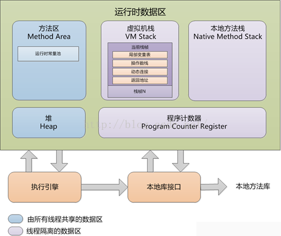
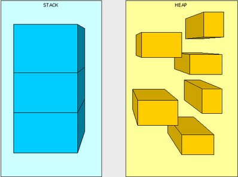

Java内存管理：Java内存区域 JVM运行时数据区

## **1、Java内存区域概述**

### **1-2、C/C++与Java程序开发的内存管理**

> ​       在内存管理领域，C/C++程序开发与Java程序开发有着完全不同的理念：

> 1、C/C++程序开发
>
> ​       自己管理内存是一项基础的工作；
>
> ​       自已分配内存，但也得自己来及时回收；
>
> ​       比较自由，但多了些工作量，且容易出现内存泄露和内存溢出等问题；
>
> 2、Java程序开发
>
> ​       JVM管理内存，不需要自己手动分配内存和释放内存；
>
> ​       不容易出现内存泄露和内存溢出；
>
> ​       一旦出现问题不容易排查，所以得了解JVM是怎么使用内存；

### **1-2、Java内存区域与JVM运行时数据区**


> ​       如上图， Java虚拟机规范定义了字节码执行期间使用的各种运行时数据区，即JVM在执行Java程序的过程==中，会把它管理的内存划分为若干个不同的数据区域，包括：==
>
> > ==​      **程序计数器、java虚拟机栈、本地方法栈、java堆、方法区、运行时常量池；**==
>
> ==​       从线程共享角度来说，可以分为两类：==
>
> ==**1、所有线程共享的数据区**==
>
> ==​       方法区、运行时常量池、java堆；==
>
> ==​       这些数据区域是在Java虚拟机启动时创建的，只有当Java虚拟机退出时才会被销毁；==
>
> ==**2、线程间隔离的数据区**==
>
> ==​       程序计数器、java虚拟机栈、本地方法栈、==
>
> ==​       这些数据区域是每个线程的"私有"数据区，每个线程都有自己的，不与其他线程共享；==
>
> ==​       每个线程的数据区在创建线程时创建，并在线程退出时被销毁；==
>
> ==3、另外，还一种特殊的数据区==
>
> ​==      **直接内存-**-使用Native函数库直接分配的堆外内存；==
>
> ​       ==即Java内存区域 = JVM运行时数据区 +直接内存。==

## **2、Java各内存区域说明**

### **2-1、程序计数器**

> 程序计数器是一块较小的内存空间，可以看作是当前线程所执行的字节码的行号指示器。分支、循环、跳转、异常处理、线程恢复等基础功能都需要依赖这个计数器来完成。==**程序计数器指向正在执行的字节码地址，而不是下一条**== 
>
> 由于Java虚拟机的多线程是通过线程轮流切换并分配处理器执行时间的方式来实现的，在任何一个确定的时刻，一个处理器（对于多核处理器来说是一个内核）只会执行一条线程中的指令。因此，为了线程切换后能恢复到正确的执行位置，每条线程都需要有一个独立的程序计数器，各条线程之间的计数器互不影响，独立存储，我们称这类内存区域为“**线程私有**”的内存。
>
> ==如果线程正在执行的是一个Java 方法，这个计数器记录的是正在执行的虚拟机字节码指令的地址；如果正在执行的是Natvie 方法，这个计数器值则为空（Undefined）。==
>
> ==**此内存区域是唯一一个在Java 虚拟机规范中没有规定任何OutOfMemoryError情况的区域。**==

### **2-2、Java虚拟机栈**

线程私有，它的生命周期与线程相同。虚拟机栈描述的是Java 方法执行的内存模型：**每个方法被执行的时候都会同时创建一个栈帧（Stack Frame）用于存储局部变量表、操作数栈、动态链接、方法出口等信息**。

**局部变量表**中存放了==编译期可知==的各种：

- **基本数据类型**(boolen、byte、char、short、int、 float、 long、double）
- **对象引用**（reference类型，它不等于对象本身，可能是一个指向对象起始地址的指针，也可能是指向一个代表对象的句柄或其他与此对象相关的位置）
- **returnAddress类型**（指向了一条字节码指令的地址）

其中64位长度的long和double类型的数据会占用2个局部变量空间（Slot），其余数据类型只占用1个。==**局部变量表所需的内存空间在编译期间完成分配**，当进入一个方法时，这个方法需要在帧中分配多大的局部变量空间是完全确定的，在方法运行期间不会改变局部变量表的大小==。

Java虚拟机规范中对这个区域规定了两种异常状况：

- **StackOverflowError**：线程请求的栈深度大于虚拟机所允许的深度，将会抛出此异常。
- **OutOfMemoryError**：当可动态扩展的虚拟机栈在扩展时无法申请到足够的内存，就会抛出该异常。

动画是由一帧一帧图片连续切换结果的结果而产生的，其实虚拟机的运行和动画也类似，每个在虚拟机中运行的程序也是由许多的帧的切换产生的结果，只是这些帧里面存放的是方法的局部变量，操作数栈，动态链接，方法返回地址和一些额外的附加信息组成。每一个方法被调用直至执行完成的过程，就对应着一个栈帧在虚拟机栈中从入栈到出栈的过程。

对于执行引擎来说，活动线程中，只有栈顶的栈帧是有效的，称为**当前栈帧**，这个栈帧所关联的方法称为**当前方法**。==**执行引擎所运行的所有字节码指令都只针对当前栈帧进行操作**。==

**内存分配特点**

​       因为除了栈帧的出栈和入栈之外，JVM栈从来不被直接操作，所以栈帧可以在堆中分配；

​       ==JVM栈所使用的内存不需要保证是连续的；==

​       JVM规范允许JVM栈被实现成固定大小的或者是根据计算动态扩展和收缩的：

​		A）、固定大小

​		如果JVM栈是固定大小的，则当创建新线程的栈时，可以独立地选择每个JVM栈的大小；

​		B）、动态扩展或收缩

​       		在动态扩展或收缩JVM栈的情况下，JVM实现应该提供调节JVM栈最大和最小内存空间的手段；两种情况					下，JVM实现都应当提供调节JVM栈初始内存空间大小的手段；

​      **HotSpot VM通过"-Xss"参数设置JVM栈内存空间大小；**

#### 局部变量表

==局部变量表是一组变量值存储空间，**用于存放方法参数和方法内部定义的局部变量**==。在Java程序被编译成Class文件时，就在方法的Code属性的max_locals数据项中确定了该方法所需要分配的最大局部变量表的容量。

==局部变量表的容量以**变量槽**（Slot）为最小单位，==32位虚拟机中一个Slot可以存放一个32位以内的数据类型（boolean、byte、char、short、int、float、reference和returnAddress八种）。

reference类型虚拟机规范没有明确说明它的长度，但一般来说，虚拟机实现至少都应当能从此引用中直接或者间接地查找到对象在Java堆中的起始地址索引和方法区中的对象类型数据。

returnAddress类型是为字节码指令jsr、jsr_w和ret服务的，它指向了一条字节码指令的地址。

==**虚拟机是使用局部变量表完成参数值到参数变量列表的传递过程的**，如果是实例方法（非static），那么局部变量表的第0位索引的Slot默认是用于传递方法所属对象实例的引用，在方法中通过this访问。==

 ==Slot是可以重用的，当Slot中的变量超出了作用域，那么下一次分配Slot的时候，将会覆盖原来的数据。Slot对对象的引用会影响GC（要是被引用，将不会被回收）。==

 ==**系统不会为局部变量赋予初始值（实例变量和类变量都会被赋予初始值）**==。也就是说不存在类变量那样的准备阶段。

#### 操作数栈

和局部变量区一样，==操作数栈也是被组织成一个以字长为单位的数组==。但是和前者不同的是，它不是通过索引来访问，而是==通过标准的栈操作——压栈和出栈—来访问的==。比如，如果某个指令把一个值压入到操作数栈中，稍后另一个指令就可以弹出这个值来使用。

虚拟机在操作数栈中存储数据的方式和在局部变量区中是一样的：如int、long、float、double、reference和returnType的存储。==**对于byte、short以及char类型的值在压入到操作数栈之前，也会被转换为int。**==

虚拟机把操作数栈作为它的工作区——大多数指令都要从这里弹出数据，执行运算，然后把结果压回操作数栈。比如，iadd指令就要从操作数栈中弹出两个整数，执行加法运算，其结果又压回到操作数栈中，看看下面的示例，它演示了虚拟机是如何把两个int类型的局部变量相加，再把结果保存到第三个局部变量的：

**[plain]** [view plain](https://blog.csdn.net/u012152619/article/details/46968883#) [copy](https://blog.csdn.net/u012152619/article/details/46968883#) 

1. begin  
2. iload_0    // push the int in local variable 0 ontothe stack  
3. iload_1    //push the int in local variable 1 onto the stack  
4. iadd       // pop two ints, add them, push result  
5. istore_2   // pop int, store into local variable 2  
6. end  

在这个字节码序列里，前两个指令iload_0和iload_1将存储在局部变量中索引为0和1的整数压入操作数栈中，其后iadd指令从操作数栈中弹出那两个整数相加，再将结果压入操作数栈。第四条指令istore_2则从操作数栈中弹出结果，并把它存储到局部变量区索引为2的位置。下图详细表述了这个过程中局部变量和操作数栈的状态变化，图中没有使用的局部变量区和操作数栈区域以空白表示。

  

####  动态连接

==虚拟机运行的时候,运行时常量池会保存大量的符号引用，这些符号引用可以看成是每个方法的间接引用。==如果代表栈帧A的方法想调用代表栈帧B的方法，那么这个虚拟机的方法调用指令就会以B方法的符号引用作为参数，但是因为符号引用并不是直接指向代表B方法的内存位置，所以在调用之前还必须要将符号引用转换为直接引用，然后通过直接引用才可以访问到真正的方法。

**==如果符号引用是在类加载阶段或者第一次使用的时候转化为直接引用，那么这种转换成为静态解析，如果是在运行期间转换为直接引用，那么这种转换就成为动态连接。==**

#### 返回地址

​       **==方法的返回分为两种情况，一种是正常退出，退出后会根据方法的定义来决定是否要传返回值给上层的调用者，一种是异常导致的方法结束，这种情况是不会传返回值给上层的调用方法。==**

==不过无论是那种方式的方法结束，在退出当前方法时都会跳转到当前方法被调用的位置，如果方法是正常退出的，则调用者的PC计数器的值就可以作为返回地址,，果是因为异常退出的，则是需要通过异常处理表来确定。==

==方法的一次调用就对应着栈帧在虚拟机栈中的一次入栈出栈操作，因此方法退出时可能做的事情包括：恢复上层方法的局部变量表以及操作数栈，如果有返回值的话，就把返回值压入到调用者栈帧的操作数栈中，还会把PC计数器的值调整为方法调用入口的下一条指令。==

  


### **2-3、本地方法栈**

本地方法栈（Native  MethodStacks）与虚拟机栈所发挥的作用是非常相似的==，其区别不过是虚拟机栈为虚拟机执行Java  方法（也就是字节码）服务，而本地方法栈则是为虚拟机使用到的Native  方法服务。==虚拟机规范中对本地方法栈中的方法使用的语言、使用方式与数据结构并没有强制规定，因此具体的虚拟机可以自由实现它。甚至有的虚拟机（譬如**Sun HotSpot 虚拟机）直接就把本地方法栈和虚拟机栈合二为一**。

与虚拟机栈一样，本地方法栈区域也会抛出StackOverflowError和OutOfMemoryError异常。

### **2-4、Java堆**

对于大多数应用而言，**Java堆（Heap）**是Java虚拟机所管理的内存中最大的一块，它**被所有线程共享的**，在虚拟机启动时创建。此内存区域**唯一的目的**是**存放对象实例**，几乎所有的对象实例都在这里分配内存，且每次分配的空间是**不定长**的。在Heap 中分配一定的内存来保存对象实例，实际上只是保存**对象实例的属性值**，**属性的类型**和**对象本身的类型标记**等，**并不保存对象的方法（方法是指令，保存在Stack中）**,在Heap 中分配一定的内存保存对象实例和对象的序列化比较类似。对象实例在Heap 中分配好以后，需要**在Stack中保存一个4字节的Heap 内存地址**，用来定位该对象实例在Heap 中的位置，便于找到该对象实例。

Java虚拟机规范中描述道：所有的对象实例以及数组都要在堆上分配，但是随着JIT编译器的发展和逃逸分析技术逐渐成熟，栈上分配、标量替换优化技术将会导致一些微妙的变化发生，所有的对象都在堆上分配的定论也并不**“绝对”**了。

**堆是垃圾收集器管理的主要区域**，因此很多时候也被称做“**GC 堆**”。

如果内存回收的角度看，由于现在收集器基本都是采用的分代收集算法，所以Java 堆中还可以细分为：新生代和老年代；


- **新生代（Young）**： 新生成的对象优先存放在新生代中，新生代对象朝生夕死，存活率很低。在新生代中，常规应用进行一次垃圾收集一般可以回收70% ~ 95% 的空间，回收效率很高。新生代又可细分为**Eden空间**、**From Survivor空间**、**To Survivor空间**，默认比例为8:1:1。可通过==**-Xmn**==参数来指定新生代的大小，也可以通过==**-XX:SurvivorRation**==来调整Eden Space及SurvivorSpace的大小。
- **老年代（Tenured/Old）**：用于存放经过多次新生代GC仍然存活的对象，例如缓存对象，*新建的对象也有可能直接进入老年代，主要有两种情况*：**1、大对象**，可通过启动参数设置==**-XX:PretenureSizeThreshold**===1024(单位为字节，默认为0)来代表超过多大时就不在新生代分配，而是直接在老年代分配。**2、大的数组对象，且数组中无引用外部对象**。老年代中的对象生命周期较长，存活率比较高，在老年代中进行GC的频率相对而言较低，而且回收的速度也比较慢。
- **永久代（Perm）**：永久代存储类信息、常量、静态变量、即时编译器编译后的代码等数据，对这一区域而言，Java虚拟机规范指出可以不进行垃圾收集，一般而言不会进行垃圾回收。

**==老年代所占的内存大小为-Xmx对应的值减去-Xmn对应的值。==**

==其中**新生代和老年代组成了Java堆的全部内存区域**，而**永久代不属于堆空间，它在JDK 1.8以前被Sun HotSpot虚拟机用作方法区的实现**==

 **根据Java虚拟机规范的规定，Java对可以处于物理上不连续的内存空间中，只要逻辑上是连续的即可。**

==**如果在堆中没有内存完成实例分配，并且堆也无法再扩展时，将会抛出OutOfMemoryError 异常。**==

> **4、内存分配特点**
>
> > **（A）、Java堆划分**
> >
> > ​       为更好回收内存，或更快分配内存，需要对Java堆进行划分：
> >
> > > （I）、从垃圾收集器的角度来看
> > >
> > > ​       JVM规范没有规定JVM如何实现垃圾收集器；
> > >
> > > ​       由于很多JVM采用分代收集算法，所以Java堆还可以细分为：新生代、老年代和永久代；
> > >
> > > （II）、从内存分配角度来看
> > >
> > > ​       为解决分配内存线程不安全问题，需要同步处理；
> > >
> > > ​       Java堆可能划分出每个线程私有的分配缓冲区（Thread Local Allocation Buffer,TLAB）,减少线程同步；
> > >
> > > **HotSpot VM通过"-XX：+/-UseTLAB"指定是否使用TLAB；**

> > **（B）、分配调整**
> >
> > ​       和JVM栈一样，Java堆所使用的物理内存不需要保证是连续的，逻辑连续即可；
> >
> > ​       JVM规范允许Java堆被实现成固定大小的或者是根据计算动态扩展和收缩的：
> >
> > > ​       两种情况下，JVM实现都应当提供调节JJava堆初始内存空间大小的手段；
> > >
> > > ​       在动态扩展或收缩的情况下，还应该提供调节最大和最小内存空间的手段；
> >
> > **（C）、HotSpot VM相关调整**
> >
> > ​       目前主流的JVM都把Java堆实现成动态扩展的，如HotSpot VM：

> > > （1）、初始空间大小
> > >
> > > ​       通过"-Xms"或"-XX:InitialHeapSize"参数指定Java堆初始空间大小；
> > >
> > > ​       默认为1/64的物理内存空间；
> > >
> > > （2）、最大空间大小
> > >
> > > ​       通过"-Xmx"或"-XX:MaxHeapSize"参数指定ava堆内存分配池的最大空间大小；
> > >
> > > ​       默认为1/4的物理内存空间；
> > >
> > > ​       Parallel垃圾收集器默认的最大堆大小是当小于等于192MB物理内存时，为物理内存的一半，否则为物理内存的四分之一；
> > >
> > > （3）、各年代内存的占用空间与可用空间的比例
> > >
> > > ​       通过"-XX:MinHeapFreeRatio"和"-XX:MaxHeapFreeRatio"参数设置堆中各年代内存的占用空间与可用空间的比例保持在特定范围内；
> > >
> > > ​       默认：
> > >
> > > > ​       "-XX:MinHeapFreeRatio=40"：即一个年代（新生代或老年代）内存空余小于40%时，JVM会从未分配的堆内存中分配给该年代，以保持该年代40%的空余内存，直到分配完"-Xmx"指定的堆内存最大限制；
> > >
> > > > ​       "-XX:MaxHeapFreeRatio=70"：即一个年代（新生代或老年代）内存空余大于70%时，JVM会缩减该年代内存，以保持该年代70%的空余内存，直到缩减到"-Xms"指定的堆内存最小限制；
> > >
> > > ​      这两个参数不适用于Parallel垃圾收集器（通过“-XX:YoungGenerationSizeIncrement”、“-XX:TenuredGenerationSizeIncrement ”能及“-XX:AdaptiveSizeDecrementScaleFactor”调节）；
> > >
> > > （4）、年轻代与老年代的大小比例
> > >
> > > ​       通过"-XX:NewRatio"：控制年轻代与老年代的大小比例；
> > >
> > > ​       默认设置"-XX:NewRatio=2"表新生代和老年代之间的比例为1：2；
> > >
> > > ​       换句话说，eden和survivor空间组合的年轻代大小将是总堆大小的三分之一；
> > >
> > > （5）、年轻代空间大小
> > >
> > > ​       通过"-Xmn"参数指定年轻代（nursery）的堆的初始和最大大小；
> > >
> > > ​       或通过"-XX：NewSize"和"-XX：MaxNewSize"限制年轻代的最小大小和最大大小；
> > >
> > > （6）、定永久代空间大小
> > >
> > > ​       通过"-XX：MaxPermSize（JDK7）"或"-XX：MaxMetaspaceSize（JDK8）"参数指定永久代的最大内存大小；
> > >
> > > ​       通过"-XX：PermSize（JDK7）"或"-XX：MetaspaceSize（JDK8）"参数指定永久代的内存阈值--超过将触发垃圾回收；
> > >
> > > ​       注：**JDK8中永久代已被删除，类元数据存储空间在本地内存中分配**；
> > >
> > > 

> > **（D）、调整策略**
> >
> > ​      关于这些参数的调整需要垃圾收集的一些知识（以后文章会介绍），先来简单了解：
> >
> > > ​      当使用某种并行垃圾收集器时，应该指定期望的具体行为而不是指定堆的大小；
> > >
> > > ​      让垃圾收集器自动地、动态的调整堆的大小来满足期望的行为；
> > >
> > > ​      调整的一般规则：
> > >
> > > > ​      除非你的应用程序无法接受长时间的暂停，否则你可以将堆调的尽可能大一些；
> > > >
> > > > ​      除非你发现问题的原因在于老年代的垃圾收集或应用程序暂停次数过多，否则你应该将堆的较大部分分给年轻代；

### **2-5、方法区**

==**方法区与Java堆一样，是各个线程共享的内存区域，区用于存储已被虚拟机加载的类信息、常量、静态变量、即时编译器编译后的代码等数据。**==

方法区在一个jvm实例的内部，**类型信息**被存储在一个称为方法区的内存逻辑区中。类型信息是由类加载器在类加载时从类文件中提取出来的。类(静态)变量也存储在方法区中。

**==简单说方法区用来存储类型的元数据信息，一个.class文件是类被java虚拟机使用之前的表现形式，一旦这个类要被使用，java虚拟机就会对其进行装载、连接（验证、准备、解析）和初始化。而装载后的结果就是由.class文件转变为方法区中的一段特定的数据结构。这个数据结构会存储如下信息：==**

   用于存储JVM加载的每一个类的结构信息，主要包括：

> （A）、**运行时常量池（Runtime Constant Pool）、**字段和方法数据；
>
> （B）、构造函数、普通方法的字节码内容以及JIT编译后的代码；
>
> （C）、还包括一些在类、实例、接口初始化时用到的特殊方法；

**类型信息**

​      这个类型的全限定名

​      这个类型的直接超类的全限定名

​      这个类型是类类型还是接口类型

​      这个类型的访问修饰符

​      任何直接超接口的全限定名的有序列表

 

**字段信息**

​      字段名

​      字段类型

​      字段的修饰符

 

**方法信息**

​      方法名

​      方法返回类型

​      方法参数的数量和类型（按照顺序）

​      方法的修饰符

 

==**其他信息**==

==​      除了常量以外的所有类（静态）变量==

​==      一个指向ClassLoader的指针==

==一个指向Class对象的指针==

==常量池（常量数据以及对其他类型的符号引用）==

 

JVM为每个已加载的类型都维护一个**常量池**。==常量池就是这个类型用到的常量的一个有序集合，包括**实际的常量**(string,integer,和floating point常量)和对类型、域和方法的**符号引用**。池中的数据项象数组项一样，**是通过索引访问的**。==

 

每个类的这些元数据，无论是在构建这个类的实例还是调用这个类某个对象的方法，都会访问方法区的这些元数据。

==构建一个对象时，JVM会在堆中给对象分配空间，这些空间用来存储当前对象实例属性以及其父类的实例属性（而这些属性信息都是从方法区获得），注意，这里并不是仅仅为当前对象的实例属性分配空间，还需要给父类的实例属性分配，==到此其实我们就可以回答第一个问题了，即实例化父类的某个子类时，JVM也会同时构建父类的一个对象。从另外一个角度也可以印证这个问题：调用当前类的构造方法时，首先会调用其父类的构造方法直到Object，而构造方法的调用意味着实例的创建，所以子类实例化时，父类肯定也会被实例化。

类变量被类的所有实例共享，即使没有类实例时你也可以访问它。**这些变量只与类相关，所以在方法区中**，它们成为类数据在逻辑上的一部分。在JVM使用一个类之前，它必须在方法区中为每个non-final类变量分配空间。

 

方法区主要有以下几个特点： 

1、==方法区是线程安全的==。**由于所有的线程都共享方法区，所以，方法区里的数据访问必须被设计成线程安全的。例如，假如同时有两个线程都企图访问方法区中的同一个类，而这个类还没有被装入JVM，那么只允许一个线程去装载它，而其它线程必须等待**

2、==方法区的大小不必是固定的，JVM可根据应用需要动态调整。同时，方法区也不一定是连续的，方法区可以在一个堆(甚至是JVM自己的堆)中自由分配。== 

3、==方法区也可被垃圾收集，当某个类不在被使用(不可触及)时，JVM将卸载这个类，进行垃圾收集==

 

可以通过==**-XX:PermSize** 和 **-XX:MaxPermSize**== 参数限制方法区的大小。

对于习惯在HotSpot 虚拟机上开发和部署程序的开发者来说，很多人愿意把方法区称为“**永久代**”（PermanentGeneration），本质上两者并不等价，仅仅是因为HotSpot  虚拟机的设计团队选择把GC 分代收集扩展至方法区，或者说使用永久代来实现方法区而已。这样HotSpot的垃圾收集器可以想管理Java对一样管理这部分内存，能够省去专门为方法区编写内存管理代码的工作。对于其他虚拟机（如BEA JRockit、IBM J9  等）来说是不存在永久代的概念的。

==注意：使用永久代代替方法区，就现在看来不是一个好主意，因为这样更容易遇到内存溢出的问题（永久代有-XX:MaxPermSize的上限）。目前已经发布的JDK1.7的Hotspot中，已经把原本房租永久代的字符串常量池移出。==

相对而言，垃圾收集行为在这个区域是比较少出现的，但并非数据进入了方法区就如永久代的名字一样“永久”存在了。这个区域的内存回收目标主要是针对常量池的回收和对类型的卸载。

当方法区无法满足内存分配需求时，将抛出OutOfMemoryError异常。

**JDK 1.8以前的永久代（PermGen）**

Java虚拟机规范对方法区的限制非常宽松，除了和Java堆一样不需要连续的内存和可以选择固定大小或者可扩展外，还可以选择不实现垃圾收集，也就是说，Java虚拟机规范只是规定了方法区的概念和它的作用，并没有规定如何去实现它。**对于JDK 1.8之前的版本，HotSpot虚拟机设计团队选择把GC分代收集扩展至方法区，即用永久代来实现方法区**，这样HotSpot的垃圾收集器可以像管理Java堆一样管理这部分内存，能够省去专门为方法区编写内存管理代码的工作。对于其他的虚拟机（如**Oracle JRockit**、**IBM J9**等）来说是不存在永久代的概念的。

如果运行时有大量的类产生，可能会导致方法区被填满，直至溢出。常见的应用场景如：

- ==Spring和ORM框架使用CGLib操纵字节码对类进行增强，增强的类越多，就需要越大的方法区来保证动态生成的Class可以加载入内存。==
- ==大量JSP或动态产生JSP文件的应用（JSP第一次运行时需要编译为Java类）。==
- ==基于OSGi的应用（即使是同一个类文件，被不同的类加载器加载也会视为不同的类）。==

这些都会导致方法区溢出，报出`java.lang.OutOfMemoryError: PermGen space`。

**JDK 1.8的元空间（Metaspace）**

==在JDK 1.8中，HotSpot虚拟机设计团队为了促进**HotSpot**与 **JRockit**的融合，修改了方法区的实现，移除了永久代，选择使用**本地化的内存空间**（而不是JVM的内存空间）存放类的元数据，这个空间叫做**元空间（Metaspace）**。==

==做了这个改动以后，`java.lang.OutOfMemoryError: PermGen`的空间问题将不复存在，并且不再需要调整和监控这个内存空间。且虚拟机需要为方法区设计额外的GC策略：如果类元数据的空间占用达到参数**“MaxMetaspaceSize”**设置的值，将会触发对死亡对象和类加载器的垃圾回收。== 为了限制垃圾回收的频率和延迟，适当的监控和调优**元空间**是非常有必要的。元空间过多的垃圾收集可能表示类、类加载器内存泄漏或对你的应用程序来说空间太小了。

==元空间的内存管理由**元空间虚拟机**来完成。先前，对于类的元数据我们需要不同的垃圾回收器进行处理，现在只需要执行元空间虚拟机的C++代码即可完成。**在元空间中，类和其元数据的生命周期**和**其对应的类加载器**是相同的。话句话说，**只要类加载器存活，其加载的类的元数据也是存活的**，因而不会被回收掉。==

我们从行文到现在提到的元空间稍微有点不严谨。准确的来说==，**每一个类加载器的存储区域都称作一个元空间，所有的元空间合在一起就是我们一直说的元空间。**当一个类加载器被垃圾回收器标记为不再存活，其对应的元空间会被回收。在元空间的回收过程中没有重定位和压缩等操作。==但是元空间内的元数据会进行扫描来确定Java引用。

==**元空间虚拟机**负责元空间的分配，其采用的形式为**组块分配**。组块的大小因类加载器的类型而异。在元空间虚拟机中存在一个**全局的空闲组块列表**。当一个类加载器需要组块时，它就会从这个全局的组块列表中获取并维持一个自己的组块列表。当一个类加载器不再存活，那么其持有的组块将会被释放，并返回给全局组块列表。类加载器持有的组块又会被分成多个块，每一个块存储一个单元的元信息。组块中的块**是线性分配（指针碰撞分配形式）**。组块分配自内存映射区域。这些全局的虚拟内存映射区域以链表形式连接，一旦某个虚拟内存映射区域清空，这部分内存就会返回给操作系统。==


上图展示的是虚拟内存映射区域如何进行元组块的分配。类加载器1和3表明使用了反射或者为匿名类加载器，他们使用了特定大小组块。 而类加载器2和4根据其内部条目的数量使用小型或者中型的组块。

#### 运行时常量池

==是方法区的一部分，Class文件除了类版本，字段，方法，接口等描述信息外，还有一项是常量池，存放编译时，生成的各种字面量，符号引用，这部分内容将在类加载后进入方法区的运行时常量池内。==

存储内容**

​      ==是每一个类或接口的常量池（Constant_Pool）的运行时表示形式；==

==​      包括了若干种不同的常量：==

> ==​      （A）、从编译期可知的字面量和符号引用，也即Class文件结构中的常量池；==
>
> ==​      （B）、必须运行期解析后才能获得的方法或字段的直接引用；==
>
> ​==      （C）、还包括运行时可能创建的新常量（如JDK1.6中的String类intern（）方法）==

- Java虚拟机对Class文件每一部分（自然包括常量池）的格式有严格规定，每一个字节用于存储那种数据都必须符合规范上的要求才会被虚拟机认可、装载和执行。但**对于运行时常量池，Java虚拟机规范没有做任何有关细节的要求**，不同的提供商实现的虚拟机可以按照自己的需求来实现此内存区域。不过一般而言，除了保存**Class文件中的描述符号引用**外，还会把**翻译出的直接引用**也存储在运行时常量池中。

  运行时常量池相对于Class文件常量池的另外一个重要特征是具备**动态性**，Java语言并不要求常量一定只有编译器才能产生，也就是**并非置入Class文件中的常量池的内容才能进入方法区运行时常量池，运行期间也可能将新的常量放入池中**，此特性被开发人员利用得比较多的便是String类的`intern() `方法。

#### 直接内存

**直接内存（Direct Memory）**并不是虚拟机**运行时数据区**的一部分，也不是Java虚拟机规范中定义的内存区域。但这部分内存也被频繁运用，而却可能导致**OutOfMemoryError**异常出现，所以这里放到一起讲解。

以**NIO（New Input/Output）**类为例，NIO引入了一种基于通道（Channel）与缓冲区（Buffer）的I/O方式，它可以使用Native函数库直接分配堆外内存，然后通过一个存储在Java堆中的DirectByteBuffer对象作为这块内存的引用进行操作。这样能避免在Java堆和Native堆中来回复制数据，在一些场景里显著提高性能。

==本机直接内存的分配不会受到Java堆大小的限制，但是既然是内存，还是会受到本机总内存（包括RAM以及SWAP区或分页文件）大小以及处理器寻址空间的限制**。可以通过"-XX:MaxDirectMemorySize"参数指定直接内存最大空间；** **不会受到Java堆大小的限制**，即**"-Xmx"参数限制的空间不包括直接内存**；服务器管理员在配置虚拟机参数时，会根据实际内存设置-Xmx等参数信息，但经常忽略直接内存，使得各个内存区域总和大于物理内存限制（包括物理的和操作系统的限制），从而导致动态扩展时出现**OutOfMemoryError**异常。==

# JVM

 


堆与栈分开设计是为什么呢？

- ==栈存储了处理逻辑、堆存储了具体的数据，这样隔离设计更为清晰==
- ==堆与栈分离，使得堆可以被多个栈共享。==
- ==栈保存了上下文的信息，因此只能向上增长；而堆是动态分配==

#### 栈区

==线程私有，生命周期与线程相同。每个方法执行的时候都会创建一个栈帧（stack frame）用于存放 局部变量表、操作栈、动态链接、方法出口。==

#### 堆

存放对象实例，所有的对象的内存都在这里分配。垃圾回收主要就是作用于这里的。

- ==堆得内存由-Xms指定，默认是物理内存的1/64；最大的内存由-Xmx指定，默认是物理内存的1/4。==
- ==默认空余的堆内存小于40%时，就会增大，直到-Xmx设置的内存。具体的比例可以由-XX:MinHeapFreeRatio指定==
- ==空余的内存大于70%时，就会减少内存，直到-Xms设置的大小。具体由-XX:MaxHeapFreeRatio指定。==

==因此一般都建议把这两个参数设置成一样大，可以避免JVM在不断调整大小。==


总结

| 名称       | 特征                             | 作用                                       | 配置                         | 异常                                |
| ---------- | -------------------------------- | ------------------------------------------ | ---------------------------- | ----------------------------------- |
| 栈区       | 线程私有，使用一段连续的内存空间 | 存放局部变量表、操作栈、动态链接、方法出口 | -XSs                         | StackOverflowError OutOfMemoryError |
| 堆         | 线程共享，生命周期与虚拟机相同   | 保存对象实例                               | -Xms -Xmx -Xmn               | OutOfMemoryError                    |
| 程序计数器 | 线程私有、占用内存小             | 字节码行号                                 | 无                           | 无                                  |
| 方法区     | 线程共享                         | 存储类加载信息、常量、静态变量等           | -XX:PermSize -XX:MaxPermSize | OutOfMemoryError                    |

## JVM基础概念总结：数据类型、堆与栈

**数据类型**

基本类型包括：**byte, short, int, long, char, float, double, Boolean, returnAddress**

引用类型包括：**类类型，接口类型和数组。**

**堆与栈**

堆和栈是程序运行的关键，很有必要把他们的关系说清楚。

[](https://s5.51cto.com/wyfs02/M01/A4/06/wKioL1mlFPzT7_hLAAA-qYFsUa8977.png-wh_651x-s_286560225.png)

====**栈是运行时的单位，而堆是存储的单位。**====


**堆中存什么？栈中存什么？**

==堆中存的是对象。栈中存的是基本数据类型和堆中对象的引用==。==一个对象的大小是不可估计的，或者说是可以动态变化的，但是在栈中，一个对象只对应了一个4btye的引用（堆栈分离的好处）==。

**为什么不把基本类型放堆中呢？**

​	====因为其占用的空间一般是1~8个字节——需要空间比较少，而且因为是基本类型，所以不会出现动态增长的情况——长度固定，因此栈中存储就够了，如果把他存在堆中是没有什么意义的（还会浪费空间，后面说明）。可以这么说，基本类型和对象的引用都是存放在栈中，而且都是几个字节的一个数，因此 在程序运行时，他们的处理方式是统一的====。但是基本类型、对象引用和对象本身就有所区别了，因为一个是栈中的数据一个是堆中的数据。最常见的一个问题就是，Java中参数传递时的问题。

**Java中的参数传递时传值呢？还是传引用？**

要说明这个问题，先要明确两点：

\1. 不要试图与C进行类比，Java中没有指针的概念

\2. ==**程序运行永远都是在栈中进行的，因而参数传递时，只存在传递基本类型和对象引用的问题。不会直接传对象本身**==。

==明确以上两点后。Java在方法调用传递参数时，因为没有指针，所以它都是进行传值调用（这点可以参考C的传值调用）。==因此，很多书里面都说Java是进行传值调用，这点没有问题，而且也简化的C中复杂性。

但是传引用的错觉是如何造成的呢？在运行栈中，基本类型和引用的处理是一样的，都是传值，所以，==**如果是传引用的方法调用，也同时可以理解为“传引用值”的传值调用，即引用的处理跟基本类型是完全一样的。但是当进入被调用方法时，被传递的这个引用的值，被程序解释（或者查找）到堆中的对象，这个时候才对应到真正的对象。如果此时进行修改，修改的是引用对应的对象，而不是引用本身，即：修改的是堆中的数据。所以这个修改是可以保持的了。**==

对象，从某种意义上说，是由基本类型组成的。可以把一个对象看作为一棵树，对象的属性如果还是对象，则还是一颗树（即非叶子节点），基本类型则为树的叶子节点。程序参数传递时，被传递的值本身都是不能进行修改的，但是，如果这个值是一个非叶子节点（即一个对象引用），则可以修改这个节点下面的所有内容。
堆和栈中，栈是程序运行最根本的东西。程序运行可以没有堆，但是不能没有栈。而堆是为栈进行数据存储服务，说白了堆就是一块共享的内存。不过，正是因为堆和栈的分离的思想，才使得Java的垃圾回收成为可能。

**Java中，栈的大小通过-Xss来设置，当栈中存储数据比较多时，需要适当调大这个值，否则会出现java.lang.StackOverflowError异常。常见的出现这个异常的是无法返回的递归，因为此时栈中保存的信息都是方法返回的记录点。**

## 总结

| **名称**     | **特征**                                                 | **作用**                                                     | **配置参数**                       | **异常**                           |
| ------------ | -------------------------------------------------------- | ------------------------------------------------------------ | ---------------------------------- | ---------------------------------- |
| 程序计数器   | 占用内存小，线程私有，生命周期与线程相同                 | 大致为字节码行号指示器                                       | 无                                 | 无                                 |
| 虚拟机栈     | 线程私有，生命周期与线程相同，使用连续的内存空间         | Java 方法执行的内存模型，存储局部变量表、操作栈、动态链接、方法出口等信息 | -Xss                               | StackOverflowErrorOutOfMemoryError |
| java堆       | 线程共享，生命周期与虚拟机相同，可以不使用连续的内存地址 | 保存对象实例，所有对象实例（包括数组）都要在堆上分配         | -Xms-Xmx-Xmn                       | OutOfMemoryError                   |
| 方法区       | 线程共享，生命周期与虚拟机相同，可以不使用连续的内存地址 | 存储已被虚拟机加载的类信息、常量、静态变量、即时编译器编译后的代码等数据 | -XX:PermSize:16M-XX:MaxPermSize64M | OutOfMemoryError                   |
| 运行时常量池 | 方法区的一部分，具有动态性                               | 存放字面量及符号引用                                         |                                    |                                    |

## 堆与栈的对比

经常有人把Java 内存区分为堆内存（Heap）和栈内存（Stack），这种分法比较粗糙，Java内存区域的划分实际上远比这复杂。这种划分方式的流行只能说明大多数程序员最关注的、与对象内存分配关系最密切的内存区域是这两块。

==堆很灵活，但是不安全==。对于对象，我们要动态地创建、销毁，不能说后创建的对象没有销毁，先前创建的对象就不能销毁，那样的话我们的程序就寸步难行，所以Java中用堆来存储对象。而一旦堆中的对象被销毁，我们继续引用这个对象的话，就会出现著名的  NullPointerException，这就是堆的缺点——错误的引用逻辑只有在运行时才会被发现。

==栈不灵活，但是很严格，是安全的，易于管理==。因为只要上面的引用没有销毁，下面引用就一定还在，在大部分程序中，都是先定义的变量、引用先进栈，后定义的后进栈，同时，区块内部的变量、引用在进入区块时压栈，区块结束时出栈，理解了这种机制，我们就可以很方便地理解各种编程语言的作用域的概念了，同时这也是栈的优点——错误的引用逻辑在编译时就可以被发现。

==栈--主要存放引用和基本数据类型。== 

==堆--用来存放 new 出来的对象实例。==

## 内存溢出和内存泄漏

==内存溢出 **out of memory**，是指程序在申请内存时，没有足够的内存空间供其使用，出现out of memory；比如申请了一个integer，但给它存了long才能存下的数，那就是内存溢出。==

==内存泄露 **memory leak**，是指程序在申请内存后，无法释放已申请的内存空间，一次内存泄露危害可以忽略，但内存泄露堆积后果很严重，无论多少内存,迟早会被占光。==

==memory leak会最终会导致out ofmemory。==

 

Java 堆内存的OutOfMemoryError异常是实际应用中最常见的内存溢出异常情况。出现Java 堆内存溢出时，异常堆栈信息“java.lang.OutOfMemoryError”会跟着进一步提示“Java heapspace”。

要解决这个区域的异常，一般的手段是首先通过内存映像分析工具（如Eclipse  Memory Analyzer）对dump  出来的堆转储快照进行分析，重点是确认内存中的对象是否是必要的，也就是要先分清楚到底是出现了内存泄漏（Memory  Leak）还是内存溢出（Memory Overflow）。

如果是内存泄漏，可进一步通过工具查看泄漏对象到GC Roots  的引用链。于是就能找到泄漏对象是通过怎样的路径与GC Roots 相关联并导致垃圾收集器无法自动回收它们的。掌握了泄漏对象的类型信息，以及GC  Roots 引用链的信息，就可以比较准确地定位出泄漏代码的位置。

如果不存在泄漏，换句话说就是内存中的对象确实都还必须存活着，那就应当检查虚拟机的堆参数（-Xmx 与-Xms），与机器物理内存对比看是否还可以调大，从代码上检查是否存在某些对象生命周期过长、持有状态时间过长的情况，尝试减少程序运行期的内存消耗。

## ==内存分配过程==

==1、JVM 会试图为相关Java对象在Eden Space中初始化一块内存区域。==

==2、当Eden空间足够时，内存申请结束；否则到下一步。==

==3、JVM 试图释放在Eden中所有不活跃的对象（这属于1或更高级的垃圾回收）。释放后若Eden空间仍然不足以放入新对象，则试图将部分Eden中活跃对象放入Survivor区。==

==4、Survivor区被用来作为Eden及Old的中间交换区域，当Old区空间足够时，Survivor区的对象会被移到Old区，否则会被保留在Survivor区。==

==5、当Old区空间不够时，JVM 会在Old区进行完全的垃圾收集（0级）。==

==6、完全垃圾收集后，若Survivor及Old区仍然无法存放从Eden复制过来的部分对象，导致JVM无法在Eden区为新对象创建内存区域，则出现“outofmemory”错误。==

## 对象访问

对象访问在Java 语言中无处不在，是最普通的程序行为，但即使是最简单的访问，也会却涉及Java 栈、Java 堆、方法区这三个最重要内存区域之间的关联关系，如下面的这句代码：

 

Object obj = newObject();

 

假设这句代码出现在方法体中，那“Object  obj”这部分的语义将会反映到Java 栈的本地变量表中，作为一个reference 类型数据出现。而“new  Object()”这部分的语义将会反映到Java 堆中，形成一块存储了Object 类型所有实例数据值（Instance  Data，对象中各个实例字段的数据）的结构化内存，根据具体类型以及虚拟机实现的对象内存布局（Object Memory  Layout）的不同，这块内存的长度是不固定的。另外，在Java  堆中还必须包含能查找到此对象类型数据（如对象类型、父类、实现的接口、方法等）的地址信息，这些类型数据则存储在方法区中。

由于reference 类型在Java 虚拟机规范里面只规定了一个指向对象的引用，并没有定义这个引用应该通过哪种方式去定位，以及访问到Java 堆中的对象的具体位置，因此==不同虚拟机实现的对象访问方式会有所不同，主流的访问方式有两种：**使用句柄**和**直接指针**。==

==如果使用句柄访问方式，Java 堆中将会划分出一块内存来作为句柄池，reference中存储的就是对象的句柄地址，而句柄中包含了对象实例数据和类型数据各自的具体地址信息。==


# Java虚拟机类加载机制

## 类加载过程

类从被加载到虚拟机内存中开始，到卸载出内存为止，它的整个生命周期包括以下7个阶段：

- **加载（Loading）**
- **验证（Verification）**
- **准备（Preparation）**
- **解析（Resolution）**
- **初始化（Initialization）**
- 使用（Using）
- 卸载（Unloading）

其中前五个阶段即为类加载的全过程。在后面会进行详细的介绍。而验证、准备、解析3个部分统称为**连接（Linking）**。这7个阶段的发生顺序如下图： 
 


 加载、验证、准备、初始化和卸载这5个阶段的顺序是确定的，类的加载过程必须按照这种顺序按部就班地开始（开始而不是完成，这些阶段是互相交叉着进行的，在一个阶段执行过程中就会激活另一个阶段），而解析阶段则不一定：它在某些情况下可以在初始化阶段之后再开始，这是为了支持Java语言的运行时绑定（也称为动态绑定或晚期绑定）。以下陈述的内容都已HotSpot为基准。

# 类初始化的时机

简单地说，在类加载过程中，准备阶段是正式为类变量(static 成员变量)分配内存并设置类变量初始值（零值）的阶段，而初始化阶段是真正开始执行类中定义的java程序代码(字节码)并按程序猿的意图去初始化类变量的过程。更直接地说，初始化阶段就是执行类构造器<clinit>()方法的过程。<clinit>()方法是由编译器自动收集类中的所有类变量的赋值动作和静态代码块static{}中的语句合并产生的，其中编译器收集的顺序是由语句在源文件中出现的顺序所决定。

　　**类构造器\<clinit>()与实例构造器\<init>()不同，它不需要程序员进行显式调用，虚拟机会保证在子类类构造器\<clinit>()执行之前，父类的类构造\<clinit>()执行完毕。**由于父类的构造器\<clinit>()先执行，也就意味着父类中定义的静态代码块/静态变量的初始化要优先于子类的静态代码块/静态变量的初始化执行。特别地，类构造器\<clinit>()对于类或者接口来说并不是必需的，如果一个类中没有静态代码块，也没有对类变量的赋值操作，那么编译器可以不为这个类生产类构造器\<clinit>()。此外，在同一个类加载器下，一个类只会被初始化一次，但是一个类可以任意地实例化对象。也就是说，**在一个类的生命周期中，类构造器\<clinit>()最多会被虚拟机调用一次，而实例构造器\<init>()则会被虚拟机调用多次，只要程序员还在创建对象。**

　　注意，这里所谓的实例构造器\<init>()是指收集类中的所有实例变量的赋值动作、实例代码块和构造函数合并产生的.


对于类加载过程的第一个阶段：加载，jvm规范中并没有进行强制约束其开始时机，可交由jvm的具体实现来自由把握。但是对于初始化阶段，jvm规范严格规定了有且只有下列5种情况必须对类进行**“初始化”**（很自然地，加载、验证、准备需要在此之前开始）：

- 遇到`new`、`getstatic`、`putstatic`、`invokestatic`这四条字节码指令时，如果类没有进行过初始化，则必须先触发其初始化。最常见的生成这4条指令的场景是：**使用new关键字实例化对象**的时候(**由执行类实例创建表达式而引起的对象创建**)；**读取或设置一个类的静态字段（被final修饰、已在编译期把结果放入常量池的静态字段除外）**的时候；以及**调用一个类的静态方法**的时候。
- 使用 `java.lang.reflect`包的方法对类进行**反射调用**的时候，如果类没有进行初始化，则需要先触发其初始化。
- 当初始化一个类的时候，如果发现其**父类**还没有进行过初始化，则需要先触发其父类的初始化。
- 当虚拟机启动时，用户需要制定一个要执行的**主类（包含main方法的那个类）**，虚拟机会先初始化这个主类；
- 当使用jdk1.7 的**动态语言支持**时，如果一个`java.lang.invoke.MethodHandle`实例最后的解析结果`REF_getStatic`, `REF_putStatic`, `REF_invokeStatic` 的方法句柄，并且这个方法句柄所对应的类没有进行过初始化，则需要先触发其初始化；

使用Clone方法(特别需要说明的是，用clone方法创建对象的过程中并不会调用任何构造函数。 )


以上5种场景中的行为称为对一个类进行**主动引用**。除此之外，所有引用类的方式都不会触发初始化，称为**被动引用**。被动引用的常见例子包括：

- 通过子类引用**父类的静态字段**，不会导致子类初始化。
- 通过**数组定义**来引用类，不会触发此类的初始化，如`SuperClass[] sca = new SuperClass[10];`。
- **常量**在编译阶段会存入调用类的常量池中，本质上并没有直接引用到定义常量的类，因此不会触发定义常量的类的初始化。

**接口的加载过程**和类加载过程略有不同，它们真正的区别在于在前文提到的5种需要开始初始化场景中的第3种：当一个类在初始化时，要求其父类全部都已经初始化过了，但是一个接口在初始化时，并不要求其**父接口**全部都完成了初始化，只有在真正使用到父接口的时候（如引用接口中定义的常量）才会初始化。

==**注意，**==对于这五种会触发类进行初始化的场景，虚拟机规范中使用了一个很强烈的限定语：“有且只有”，这五种场景中的行为称为对一个类进行 **主动引用**。除此之外，所有引用类的方式，都不会触发初始化，称为 **被动引用**。

　　特别需要指出的是，类的实例化与类的初始化是两个完全不同的概念：

- 类的实例化是指创建一个类的实例(对象)的过程；
- 类的初始化是指为类中各个类成员(被static修饰的成员变量)赋初始值的过程，是类生命周期中的一个阶段。

### 被动引用的几种经典场景

　　**1)、通过子类引用父类的静态字段，不会导致子类初始化**

- 对于静态字段，只有直接定义这个字段的类才会被初始化，因此通过其子类来引用父类中定义的静态字段，只会触发父类的初始化而不会触发子类的初始化。 

  **2)、通过数组定义来引用类，不会触发此类的初始化** 

  **3)、常量在编译阶段会存入调用类的常量池中，本质上并没有直接引用到定义常量的类，因此不会触发定义常量的类的初始化** 

------

看到这个题目，很多人会觉得我写我的java代码，至于类，JVM爱怎么加载就怎么加载，博主有很长一段时间也是这么认为的。随着编程经验的日积月累，越来越感觉到了解虚拟机相关要领的重要性。闲话不多说，老规矩，先来一段代码吊吊胃口。

```java
public class SSClass
{
    static
    {
        System.out.println("SSClass");
    }
}    
public class SuperClass extends SSClass
{
    static
    {
        System.out.println("SuperClass init!");
    }
 
    public static int value = 123;
 
    public SuperClass()
    {
        System.out.println("init SuperClass");
    }
}
public class SubClass extends SuperClass
{
    static
    {
        System.out.println("SubClass init");
    }
 
    static int a;
 
    public SubClass()
    {
        System.out.println("init SubClass");
    }
}
public class NotInitialization
{
    public static void main(String[] args)
    {
        System.out.println(SubClass.value);
    }
}
```


运行结果：

```java
SSClass
SuperClass init!
123
```


答案答对了嚒？
 也许有人会疑问：为什么没有输出SubClass init。ok~解释一下：对于静态字段，只有直接定义这个字段的类才会被初始化，因此通过其子类来引用父类中定义的静态字段，只会触发父类的初始化而不会触发子类的初始化。

### **加载**

在加载阶段（可以参考java.lang.ClassLoader的loadClass()方法），虚拟机需要完成以下3件事情：

1. 通过一个类的全限定名来获取定义此类的二进制字节流
2. 将这个字节流所代表的静态存储结构转化为方法区的运行时数据结构；
3. 在内存中生成一个代表这个类的java.lang.Class对象，作为方法区这个类的各种数据的访问入口；

这三点要求不算具体，在jvm实现时灵活度很大。例如上面的第一条，它没有指明二进制字节流要从一个Class文件中获取，准确地说没有指明要从哪里获取、怎样获取。这也为许多Java技术提供了基础，例如：

- 从ZIP包读取，这很常见，最终成为日后JAR、EAR、WAR格式的基础。
- 从网络中获取，这种场景最典型的应用是Applet。
- 运行时计算生成，这种场景使用得最多得就是**动态代理**技术，在`java.lang.reflect.Proxy`中，就是用了`ProxyGenerator.generateProxyClass`的代理类的二进制字节流。
- 由其他文件生成，典型场景是**JSP应用**，即由JSP文件生成对应的Class类。
- 从数据库读取，这种场景相对少见，例如有些**中间件服务器**（如SAP Netweaver）可以选择把程序安装到数据库中来完成程序代码在集群间的分发。

**非数组类的加载**

相对于类加载过程的其他阶段，一个非数组类的加载阶段（准确地说，是加载阶段中**获取类的二进制字节流的动作**）是开发人员可控性最强的，因为加载阶段既可以使用**系统提供的引导类加载器**完成，也可以由**用户自定义的类加载器**完成，通过自定义类加载器去控制字节流的获取方式，即重写一个类加载器的`loadClass()`方法。关于类加载器的内容将在系列的下一篇文章中介绍。

**数组类的加载**

**数组类本身不通过类加载器创建，它是由jvm直接创建的。**但数组类的元素类型（Element Type，指的是数组去掉所有维度的类型）最终是要靠类加载器去创建，一个数据类C的创建过程遵循以下规则：

- 如果数组的**组件类型**（ComponentType，指的是数组去掉一个维度的类型）是**引用类型**，就递归采用本节中定义的加载过程去加载此组件类型，**数组类将在加载该组件类型的类加载器的类名称空间上被标识**（这很重要，在下一篇文章中会讲到，一个类必须与类加载器一起确定唯一性）。
- 如果数组的**组件类型不是引用类型**（例如int[]数组），Java虚拟机将会把数组类标记为与**引导类加载器**关联。
- 数组类的**可见性**与它的**组件类型**的可见性一致，如果组件类型不是引用类型，那数组类的可见性将默认为public。

**加载阶段完成后**，虚拟机**外部的二进制字节流**就按照虚拟机所需的格式**存储在方法区之中**，方法区的数据存储格式由虚拟机实现自行定义，虚拟机规范未规定此区域的具体数据结构。然后在内存中**实例化一个java.lang.Class类的对象**（并无明确规定是在Java 堆中，**对于HotSpot虚拟机而言，Class对象比较特殊，它虽是对象，但存放在方法区里**），这个对象将作为程序访问方法区中的这些类型数据的外部接口。

加载阶段和连接阶段（Linking）的部分内容（如一部分字节码文件格式验证动作）是交叉进行的，加载阶段尚未完成，连接阶段可能已经开始，但这些夹在加载阶段之中进行的动作，仍然属于连接阶段的内容，这两个阶段的开始时间仍然保持着固定的先后顺序。

### **验证**

验证是连接阶段的第一步，这一阶段的目的是为了确保Class文件的字节流中包含的信息符合当前虚拟机的要求，并且不会危害虚拟机自身的安全。
 验证阶段大致会完成4个阶段的检验动作：

1. 文件格式验证：验证字节流是否符合Class文件格式的规范；例如：是否以魔术0xCAFEBABE开头、主次版本号是否在当前虚拟机的处理范围之内、常量池中的常量是否有不被支持的类型。
2. 元数据验证：对字节码描述的信息进行语义分析（注意：对比javac编译阶段的语义分析），以保证其描述的信息符合Java语言规范的要求；例如：这个类是否有父类，除了java.lang.Object之外。
3. 字节码验证：通过数据流和控制流分析，确定程序语义是合法的、符合逻辑的。
4. 符号引用验证：确保解析动作能正确执行。

验证阶段是非常重要的，但不是必须的，它对程序运行期没有影响，如果所引用的类经过反复验证，那么可以考虑采用-Xverifynone参数来关闭大部分的类验证措施，以缩短虚拟机类加载的时间。

```java
1. 文件格式验证

第一阶段要验证字节流是否符合Class文件格式的规范，并且能被当前版本的虚拟机处理。这一阶段可能包括下面这些验证点：

是否以魔数0xCAFEBABE开头。
主次版本号是否在当前虚拟机的处理范围之内
常量池的常量中是否有不被支持的常量类型（tag标志）。
指向常量的各种索引值中是否有指向不存在的常量或不符合类型的常量。
Class文件中各个部分及文件本身是否有被删除的或附加的其他信息。 ……
这阶段的验证是基于二进制字节流进行的，只有通过了这个阶段的验证后，字节流才会进入方法区中进行存储，所以后面的3个验证阶段全部是基于方法区的存储结构进行的，不会再直接操作字节流。

2. 元数据验证

第二阶段是对字节码描述的信息（即类的元数据信息）进行语义分析，以保证其描述的信息符合Java语言规范的要求。例如下面这些验证点：

该类是否有父类（除了java.lang.Object之外，所有的类都应有父类）
该类的父类是否继承了不允许被继承的类（final修饰的类）
若此类不是抽象类，是否实现了其父类或接口之中要求实现的所有方法 ……
该阶段的主要目的是对类的元数据信息进行语义检验，保证不存在不符合Java语言规范的元数据信息。

3. 字节码验证

第三阶段的主要目的是进行数据流和控制流分析，确定程序语义是合法的、符合逻辑的。在第二阶段对元数据信息中的数据类型做完校验之后，这个阶段将对类的方法体进行校验分析，以保证被校验类的方法在运行时不会做出危害虚拟机安全的行为。例如：

保证任意时刻操作数栈的数据类型与指令代码序列都能配合工作。
保证跳转指令不会跳转到方法体以外的字节码指令上。
保证方法体中类型转换是有效的，例如子类对象可以赋值给父类数据类型，但父类对象赋值给子类数据类型是危险和不合法的。 ……
4. 符号引用验证

最后一个阶段的校验发生在虚拟机将符号引用转化为直接引用的时候，这个转化动作将在连接的第三阶段——解析阶段中发生。符号引用验证可以看做是对类自身以外（常量池中的各种符号引用）的信息进行匹配性校验，通常需要校验下列内容：

符号引用中通过字符串描述的全限定名是否能找到对应的类。
指定的类中是否存在符合描述符与简单名称描述的方法与字段。
符号引用中的类、字段、方法的访问性（private、protected、public、default）是否可被当前类访问。 ……
符号引用的目的是确保解析动作能正常执行
```


### **准备**

准备阶段是正式为类变量分配内存并设置类变量初始值的阶段，这些变量所使用的内存都将在方法区中进行分配。这时候进行内存分配的仅包括类变量（被static修饰的变量），而不包括实例变量，实例变量将会在对象实例化时随着对象一起分配在堆中。其次，这里所说的初始值“通常情况”下是数据类型的零值，假设一个类变量的定义为：

```java
public static int value=123;
```

那变量value在准备阶段过后的初始值为0而不是123.因为这时候尚未开始执行任何java方法，而把value赋值为123的putstatic指令是程序被编译后，存放于类构造器()方法之中，所以把value赋值为123的动作将在初始化阶段才会执行。
 至于“特殊情况”是指：public static final int value=123，即当类字段的字段属性是ConstantValue时，会在准备阶段初始化为指定的值，所以标注为final之后，value的值在准备阶段初始化为123而非0.

### **解析**

解析阶段是虚拟机将常量池内的符号引用替换为直接引用的过程。解析动作主要针对类或接口、字段、类方法、接口方法、方法类型、方法句柄和调用点限定符7类符号引用进行。其中后三种与java的动态语言支持息息相关。 

**对同一个符号引用进行多次解析请求**是很常见的，除 invokedynamic 指令外（ invokedynamic指令是用于动态语言支持的，它所对应的引用称为**“动态调用点限定符”**，必须等到程序实际运行到这条指令的时候，解析动作才能进行）虚拟机实现可能会对第一次解析的结果进行**缓存（将直接引用保存在运行时常量池中）**，无论是否真正执行了多次解析动作，虚拟机实现必须保证在同一个实体中，如果一个符号引用之前已经被成功解析过，后续的引用解析请求就应当一直成功，反之亦然。 

### **初始化**

类初始化阶段是类加载过程的最后一步，到了初始化阶段，才真正开始执行类中定义的java程序代码。在准备极端，变量已经付过一次系统要求的初始值，而在初始化阶段，则根据程序猿通过程序制定的主管计划去初始化类变量和其他资源，或者说：初始化阶段是执行类构造器<clinit>()方法的过程.
 <clinit>()方法是由编译器自动收集类中的所有类变量的赋值动作和静态语句块static{}中的语句合并产生的，编译器收集的顺序是由语句在源文件中出现的顺序所决定的，静态语句块只能访问到定义在静态语句块之前的变量，定义在它之后的变量，在前面的静态语句块可以赋值，但是不能访问。如下：

```java
public class Test
{
    static
    {
        i=0;
        System.out.println(i);//这句编译器会报错：Cannot reference a field before it is defined（非法向前应用）
    }
    static int i=1;
}
```

\<clinit>()方法与实例构造器\<init>()方法不同，它不需要显示地调用父类构造器，虚拟机会保证在子类\<init>()方法执行之前，父类的\<clinit>()方法方法已经执行完毕，回到本文开篇的举例代码中，结果会打印输出：SSClass就是这个道理。
 由于父类的\<clinit>()方法先执行，也就意味着父类中定义的静态语句块要优先于子类的变量赋值操作。
 \<clinit>()方法对于类或者接口来说并不是必需的，如果一个类中没有静态语句块，也没有对变量的赋值操作，那么编译器可以不为这个类生产\<clinit>()方法。
 接口中不能使用静态语句块，但仍然有变量初始化的赋值操作，因此接口与类一样都会生成\<clinit>()方法。但接口与类不同的是，执行接口的\<clinit>()方法不需要先执行父接口的\<clinit>()方法。只有当父接口中定义的变量使用时，父接口才会初始化。另外，接口的实现类在初始化时也一样不会执行接口的\<clinit>()方法。
 虚拟机会保证一个类的\<clinit>()方法在多线程环境中被正确的加锁、同步，如果多个线程同时去初始化一个类，那么只会有一个线程去执行这个类的\<clinit>()方法，其他线程都需要阻塞等待，直到活动线程执行\<clinit>()方法完毕。如果在一个类的\<clinit>()方法中有好事很长的操作，就可能造成多个线程阻塞，在实际应用中这种阻塞往往是隐藏的。

```java
package jvm.classload;
 
public class DealLoopTest
{
    static class DeadLoopClass
    {
        static
        {
            if(true)
            {
                System.out.println(Thread.currentThread()+"init DeadLoopClass");
                while(true)
                {
                }
            }
        }
    }
 
    public static void main(String[] args)
    {
        Runnable script = new Runnable(){
            public void run()
            {
                System.out.println(Thread.currentThread()+" start");
                DeadLoopClass dlc = new DeadLoopClass();
                System.out.println(Thread.currentThread()+" run over");
            }
        };
 
        Thread thread1 = new Thread(script);
        Thread thread2 = new Thread(script);
        thread1.start();
        thread2.start();
    }
}
```


运行结果：（即一条线程在死循环以模拟长时间操作，另一条线程在阻塞等待）

```java
Thread[Thread-0,5,main] start
Thread[Thread-1,5,main] start
Thread[Thread-0,5,main]init DeadLoopClass
```


需要注意的是，其他线程虽然会被阻塞，但如果执行<clinit>()方法的那条线程退出<clinit>()方法后，其他线程唤醒之后不会再次进入<clinit>()方法。同一个类加载器下，一个类型只会初始化一次。
 将上面代码中的静态块替换如下：

```java
static
        {
            System.out.println(Thread.currentThread() + "init DeadLoopClass");
            try
            {
                TimeUnit.SECONDS.sleep(10);
            }
            catch (InterruptedException e)
            {
                e.printStackTrace();
            }
        }
```


运行结果：

```java
Thread[Thread-0,5,main] start
Thread[Thread-1,5,main] start
Thread[Thread-1,5,main]init DeadLoopClass (之后sleep 10s)
Thread[Thread-1,5,main] run over
Thread[Thread-0,5,main] run over
```


虚拟机规范严格规定了有且只有5中情况（jdk1.7）必须对类进行“初始化”（而加载、验证、准备自然需要在此之前开始）：

1. 遇到new,getstatic,putstatic,invokestatic这失调字节码指令时，如果类没有进行过初始化，则需要先触发其初始化。生成这4条指令的最常见的Java代码场景是：使用new关键字实例化对象的时候、读取或设置一个类的静态字段（被final修饰、已在编译器把结果放入常量池的静态字段除外）的时候，以及调用一个类的静态方法的时候。
2. 使用java.lang.reflect包的方法对类进行反射调用的时候，如果类没有进行过初始化，则需要先触发其初始化。
3. 当初始化一个类的时候，如果发现其父类还没有进行过初始化，则需要先触发其父类的初始化。
4. 当虚拟机启动时，用户需要指定一个要执行的主类（包含main()方法的那个类），虚拟机会先初始化这个主类。
5. 当使用jdk1.7动态语言支持时，如果一个java.lang.invoke.MethodHandle实例最后的解析结果REF_getstatic,REF_putstatic,REF_invokeStatic的方法句柄，并且这个方法句柄所对应的类没有进行初始化，则需要先出触发其初始化。

开篇已经举了一个范例：通过子类引用付了的静态字段，不会导致子类初始化。
 这里再举两个例子。
 \1. 通过数组定义来引用类，不会触发此类的初始化：（SuperClass类已在本文开篇定义）

```java
public class NotInitialization
{
    public static void main(String[] args)
    {
        SuperClass[] sca = new SuperClass[10];
    }
}
```


运行结果：（无）
 \2. 常量在编译阶段会存入调用类的常量池中，本质上并没有直接引用到定义常量的类，因此不会触发定义常量的类的初始化：

```java
public class ConstClass
{
    static
    {
        System.out.println("ConstClass init!");
    }
    public static  final String HELLOWORLD = "hello world";
}
public class NotInitialization
{
    public static void main(String[] args)
    {
        System.out.println(ConstClass.HELLOWORLD);
    }
}
```


运行结果：hello world

------

附：昨天从论坛上看到一个例子，很有意思，如下：

```java
package jvm.classload;
 
public class StaticTest
{
    public static void main(String[] args)
    {
        staticFunction();
    }
 
    static StaticTest st = new StaticTest();
 
    static
    {
        System.out.println("1");
    }
 
    {
        System.out.println("2");
    }
 
    StaticTest()
    {
        System.out.println("3");
        System.out.println("a="+a+",b="+b);
    }
 
    public static void staticFunction(){
        System.out.println("4");
    }
 
    int a=110;
    static int b =112;
}
```


问题是：请问输出是什么？


在《[Java虚拟机类加载机制](http://blog.csdn.net/u013256816/article/details/50829596)》一文中详细阐述了类加载的过程，并举了几个例子进行了简要分析，在文章的最后留了一个悬念给各位，这里来揭开这个悬念。建议先看完《[Java虚拟机类加载机制](http://blog.csdn.net/u013256816/article/details/50829596)》这篇再来看这个，印象会比较深刻，如若不然，也没什么关系~~ 
 下面是程序代码：

```
package jvm.classload;

public class StaticTest
{
    public static void main(String[] args)
    {
        staticFunction();
    }

    static StaticTest st = new StaticTest();

    static
    {
        System.out.println("1");
    }

    {
        System.out.println("2");
    }

    StaticTest()
    {
        System.out.println("3");
        System.out.println("a="+a+",b="+b);
    }

    public static void staticFunction(){
        System.out.println("4");
    }

    int a=110;
    static int b =112;
}123456789101112131415161718192021222324252627282930313233
```

  问题是：请问这段程序的输出是什么？ 
   这个是我在论坛上看到的一个问题，我觉得比较经典。 
   一般对于这类问题，小伙伴们脑海中肯定浮现出这样的knowledge:

> Java中赋值顺序： 
>    \1. 父类的静态变量赋值 
>    \2. 自身的静态变量赋值 
>    \3. 父类成员变量赋值和父类块赋值 
>    \4. 父类构造函数赋值 
>    \5. 自身成员变量赋值和自身块赋值 
>    \6. 自身构造函数赋值

  ok,按照这个理论输出是什么呢？答案输出:1 4，这样正确嚒？肯定不正确啦，这里不是说上面的规则不正确，而是说不能简单的套用这个规则。 
   正确的答案是：

```
2
3
a=110,b=0
1
412345
```

  是不是有点不可思议？且听我一一道来，这里主要的点之一：==实例初始化不一定要在类初始化结束之后才开始初始化。== 
   类的生命周期是：加载->验证->准备->解析->初始化->使用->卸载，只有在准备阶段和初始化阶段才会涉及类变量的初始化和赋值，因此只针对这两个阶段进行分析； 
   类的准备阶段需要做是为类变量分配内存并设置默认值，因此类变量st为null、b为0；（需要注意的是如果类变量是final，编译时javac将会为value生成ConstantValue属性，在准备阶段虚拟机就会根据ConstantValue的设置将变量设置为指定的值，如果这里这么定义：static  **final** int b=112,那么在准备阶段b的值就是112，而不再是0了。） 
   类的初始化阶段需要做是执行类构造器（类构造器是编译器收集所有静态语句块和类变量的赋值语句按语句在源码中的顺序合并生成类构造器，对象的构造方法是<init>()，类的构造方法是<clinit>()，可以在堆栈信息中看到），因此先执行第一条静态变量的赋值语句即st  = new StaticTest  ()，此时会进行对象的初始化，对象的初始化是先初始化成员变量再执行构造方法，因此设置a为110->打印2->执行构造方法(打印3,此时a已经赋值为110，但是b只是设置了默认值0，并未完成赋值动作)，等对象的初始化完成后继续执行之前的类构造器的语句，接下来就不详细说了，按照语句在源码中的顺序执行即可。  
   这里面还牵涉到一个冷知识，就是在嵌套初始化时有一个特别的逻辑。特别是内嵌的这个变量恰好是个静态成员，而且是本类的实例。 
   这会导致一个有趣的现象：“实例初始化竟然出现在静态初始化之前”。 
   其实并没有提前，你要知道java记录初始化与否的时机。 
   看一个简化的代码，把关键问题解释清楚：

```
public class Test {
    public static void main(String[] args) {
        func();
    }
    static Test st = new Test();
    static void func(){}
}1234567
```

  根据上面的代码，有以下步骤：

1. 首先在执行此段代码时，首先由main方法的调用触发静态初始化。
2. 在初始化Test 类的静态部分时，遇到st这个成员。
3. 但凑巧这个变量引用的是本类的实例。
4. 那么问题来了，此时静态初始化过程还没完成就要初始化实例部分了。是这样么？
5. 从人的角度是的。但从java的角度，一旦开始初始化静态部分，无论是否完成，后续都不会再重新触发静态初始化流程了。
6. 因此在实例化st变量时，实际上是把实例初始化嵌入到了静态初始化流程中，并且在楼主的问题中，嵌入到了静态初始化的起始位置。这就导致了实例初始化完全至于静态初始化之前。这也是导致a有值b没值的原因。
7. 最后再考虑到文本顺序，结果就显而易见了。


## Java 对象的创建过程

## **2、为对象分配内存**

> ​    

#### 对象的创建

**1. 类加载检查**

虚拟机遇到一条new指令时，首先将去检查**这个指令的参数是否能在常量池中定位到一个类的符号引用**，并且检查**这个符号引用代表的类是否已被加载、解析和初始化过的**，如果没有，则必须先执行相应的类加载过程.

**2. 分配内存**

在类加载检查通过后，虚拟机就将为新生对象分配内存。对象所需内存的大小在类加载完成后便可完全确定（如何确定在下一节对象内存布局时再详细讲解），为对象分配空间的任务具体便等同于**从Java堆中划出一块大小确定的内存空间**，可以分如下两种情况讨论：

- **Java堆中内存绝对规整** 所有用过的内存都被放在一边，空闲的内存被放在另一边，**中间放着一个指针作为分界点的指示器**，那所分配内存就仅仅是把那个指针向空闲空间那边挪动一段与对象大小相等的距离，这种分配方式称为**“指针碰撞”（Bump The Pointer）**。
- **Java堆中的内存不规整** 已被使用的内存和空闲的内存相互交错，那就没有办法简单的进行指针碰撞了，虚拟机就必须**维护一个列表，记录哪些内存块是可用的**，在分配的时候从列表中找到一块足够大的空间划分给对象实例，并更新列表上的记录，这种分配方式称为**“空闲列表”（Free List）**。

选择哪种分配方式由Java堆是否规整决定，而Java堆是否规整又由所采用的**垃圾收集器是否带有压缩整理功能**决定。因此在使用Serial、ParNew等带**Compact**过程的收集器时，系统采用的分配算法是**指针碰撞**，而使用CMS这种基于**Mark-Sweep**算法的收集器时（说明一下，CMS收集器可以通过UseCMSCompactAtFullCollection或CMSFullGCsBeforeCompaction来整理内存），就通常采用**空闲列表**。关于垃圾收集器的具体内容将在下一篇文章中介绍。

除如何划分可用空间之外，另外一个需要考虑的问题是对象创建在虚拟机中是非常频繁的行为，即使是仅仅修改一个指针所指向的位置，在并发情况下也**并非线程安全**的，可能出现正在给对象A分配内存，指针还没来得及修改，对象B又同时使用了原来的指针来分配内存。解决这个问题有如下两个方案：

- **对分配内存空间的动作进行同步** 实际上虚拟机是采用**CAS**配上**失败重试**的方式保证更新操作的原子性。
- **把内存分配的动作按照线程划分在不同的空间之中进行** 即每个线程在Java堆中预先分配一小块内存，称为**本地线程分配缓冲（TLAB ，Thread Local Allocation Buffer）**，哪个线程要分配内存，就在哪个线程的TLAB上分配，只有TLAB用完，分配新的TLAB时才需要同步锁定。虚拟机是否使用TLAB，可以通过**-XX:+/-UseTLAB**参数来设定。

**3. 初始化**

内存分配完成之后，虚拟机需要**将分配到的内存空间都初始化为零值（不包括对象头）**，如果使用TLAB的话，这一个工作也可以提前至TLAB分配时进行。这步操作保证了对象的实例字段在Java代码中可以不赋初始值就直接使用。

**4. 设置对象头**

接下来，虚拟机要**设置对象的信息**（如这个对象是哪个类的实例、如何才能找到类的元数据信息、对象的哈希码、对象的GC分代年龄等信息）并存放在对象的**对象头（Object Header）**中。根据虚拟机当前的运行状态的不同，如是否启用偏向锁等，对象头会有不同的设置方式。关于对象头的具体内容，在下一节再详细介绍。

**5. 执行<init>方法**

在上面工作都完成之后，在虚拟机的视角来看，一个新的对象已经产生了。但是在Java程序的视角看来，对象创建才刚刚开始——`<init>`方法还没有执行，所有的字段都还为零值。所以一般来说（由字节码中是否跟随有invokespecial指令所决定），new指令之后会接着执行`<init>`方法，把对象按照程序员的意愿进行初始化，这样一个真正可用的对象才算完全产生出来。

#### 对象的内存布局

HotSpot虚拟机中，对象在内存中存储的布局可以分为三块区域：**对象头（Header）**、**实例数据（Instance Data）**和**对齐填充（Padding）**。

**1. 对象头**

HotSpot虚拟机的对象头包括两部分信息：

- **对象自身的运行时数据 “Mark Word”** 如哈希码（HashCode）、GC分代年龄、锁状态标志、线程持有的锁、偏向线程ID、偏向时间戳等等，这部分数据的长度在32位和64位的虚拟机（暂不考虑开启压缩指针的场景）中分别为32个和64个Bits，官方称它为**“Mark Word”**。对象需要存储的运行时数据很多，其实已经超出了32、64位Bitmap结构所能记录的限度，但是对象头信息是与对象自身定义的数据无关的额外存储成本，考虑到虚拟机的空间效率，Mark Word被设计成一个**非固定的数据结构**以便在极小的空间内存储尽量多的信息，它会**根据对象的状态复用自己的存储空间**。例如在32位的HotSpot虚拟机中对象**未被锁定**的状态下，Mark Word的32个Bits空间中的25Bits用于存储对象哈希码（HashCode），4Bits用于存储对象分代年龄，2Bits用于存储锁标志位，1Bit固定为0，在其他状态（轻量级锁定、重量级锁定、GC标记、可偏向）下对象的存储内容如下图所示：


- **类型指针** 类型指针即**对象指向它的类元数据的指针**，虚拟机通过这个指针来确定这个对象是哪个类的实例。并不是所有的虚拟机实现都必须在对象数据上保留类型指针，换句话说**查找对象的元数据信息并不一定要经过对象本身**，这点我们在下一节讨论。另外，如果对象是一个Java数组，那在对象头中还必须有一块用于**记录数组长度**的数据，因为虚拟机可以通过普通Java对象的元数据信息确定Java对象的大小，但是从数组的元数据中无法确定数组的大小。

**2. 实例数据**

实例数据是对象真正存储的有效信息，也既是我们在程序代码里面所定义的各种类型的字段内容，无论是从父类继承下来的，还是在子类中定义的都需要记录起来。这部分的存储顺序会受到虚拟机分配策略参数（FieldsAllocationStyle）和字段在Java源码中定义顺序的影响。HotSpot虚拟机默认的分配策略为longs/doubles、ints、shorts/chars、bytes/booleans、oops（Ordinary Object Pointers），从分配策略中可以看出，相同宽度的字段总是被分配到一起。在满足这个前提条件的情况下，在父类中定义的变量会出现在子类之前。如果CompactFields参数值为true（默认为true），那子类之中较窄的变量也可能会插入到父类变量的空隙之中。

**3. 对齐填充**

对齐填充并不是必然存在的，也没有特别的含义，它仅仅起着占位符的作用。由于HotSpot VM的自动内存管理系统要求对象起始地址必须是8字节的整数倍，换句话说就是对象的大小必须是8字节的整数倍。对象头部分正好似8字节的倍数（1倍或者2倍），因此当对象实例数据部分没有对齐的话，就需要通过对齐填充来补全。

#### 对象的访问定位

我们的Java程序需要通过**栈上的对象引用（reference）数据（存储在栈上的局部变量表中）**来操作堆上的具体对象。由于reference类型在Java虚拟机规范里面也只规定了是一个指向对象的引用，并没有定义这个引用的具体实现，对象访问方式也是取决于虚拟机实现而定的。主流的访问方式有使用**句柄**和**直接指针**两种。

**1. 使用句柄访问**

如果使用句柄访问的话，**Java堆中**将会划分出一块内存来作为**句柄池**，reference中存储的就是对象的句柄地址，而句柄中包含了**对象实例数据**与**类型数据**的各自的**具体地址信息**。如下图所示：


**2. 使用直接指针访问**

如果使用直接指针访问的话，Java堆对象的布局中就必须考虑如何放置访问类型数据的相关信息，reference中存储的直接就是对象地址，如下图所示：


------

这两种对象访问方式各有优势，下面分别来谈一谈：

- **句柄** 使用句柄访问的最大好处就是**reference中存储的是稳定的句柄地址**，在对象被移动（垃圾收集时移动对象是非常普遍的行为）时**只会改变句柄中的实例数据指针，而reference本身不需要被修改**。
- **直接指针** 使用直接指针来访问最大的好处就是**速度更快**，它**节省了一次指针定位的时间开销**，由于对象访问的在Java中非常频繁，因此这类开销积小成多也是一项 非常可观的执行成本。从上一部分讲解的对象内存布局可以看出，**HotSpot是使用直接指针进行对象访问的**，不过在整个软件开发的范围来 看，各种语言、框架中使用句柄来访问的情况也十分常见。


## 实例化部分

　　当一个对象被创建时，虚拟机就会为其分配内存来存放对象自己的实例变量及其从父类继承过来的实例变量(即使这些从超类继承过来的实例变量有可能被隐藏也会被分配空间)。**在为这些实例变量分配内存的同时，这些实例变量也会被赋予默认值(零值)。**在内存分配完成之后，Java虚拟机就会开始对新创建的对象按照程序猿的意志进行初始化。在Java对象初始化过程中，主要涉及三种执行对象初始化的结构，分别是 **实例变量初始化**、**实例代码块初始化** 以及 **构造函数初始化**。

------

1、实例变量初始化与实例代码块初始化

　　我们在定义（声明）实例变量的同时，还可以直接对实例变量进行赋值或者使用实例代码块对其进行赋值。如果我们以这两种方式为实例变量进行初始化，那么它们将在构造函数执行之前完成这些初始化操作。**实际上，如果我们对实例变量直接赋值或者使用实例代码块赋值，那么编译器会将其中的代码放到类的构造函数中去，并且这些代码会被放在对超类构造函数的调用语句之后(还记得吗？Java要求构造函数的第一条语句必须是超类构造函数的调用语句)，构造函数本身的代码之前。**例如：

```
public class InstanceVariableInitializer {  

    private int i = 1;  
    private int j = i + 1;  

    public InstanceVariableInitializer(int var){
        System.out.println(i);
        System.out.println(j);
        this.i = var;
        System.out.println(i);
        System.out.println(j);
    }

    {               // 实例代码块
        j += 3; 

    }

    public static void main(String[] args) {
        new InstanceVariableInitializer(8);
    }
}/* Output: 
            1
            5
            8
            5
```

　　上面的例子正好印证了上面的结论。特别需要注意的是，Java是按照编程顺序来执行实例变量初始化器和实例初始化器中的代码的，并且不允许顺序靠前的实例代码块初始化在其后面定义的实例变量，比如：

```
public class InstanceInitializer {  
    {  
        j = i;  
    }  

    private int i = 1;  
    private int j;  
}  

public class InstanceInitializer {  
    private int j = i;  
    private int i = 1;  
}  12345678910111213
```

　　上面的这些代码都是无法通过编译的，编译器会抱怨说我们使用了一个未经定义的变量。之所以要这么做是为了保证一个变量在被使用之前已经被正确地初始化。但是我们仍然有办法绕过这种检查，比如：

```
public class InstanceInitializer {  
    private int j = getI();  
    private int i = 1;  

    public InstanceInitializer() {  
        i = 2;  
    }  

    private int getI() {  
        return i;  
    }  

    public static void main(String[] args) {  
        InstanceInitializer ii = new InstanceInitializer();  
        System.out.println(ii.j);  
    }  
}  1234567891011121314151617
```

　　如果我们执行上面这段代码，那么会发现打印的结果是0。因此我们可以确信，变量j被赋予了i的默认值0，这一动作发生在实例变量i初始化之前和构造函数调用之前。

------

2、构造函数初始化

　　我们可以从上文知道，实例变量初始化与实例代码块初始化总是发生在构造函数初始化之前，那么我们下面着重看看构造函数初始化过程。众所周知，每一个Java中的对象都至少会有一个构造函数，如果我们没有显式定义构造函数，那么它将会有一个默认无参的构造函数。在编译生成的字节码中，这些构造函数会被命名成<init>()方法，参数列表与Java语言书写的构造函数的参数列表相同。

　　我们知道，**Java要求在实例化类之前，必须先实例化其超类，以保证所创建实例的完整性。**事实上，这一点是在构造函数中保证的：Java强制要求Object对象(Object是Java的顶层对象，没有超类)之外的所有对象构造函数的第一条语句必须是超类构造函数的调用语句或者是类中定义的其他的构造函数，如果我们既没有调用其他的构造函数，也没有显式调用超类的构造函数，那么编译器会为我们自动生成一个对超类构造函数的调用，比如：

```
public class ConstructorExample {  

} 123
```

　　对于上面代码中定义的类，我们观察编译之后的字节码，我们会发现编译器为我们生成一个构造函数，如下，

```
aload_0  
invokespecial   #8; //Method java/lang/Object."<init>":()V  
return  123
```

　　上面代码的第二行就是调用Object类的默认构造函数的指令。也就是说，如果我们显式调用超类的构造函数，那么该调用必须放在构造函数所有代码的最前面，也就是必须是构造函数的第一条指令。正因为如此，Java才可以使得一个对象在初始化之前其所有的超类都被初始化完成，并保证创建一个完整的对象出来。

------

　　特别地，如果我们在一个构造函数中调用另外一个构造函数，如下所示，

```
public class ConstructorExample {  
    private int i;  

    ConstructorExample() {  
        this(1);  
        ....  
    }  

    ConstructorExample(int i) {  
        ....  
        this.i = i;  
        ....  
    }  
}  1234567891011121314
```

　　对于这种情况，Java只允许在ConstructorExample(int i)内调用超类的构造函数，也就是说，下面两种情形的代码编译是无法通过的：

```
public class ConstructorExample {  
    private int i;  

    ConstructorExample() {  
        super();  
        this(1);  // Error:Constructor call must be the first statement in a constructor
        ....  
    }  

    ConstructorExample(int i) {  
        ....  
        this.i = i;  
        ....  
    }  
}  123456789101112131415
```

或者，

```
public class ConstructorExample {  
    private int i;  

    ConstructorExample() {  
        this(1);  
        super();  //Error: Constructor call must be the first statement in a constructor
        ....  
    }  

    ConstructorExample(int i) {  
        this.i = i;  
    }  
}   12345678910111213
```

　　Java通过对构造函数作出这种限制以便保证一个类的实例能够在被使用之前正确地初始化。

------

3、 小结

　　总而言之，**实例化一个类的对象的过程是一个典型的递归过程**，如下图所示。进一步地说，在实例化一个类的对象时，具体过程是这样的：

　　在准备实例化一个类的对象前，首先准备实例化该类的父类，如果该类的父类还有父类，那么准备实例化该类的父类的父类，依次递归直到递归到Object类。此时，首先实例化Object类，再依次对以下各类进行实例化，直到完成对目标类的实例化。具体而言，在实例化每个类时，都遵循如下顺序：先依次执行实例变量初始化和实例代码块初始化，再执行构造函数初始化。也就是说，编译器会将实例变量初始化和实例代码块初始化相关代码放到类的构造函数中去，并且这些代码会被放在对超类构造函数的调用语句之后，构造函数本身的代码之前。


------

4、实例变量初始化、实例代码块初始化以及构造函数初始化综合实例

```
//父类
class Foo {
    int i = 1;

    Foo() {
        System.out.println(i);             -----------(1)
        int x = getValue();
        System.out.println(x);             -----------(2)
    }

    {
        i = 2;
    }

    protected int getValue() {
        return i;
    }
}

//子类
class Bar extends Foo {
    int j = 1;

    Bar() {
        j = 2;
    }

    {
        j = 3;
    }

    @Override
    protected int getValue() {
        return j;
    }
}

public class ConstructorExample {
    public static void main(String... args) {
        Bar bar = new Bar();
        System.out.println(bar.getValue());             -----------(3)
    }
}/* Output: 
            2
            0
            2
```

　　根据上文所述的类实例化过程，我们可以将Foo类的构造函数和Bar类的构造函数等价地分别变为如下形式：

```
    //Foo类构造函数的等价变换：
    Foo() {
        i = 1;
        i = 2;
        System.out.println(i);
        int x = getValue();
        System.out.println(x);
    }12345678
```

```
    //Bar类构造函数的等价变换
    Bar() {
        Foo();
        j = 1;
        j = 3;
        j = 2
    }1234567
```

　　这样程序就好看多了，我们一眼就可以观察出程序的输出结果。在通过使用Bar类的构造方法new一个Bar类的实例时，首先会调用Foo类构造函数，因此(1)处输出是2，这从Foo类构造函数的等价变换中可以直接看出。(2)处输出是0，为什么呢？因为在执行Foo的构造函数的过程中，由于Bar重载了Foo中的getValue方法，所以根据Java的多态特性可以知道，其调用的getValue方法是被Bar重载的那个getValue方法。但由于这时Bar的构造函数还没有被执行，因此此时j的值还是默认值0，因此(2)处输出是0。最后，在执行(3)处的代码时，由于bar对象已经创建完成，所以此时再访问j的值时，就得到了其初始化后的值2，这一点可以从Bar类构造函数的等价变换中直接看出。


## 四. 总结

　　1、一个实例变量在对象初始化的过程中会被赋值几次？

　　我们知道，JVM在为一个对象分配完内存之后，会给每一个实例变量赋予默认值，这个时候实例变量被第一次赋值，这个赋值过程是没有办法避免的。如果我们在声明实例变量x的同时对其进行了赋值操作，那么这个时候，这个实例变量就被第二次赋值了。如果我们在实例代码块中，又对变量x做了初始化操作，那么这个时候，这个实例变量就被第三次赋值了。如果我们在构造函数中，也对变量x做了初始化操作，那么这个时候，变量x就被第四次赋值。也就是说，在Java的对象初始化过程中，一个实例变量最多可以被初始化4次。

------

　　2、类的初始化过程与类的实例化过程的异同？

　　类的初始化是指类加载过程中的初始化阶段对类变量按照程序猿的意图进行赋值的过程；而类的实例化是指在类完全加载到内存中后创建对象的过程。

------

　　3、假如一个类还未加载到内存中，那么在创建一个该类的实例时，具体过程是怎样的？

　　我们知道，要想创建一个类的实例，必须先将该类加载到内存并进行初始化，也就是说，类初始化操作是在类实例化操作之前进行的，但并不意味着：只有类初始化操作结束后才能进行类实例化操作。

　　总的来说，类实例化的一般过程是：**父类的类构造器\<clinit>() -> 子类的类构造器\<clinit>() -> 父类的成员变量和实例代码块 -> 父类的构造函数 -> 子类的成员变量和实例代码块 -> 子类的构造函数。**


# JAVA对象在JVM中内存分配

 以一下代码为例，来分析下，java的实例对象在内存中的空间分配（JDK1.8）。 

```java
public class Student {

    private String name;
    private static Birthday birthday = new Birthday();

    public Student(String name) {
        this.name = name;
    }

    public static void main(String[] args) {
        Student s = new Student("zhangsan");
        int age = 10;
        System.out.println(age);
    }
}

class Birthday {
    private int year = 2010;
    private int month = 10;
    private int day = 1;
}
```

以Student类执行到main方法的最后一行时来分析java实例对象在内存中的分配情况。
如下图：


 

 图画的稍微有点问题，不过能说明对象在内存中的大致位置。

从图中我们可以看出，普通的java实例对象内存分配，主要在这三个区域：虚拟机栈、堆、方法区。

## 从内存区域来分析

- **虚拟机栈:**只存放局部变量
- **堆:**存储对象的实例
- **方法区：**存放Class信息和常量信息。

## 从变量的角度来分析

- 局部变量：存放在虚拟机栈中（具体应为[栈->栈帧->局部变量表]）
  - 基本类型的值直接存在栈中。如age=10
  - 如果是对象的实例，则只存储对象实例的引用。如s=ref

- **实例变量：**存放在堆中的对象实例中。如Student的实例变量 name=ref
- **静态变量：**存放在方法区中的常量池中。如Student.class中的birthday=ref。
  - 如果常量的类型是对象的实例则只存储对象实例的引用地址

 通过变量的角度来分析，我们就可以了解为什么静态变量不用new就能调用，而实例变量必须new出对象，才能调用。 