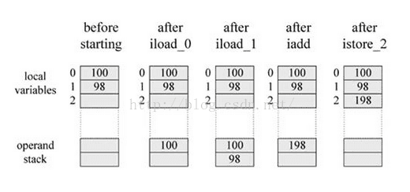
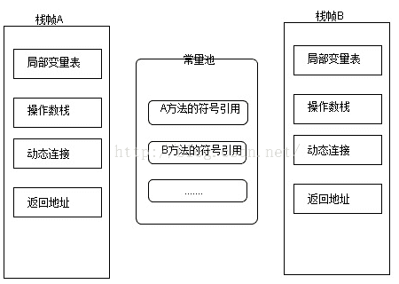

# JVN

 


堆与栈分开设计是为什么呢？

- ==栈存储了处理逻辑、堆存储了具体的数据，这样隔离设计更为清晰==
- ==堆与栈分离，使得堆可以被多个栈共享。==
- ==栈保存了上下文的信息，因此只能向上增长；而堆是动态分配==

#### 栈区

==线程私有，生命周期与线程相同。每个方法执行的时候都会创建一个栈帧（stack frame）用于存放 局部变量表、操作栈、动态链接、方法出口。==

#### 堆

存放对象实例，所有的对象的内存都在这里分配。垃圾回收主要就是作用于这里的。

- ==堆得内存由-Xms指定，默认是物理内存的1/64；最大的内存由-Xmx指定，默认是物理内存的1/4。==
- ==默认空余的堆内存小于40%时，就会增大，直到-Xmx设置的内存。具体的比例可以由-XX:MinHeapFreeRatio指定==
- ==空余的内存大于70%时，就会减少内存，直到-Xms设置的大小。具体由-XX:MaxHeapFreeRatio指定。==

==因此一般都建议把这两个参数设置成一样大，可以避免JVM在不断调整大小。==


## JVM基础概念总结：数据类型、堆与栈

**数据类型**

基本类型包括：**byte, short, int, long, char, float, double, Boolean, returnAddress**

引用类型包括：**类类型，接口类型和数组。**

**堆与栈**

堆和栈是程序运行的关键，很有必要把他们的关系说清楚。

[](https://s5.51cto.com/wyfs02/M01/A4/06/wKioL1mlFPzT7_hLAAA-qYFsUa8977.png-wh_651x-s_286560225.png)

====**栈是运行时的单位，而堆是存储的单位。**====

栈解决程序的运行问题，即程序如何执行，或者说如何处理数据；堆解决的是数据存储的问题，即数据怎么放、放在哪儿。

在Java中一个线程就会相应有一个线程栈与之对应，这点很容易理解，因为不同的线程执行逻辑有所不同，因此需要一个独立的线程栈。而堆则是所有线程共享的。栈因为是运行单位，因此里面存储的信息都是跟当前线程（或程序）相关信息的。包括局部变量、程序运行状态、方法返回值等等；而堆只负责存储对象信息。

**为什么要把堆和栈区分出来呢？栈中不是也可以存储数据吗？**

第一，从软件设计的角度看，栈代表了处理逻辑，而堆代表了数据。这样分开，使得处理逻辑更为清晰。分而治之的思想。这种隔离、模块化的思想在软件设计的方方面面都有体现。

第二，堆与栈的分离，使得堆中的内容可以被多个栈共享（也可以理解为多个线程访问同一个对象）。这种共享的收益是很多的。一方面这种共享提供了一种有效的数据交互方式(如：共享内存)，另一方面，堆中的共享常量和缓存可以被所有栈访问，节省了空间。

第三，栈因为运行时的需要，比如保存系统运行的上下文，需要进行地址段的划分。由于栈只能向上增长，因此就会限制住栈存储内容的能力。而堆不同，堆中的对象是可以根据需要动态增长的，因此栈和堆的拆分，使得动态增长成为可能，相应栈中只需记录堆中的一个地址即可。

第四，面向对象就是堆和栈的完美结合。其实，面向对象方式的程序与以前结构化的程序在执行上没有任何区别。但是，面向对象的引入，使得对待问题的思考方式发生了改变，而更接近于自然方式的思考。当我们把对象拆开，你会发现，对象的属性其实就是数据，存放在堆中；而对象的行为（方法），就是运行逻辑，放在栈中。我们在编写对象的时候，其实即编写了数据结构，也编写的处理数据的逻辑。不得不承认，面向对象的设计，确实很美。

**堆中存什么？栈中存什么？**

==堆中存的是对象。栈中存的是基本数据类型和堆中对象的引用==。==一个对象的大小是不可估计的，或者说是可以动态变化的，但是在栈中，一个对象只对应了一个4btye的引用（堆栈分离的好处）==。

**为什么不把基本类型放堆中呢？**

​	===因为其占用的空间一般是1~8个字节——需要空间比较少，而且因为是基本类型，所以不会出现动态增长的情况——长度固定，因此栈中存储就够了，如果把他存在堆中是没有什么意义的（还会浪费空间，后面说明）。==可以这么说，基本类型和对象的引用都是存放在栈中，而且都是几个字节的一个数，因此 ==在程序运行时，他们的处理方式是统一的==。但是基本类型、对象引用和对象本身就有所区别了，因为一个是栈中的数据一个是堆中的数据。最常见的一个问题就是，Java中参数传递时的问题。

**Java中的参数传递时传值呢？还是传引用？**

要说明这个问题，先要明确两点：

\1. 不要试图与C进行类比，Java中没有指针的概念

\2. ==**程序运行永远都是在栈中进行的，因而参数传递时，只存在传递基本类型和对象引用的问题。不会直接传对象本身**==。

明确以上两点后。Java在方法调用传递参数时，因为没有指针，所以它都是进行传值调用（这点可以参考C的传值调用）。因此，很多书里面都说Java是进行传值调用，这点没有问题，而且也简化的C中复杂性。

但是传引用的错觉是如何造成的呢？在运行栈中，基本类型和引用的处理是一样的，都是传值，所以，==**如果是传引用的方法调用，也同时可以理解为“传引用值”的传值调用，即引用的处理跟基本类型是完全一样的。但是当进入被调用方法时，被传递的这个引用的值，被程序解释（或者查找）到堆中的对象，这个时候才对应到真正的对象。如果此时进行修改，修改的是引用对应的对象，而不是引用本身，即：修改的是堆中的数据。所以这个修改是可以保持的了。**==

对象，从某种意义上说，是由基本类型组成的。可以把一个对象看作为一棵树，对象的属性如果还是对象，则还是一颗树（即非叶子节点），基本类型则为树的叶子节点。程序参数传递时，被传递的值本身都是不能进行修改的，但是，如果这个值是一个非叶子节点（即一个对象引用），则可以修改这个节点下面的所有内容。
堆和栈中，栈是程序运行最根本的东西。程序运行可以没有堆，但是不能没有栈。而堆是为栈进行数据存储服务，说白了堆就是一块共享的内存。不过，正是因为堆和栈的分离的思想，才使得Java的垃圾回收成为可能。

**Java中，栈的大小通过-Xss来设置，当栈中存储数据比较多时，需要适当调大这个值，否则会出现java.lang.StackOverflowError异常。常见的出现这个异常的是无法返回的递归，因为此时栈中保存的信息都是方法返回的记录点。**


#### 程序计数器

这里记录了线程执行的字节码的行号，在分支、循环、跳转、异常、线程恢复等都依赖这个计数器。

**程序计数器指向正在执行的字节码地址，而不是下一条** 

#### 方法区

类型信息、字段信息、方法信息、其他信息

总结

| 名称       | 特征                             | 作用                                       | 配置                         | 异常                                |
| ---------- | -------------------------------- | ------------------------------------------ | ---------------------------- | ----------------------------------- |
| 栈区       | 线程私有，使用一段连续的内存空间 | 存放局部变量表、操作栈、动态链接、方法出口 | -XSs                         | StackOverflowError OutOfMemoryError |
| 堆         | 线程共享，生命周期与虚拟机相同   | 保存对象实例                               | -Xms -Xmx -Xmn               | OutOfMemoryError                    |
| 程序计数器 | 线程私有、占用内存小             | 字节码行号                                 | 无                           | 无                                  |
| 方法区     | 线程共享                         | 存储类加载信息、常量、静态变量等           | -XX:PermSize -XX:MaxPermSize | OutOfMemoryError                    |

## 程序计数器

程序计数器是一块较小的内存空间，可以看作是当前线程所执行的字节码的行号指示器。分支、循环、跳转、异常处理、线程恢复等基础功能都需要依赖这个计数器来完成。

由于Java   虚拟机的多线程是通过线程轮流切换并分配处理器执行时间的方式来实现的，在任何一个确定的时刻，一个处理器（对于多核处理器来说是一个内核）只会执行一条线程中的指令。因此，为了线程切换后能恢复到正确的执行位置，每条线程都需要有一个独立的程序计数器，各条线程之间的计数器互不影响，独立存储，我们称这类内存区域为“**线程私有**”的内存。

==如果线程正在执行的是一个Java 方法，这个计数器记录的是正在执行的虚拟机字节码指令的地址；如果正在执行的是Natvie 方法，这个计数器值则为空（Undefined）。==

**此内存区域是唯一一个在Java 虚拟机规范中没有规定任何OutOfMemoryError情况的区域。**

## 虚拟机栈

线程私有，它的生命周期与线程相同。虚拟机栈描述的是Java 方法执行的内存模型：**每个方法被执行的时候都会同时创建一个栈帧（Stack Frame）用于存储局部变量表、操作数栈、动态链接、方法出口等信息**。

动画是由一帧一帧图片连续切换结果的结果而产生的，其实虚拟机的运行和动画也类似，每个在虚拟机中运行的程序也是由许多的帧的切换产生的结果，只是这些帧里面存放的是方法的局部变量，操作数栈，动态链接，方法返回地址和一些额外的附加信息组成。每一个方法被调用直至执行完成的过程，就对应着一个栈帧在虚拟机栈中从入栈到出栈的过程。

 

对于执行引擎来说，活动线程中，只有栈顶的栈帧是有效的，称为**当前栈帧**，这个栈帧所关联的方法称为**当前方法**。**执行引擎所运行的所有字节码指令都只针对当前栈帧进行操作**。

### 局部变量表

局部变量表是一组变量值存储空间，**用于存放方法参数和方法内部定义的局部变量**。在Java程序被编译成Class文件时，就在方法的Code属性的max_locals数据项中确定了该方法所需要分配的最大局部变量表的容量。

局部变量表的容量以**变量槽**（Slot）为最小单位，32位虚拟机中一个Slot可以存放一个32位以内的数据类型（boolean、byte、char、short、int、float、reference和returnAddress八种）。

reference类型虚拟机规范没有明确说明它的长度，但一般来说，虚拟机实现至少都应当能从此引用中直接或者间接地查找到对象在Java堆中的起始地址索引和方法区中的对象类型数据。

returnAddress类型是为字节码指令jsr、jsr_w和ret服务的，它指向了一条字节码指令的地址。

**虚拟机是使用局部变量表完成参数值到参数变量列表的传递过程的**，如果是实例方法（非static），那么局部变量表的第0位索引的Slot默认是用于传递方法所属对象实例的引用，在方法中通过this访问。

 Slot是可以重用的，当Slot中的变量超出了作用域，那么下一次分配Slot的时候，将会覆盖原来的数据。Slot对对象的引用会影响GC（要是被引用，将不会被回收）。

 ==**系统不会为局部变量赋予初始值（实例变量和类变量都会被赋予初始值）**==。也就是说不存在类变量那样的准备阶段。

### 操作数栈

和局部变量区一样，操作数栈也是被组织成一个以字长为单位的数组。但是和前者不同的是，它不是通过索引来访问，而是通过标准的栈操作——压栈和出栈—来访问的。比如，如果某个指令把一个值压入到操作数栈中，稍后另一个指令就可以弹出这个值来使用。

虚拟机在操作数栈中存储数据的方式和在局部变量区中是一样的：如int、long、float、double、reference和returnType的存储。**对于byte、short以及char类型的值在压入到操作数栈之前，也会被转换为int。**

虚拟机把操作数栈作为它的工作区——大多数指令都要从这里弹出数据，执行运算，然后把结果压回操作数栈。比如，iadd指令就要从操作数栈中弹出两个整数，执行加法运算，其结果又压回到操作数栈中，看看下面的示例，它演示了虚拟机是如何把两个int类型的局部变量相加，再把结果保存到第三个局部变量的：

**[plain]** [view plain](https://blog.csdn.net/u012152619/article/details/46968883#) [copy](https://blog.csdn.net/u012152619/article/details/46968883#) 

1. begin  
2. iload_0    // push the int in local variable 0 ontothe stack  
3. iload_1    //push the int in local variable 1 onto the stack  
4. iadd       // pop two ints, add them, push result  
5. istore_2   // pop int, store into local variable 2  
6. end  

在这个字节码序列里，前两个指令iload_0和iload_1将存储在局部变量中索引为0和1的整数压入操作数栈中，其后iadd指令从操作数栈中弹出那两个整数相加，再将结果压入操作数栈。第四条指令istore_2则从操作数栈中弹出结果，并把它存储到局部变量区索引为2的位置。下图详细表述了这个过程中局部变量和操作数栈的状态变化，图中没有使用的局部变量区和操作数栈区域以空白表示。

  

### 动态连接

虚拟机运行的时候,运行时常量池会保存大量的符号引用，这些符号引用可以看成是每个方法的间接引用。如果代表栈帧A的方法想调用代表栈帧B的方法，那么这个虚拟机的方法调用指令就会以B方法的符号引用作为参数，但是因为符号引用并不是直接指向代表B方法的内存位置，所以在调用之前还必须要将符号引用转换为直接引用，然后通过直接引用才可以访问到真正的方法。

**==如果符号引用是在类加载阶段或者第一次使用的时候转化为直接引用，那么这种转换成为静态解析，如果是在运行期间转换为直接引用，那么这种转换就成为动态连接。==**

### 返回地址

​       **==方法的返回分为两种情况，一种是正常退出，退出后会根据方法的定义来决定是否要传返回值给上层的调用者，一种是异常导致的方法结束，这种情况是不会传返回值给上层的调用方法。==**

==不过无论是那种方式的方法结束，在退出当前方法时都会跳转到当前方法被调用的位置，如果方法是正常退出的，则调用者的PC计数器的值就可以作为返回地址,，果是因为异常退出的，则是需要通过异常处理表来确定。==

==方法的一次调用就对应着栈帧在虚拟机栈中的一次入栈出栈操作，因此方法退出时可能做的事情包括：恢复上层方法的局部变量表以及操作数栈，如果有返回值的话，就把返回值压入到调用者栈帧的操作数栈中，还会把PC计数器的值调整为方法调用入口的下一条指令。==

  

### 异常

在Java 虚拟机规范中，对虚拟机栈规定了两种异常状况：如果线程请求的栈深度大于虚拟机所允许的深度，将抛出**StackOverflowError** 异常；如果虚拟机栈可以动态扩展（当前大部分的Java 虚拟机都可动态扩展，只不过Java 虚拟机规范中也允许固定长度的虚拟机栈），当扩展时无法申请到足够的内存时会抛出**OutOfMemoryError** 异常。

## 本地方法栈

本地方法栈（Native  MethodStacks）与虚拟机栈所发挥的作用是非常相似的==，其区别不过是虚拟机栈为虚拟机执行Java  方法（也就是字节码）服务，而本地方法栈则是为虚拟机使用到的Native  方法服务。==虚拟机规范中对本地方法栈中的方法使用的语言、使用方式与数据结构并没有强制规定，因此具体的虚拟机可以自由实现它。甚至有的虚拟机（譬如**Sun HotSpot 虚拟机）直接就把本地方法栈和虚拟机栈合二为一**。

与虚拟机栈一样，本地方法栈区域也会抛出StackOverflowError和OutOfMemoryError异常。

## 堆

堆是Java 虚拟机所管理的内存中最大的一块。Java 堆是被所有线程共享的一块内存区域，在虚拟机启动时创建。**此内存区域的唯一目的就是存放对象实例**，**几乎所有的对象实例都在这里分配内存。但是随着JIT 编译器的发展与逃逸分析技术的逐渐成熟，栈上分配、标量替换优化技术将会导致一些微妙的变化发生，所有的对象都分配在堆上也渐渐变得不是那么“绝对”了。**

**堆是垃圾收集器管理的主要区域**，因此很多时候也被称做“**GC 堆**”。

堆的大小可以通过==-Xms==(**最小值)和**==-Xmx==**(最大值)参数设置，-Xms为JVM启动时申请的最小内存，默认为操作系统物理内存的1/64但小于1G，-Xmx为JVM可申请的最大内存，默认为物理内存的1/4但小于1G，默认当空余堆内存小于40%时，JVM会增大Heap到-Xmx指定的大小，可通过**==-XX:MinHeapFreeRation==**=来指定这个比列；当空余堆内存大于70%时，JVM会减小heap的大小到-Xms指定的大小，可通过**==-XX:MaxHeapFreeRation===来指定这个比列，对于运行系统，为避免在运行时频繁调整Heap的大小，通常-Xms与-Xmx的值设成一样。


如果从内存回收的角度看，由于现在收集器基本都是采用的分代收集算法，所以Java 堆中还可以细分为：新生代和老年代；

**新生代**：**程序新创建的对象都是从新生代分配内存**，新生代由**Eden Space**和两块相同大小的**Survivor Space**(通常又称S0和S1或From和To)构成，可通过==**-Xmn**==参数来指定新生代的大小，也可以通过==**-XX:SurvivorRation**==来调整Eden Space及SurvivorSpace的大小。

**老年代**：用于存放经过多次新生代GC仍然存活的对象，例如缓存对象，*新建的对象也有可能直接进入老年代，主要有两种情况*：**1、大对象**，可通过启动参数设置==**-XX:PretenureSizeThreshold**===1024(单位为字节，默认为0)来代表超过多大时就不在新生代分配，而是直接在老年代分配。**2、大的数组对象，且数组中无引用外部对象**。

**==老年代所占的内存大小为-Xmx对应的值减去-Xmn对应的值。==**

 **根据Java虚拟机规范的规定，Java对可以处于物理上不连续的内存空间中，只要逻辑上是连续的即可。**

**如果在堆中没有内存完成实例分配，并且堆也无法再扩展时，将会抛出OutOfMemoryError 异常。**

## 方法区

==**方法区用于存储已被虚拟机加载的类信息、常量、静态变量、即时编译器编译后的代码等数据。**==

方法区在一个jvm实例的内部，**类型信息**被存储在一个称为方法区的内存逻辑区中。类型信息是由类加载器在类加载时从类文件中提取出来的。类(静态)变量也存储在方法区中。

**==简单说方法区用来存储类型的元数据信息，一个.class文件是类被java虚拟机使用之前的表现形式，一旦这个类要被使用，java虚拟机就会对其进行装载、连接（验证、准备、解析）和初始化。而装载后的结果就是由.class文件转变为方法区中的一段特定的数据结构。这个数据结构会存储如下信息：==**

 

**类型信息**

​      这个类型的全限定名

​      这个类型的直接超类的全限定名

​      这个类型是类类型还是接口类型

​      这个类型的访问修饰符

​      任何直接超接口的全限定名的有序列表

 

**字段信息**

​      字段名

​      字段类型

​      字段的修饰符

 

**方法信息**

​      方法名

​      方法返回类型

​      方法参数的数量和类型（按照顺序）

​      方法的修饰符

 

==**其他信息**==

==​      除了常量以外的所有类（静态）变量==

==​      一个指向ClassLoader的指针==

==​      一个指向Class对象的指针==

​==      常量池（常量数据以及对其他类型的符号引用）==

 

JVM为每个已加载的类型都维护一个**常量池**。==常量池就是这个类型用到的常量的一个有序集合，包括**实际的常量**(string,integer,和floating point常量)和对类型、域和方法的**符号引用**。池中的数据项象数组项一样，**是通过索引访问的**。==

 

每个类的这些元数据，无论是在构建这个类的实例还是调用这个类某个对象的方法，都会访问方法区的这些元数据。

==构建一个对象时，JVM会在堆中给对象分配空间，这些空间用来存储当前对象实例属性以及其父类的实例属性（而这些属性信息都是从方法区获得），注意，这里并不是仅仅为当前对象的实例属性分配空间，还需要给父类的实例属性分配，==到此其实我们就可以回答第一个问题了，即实例化父类的某个子类时，JVM也会同时构建父类的一个对象。从另外一个角度也可以印证这个问题：调用当前类的构造方法时，首先会调用其父类的构造方法直到Object，而构造方法的调用意味着实例的创建，所以子类实例化时，父类肯定也会被实例化。

类变量被类的所有实例共享，即使没有类实例时你也可以访问它。**这些变量只与类相关，所以在方法区中**，它们成为类数据在逻辑上的一部分。在JVM使用一个类之前，它必须在方法区中为每个non-final类变量分配空间。

 

方法区主要有以下几个特点： 

1、==方法区是线程安全的==。**由于所有的线程都共享方法区，所以，方法区里的数据访问必须被设计成线程安全的。例如，假如同时有两个线程都企图访问方法区中的同一个类，而这个类还没有被装入JVM，那么只允许一个线程去装载它，而其它线程必须等待**

2、==方法区的大小不必是固定的，JVM可根据应用需要动态调整。同时，方法区也不一定是连续的，方法区可以在一个堆(甚至是JVM自己的堆)中自由分配。== 

3、==方法区也可被垃圾收集，当某个类不在被使用(不可触及)时，JVM将卸载这个类，进行垃圾收集==

 

可以通过==**-XX:PermSize** 和 **-XX:MaxPermSize**== 参数限制方法区的大小。

对于习惯在HotSpot 虚拟机上开发和部署程序的开发者来说，很多人愿意把方法区称为“**永久代**”（PermanentGeneration），本质上两者并不等价，仅仅是因为HotSpot  虚拟机的设计团队选择把GC 分代收集扩展至方法区，或者说使用永久代来实现方法区而已。这样HotSpot的垃圾收集器可以想管理Java对一样管理这部分内存，能够省去专门为方法区编写内存管理代码的工作。对于其他虚拟机（如BEA JRockit、IBM J9  等）来说是不存在永久代的概念的。

==注意：使用永久代代替方法区，就现在看来不是一个好主意，因为这样更容易遇到内存溢出的问题（永久代有-XX:MaxPermSize的上限）。目前已经发布的JDK1.7的Hotspot中，已经把原本房租永久代的字符串常量池移出。==

==运行时常量池：==用于存放编译期生成的各种字面量和符号引用，这部分内容将在类加载后进入方法区的运行时常量池中存放。具备动态性。（参考jvmP42）

相对而言，垃圾收集行为在这个区域是比较少出现的，但并非数据进入了方法区就如永久代的名字一样“永久”存在了。这个区域的内存回收目标主要是针对常量池的回收和对类型的卸载。

当方法区无法满足内存分配需求时，将抛出OutOfMemoryError异常。

## 总结

| **名称**     | **特征**                                                 | **作用**                                                     | **配置参数**                       | **异常**                           |
| ------------ | -------------------------------------------------------- | ------------------------------------------------------------ | ---------------------------------- | ---------------------------------- |
| 程序计数器   | 占用内存小，线程私有，生命周期与线程相同                 | 大致为字节码行号指示器                                       | 无                                 | 无                                 |
| 虚拟机栈     | 线程私有，生命周期与线程相同，使用连续的内存空间         | Java 方法执行的内存模型，存储局部变量表、操作栈、动态链接、方法出口等信息 | -Xss                               | StackOverflowErrorOutOfMemoryError |
| java堆       | 线程共享，生命周期与虚拟机相同，可以不使用连续的内存地址 | 保存对象实例，所有对象实例（包括数组）都要在堆上分配         | -Xms-Xmx-Xmn                       | OutOfMemoryError                   |
| 方法区       | 线程共享，生命周期与虚拟机相同，可以不使用连续的内存地址 | 存储已被虚拟机加载的类信息、常量、静态变量、即时编译器编译后的代码等数据 | -XX:PermSize:16M-XX:MaxPermSize64M | OutOfMemoryError                   |
| 运行时常量池 | 方法区的一部分，具有动态性                               | 存放字面量及符号引用                                         |                                    |                                    |

## 直接内存

直接内存（Direct Memory）并不是虚拟机运行时数据区的一部分，也不是Java虚拟机规范中定义的内存区域，但是这部分内存也被频繁地使用，而且也可能导致OutOfMemoryError 异常出现，所以我们放到这里一起讲解。

==在JDK  1.4 中新加入了NIO（NewInput/Output）类，引入了一种基于通道（Channel）与缓冲区（Buffer）的I/O  方式，它可以使用Native 函数库直接分配堆外内存，然后通过一个存储在Java 堆里面的DirectByteBuffer  对象作为这块内存的引用进行操作。这样能在一些场景中显著提高性能，因为避免了在Java 堆和Native 堆中来回复制数据。==

## 堆与栈的对比

经常有人把Java 内存区分为堆内存（Heap）和栈内存（Stack），这种分法比较粗糙，Java内存区域的划分实际上远比这复杂。这种划分方式的流行只能说明大多数程序员最关注的、与对象内存分配关系最密切的内存区域是这两块。

==堆很灵活，但是不安全==。对于对象，我们要动态地创建、销毁，不能说后创建的对象没有销毁，先前创建的对象就不能销毁，那样的话我们的程序就寸步难行，所以Java中用堆来存储对象。而一旦堆中的对象被销毁，我们继续引用这个对象的话，就会出现著名的  NullPointerException，这就是堆的缺点——错误的引用逻辑只有在运行时才会被发现。

==栈不灵活，但是很严格，是安全的，易于管理==。因为只要上面的引用没有销毁，下面引用就一定还在，在大部分程序中，都是先定义的变量、引用先进栈，后定义的后进栈，同时，区块内部的变量、引用在进入区块时压栈，区块结束时出栈，理解了这种机制，我们就可以很方便地理解各种编程语言的作用域的概念了，同时这也是栈的优点——错误的引用逻辑在编译时就可以被发现。

==栈--主要存放引用和基本数据类型。== 

==堆--用来存放 new 出来的对象实例。==

## 内存溢出和内存泄漏

内存溢出 **out of memory**，是指程序在申请内存时，没有足够的内存空间供其使用，出现out of memory；比如申请了一个integer，但给它存了long才能存下的数，那就是内存溢出。

内存泄露 **memory leak**，是指程序在申请内存后，无法释放已申请的内存空间，一次内存泄露危害可以忽略，但内存泄露堆积后果很严重，无论多少内存,迟早会被占光。

memory leak会最终会导致out ofmemory。

 

Java 堆内存的OutOfMemoryError异常是实际应用中最常见的内存溢出异常情况。出现Java 堆内存溢出时，异常堆栈信息“java.lang.OutOfMemoryError”会跟着进一步提示“Java heapspace”。

要解决这个区域的异常，一般的手段是首先通过内存映像分析工具（如Eclipse  Memory Analyzer）对dump  出来的堆转储快照进行分析，重点是确认内存中的对象是否是必要的，也就是要先分清楚到底是出现了内存泄漏（Memory  Leak）还是内存溢出（Memory Overflow）。

如果是内存泄漏，可进一步通过工具查看泄漏对象到GC Roots  的引用链。于是就能找到泄漏对象是通过怎样的路径与GC Roots 相关联并导致垃圾收集器无法自动回收它们的。掌握了泄漏对象的类型信息，以及GC  Roots 引用链的信息，就可以比较准确地定位出泄漏代码的位置。

如果不存在泄漏，换句话说就是内存中的对象确实都还必须存活着，那就应当检查虚拟机的堆参数（-Xmx 与-Xms），与机器物理内存对比看是否还可以调大，从代码上检查是否存在某些对象生命周期过长、持有状态时间过长的情况，尝试减少程序运行期的内存消耗。

## 内存分配过程

1、JVM 会试图为相关Java对象在Eden Space中初始化一块内存区域。

2、当Eden空间足够时，内存申请结束；否则到下一步。

3、JVM 试图释放在Eden中所有不活跃的对象（这属于1或更高级的垃圾回收）。释放后若Eden空间仍然不足以放入新对象，则试图将部分Eden中活跃对象放入Survivor区。

4、Survivor区被用来作为Eden及Old的中间交换区域，当Old区空间足够时，Survivor区的对象会被移到Old区，否则会被保留在Survivor区。

5、当Old区空间不够时，JVM 会在Old区进行完全的垃圾收集（0级）。

6、完全垃圾收集后，若Survivor及Old区仍然无法存放从Eden复制过来的部分对象，导致JVM无法在Eden区为新对象创建内存区域，则出现“outofmemory”错误。

## 对象访问

对象访问在Java 语言中无处不在，是最普通的程序行为，但即使是最简单的访问，也会却涉及Java 栈、Java 堆、方法区这三个最重要内存区域之间的关联关系，如下面的这句代码：

 

Object obj = newObject();

 

假设这句代码出现在方法体中，那“Object  obj”这部分的语义将会反映到Java 栈的本地变量表中，作为一个reference 类型数据出现。而“new  Object()”这部分的语义将会反映到Java 堆中，形成一块存储了Object 类型所有实例数据值（Instance  Data，对象中各个实例字段的数据）的结构化内存，根据具体类型以及虚拟机实现的对象内存布局（Object Memory  Layout）的不同，这块内存的长度是不固定的。另外，在Java  堆中还必须包含能查找到此对象类型数据（如对象类型、父类、实现的接口、方法等）的地址信息，这些类型数据则存储在方法区中。

由于reference 类型在Java 虚拟机规范里面只规定了一个指向对象的引用，并没有定义这个引用应该通过哪种方式去定位，以及访问到Java 堆中的对象的具体位置，因此不同虚拟机实现的对象访问方式会有所不同，主流的访问方式有两种：**使用句柄**和**直接指针**。

如果使用句柄访问方式，Java 堆中将会划分出一块内存来作为句柄池，reference中存储的就是对象的句柄地址，而句柄中包含了对象实例数据和类型数据各自的具体地址信息。


# Java虚拟机类加载机制


看到这个题目，很多人会觉得我写我的java代码，至于类，JVM爱怎么加载就怎么加载，博主有很长一段时间也是这么认为的。随着编程经验的日积月累，越来越感觉到了解虚拟机相关要领的重要性。闲话不多说，老规矩，先来一段代码吊吊胃口。

```java
public class SSClass
{
    static
    {
        System.out.println("SSClass");
    }
}    
public class SuperClass extends SSClass
{
    static
    {
        System.out.println("SuperClass init!");
    }
 
    public static int value = 123;
 
    public SuperClass()
    {
        System.out.println("init SuperClass");
    }
}
public class SubClass extends SuperClass
{
    static
    {
        System.out.println("SubClass init");
    }
 
    static int a;
 
    public SubClass()
    {
        System.out.println("init SubClass");
    }
}
public class NotInitialization
{
    public static void main(String[] args)
    {
        System.out.println(SubClass.value);
    }
}
```


运行结果：

```java
SSClass
SuperClass init!
123
```


答案答对了嚒？
 也许有人会疑问：为什么没有输出SubClass init。ok~解释一下：对于静态字段，只有直接定义这个字段的类才会被初始化，因此通过其子类来引用父类中定义的静态字段，只会触发父类的初始化而不会触发子类的初始化。
 上面就牵涉到了虚拟机类加载机制。如果有兴趣，可以继续看下去。

------

## 类加载过程

类从被加载到虚拟机内存中开始，到卸载出内存为止，它的整个生命周期包括：加载（Loading）、验证（Verification）、准备(Preparation)、解析(Resolution)、初始化(Initialization)、使用(Using)和卸载(Unloading)7个阶段。其中准备、验证、解析3个部分统称为连接（Linking）。如图所示。
 
 加载、验证、准备、初始化和卸载这5个阶段的顺序是确定的，类的加载过程必须按照这种顺序按部就班地开始，而解析阶段则不一定：它在某些情况下可以在初始化阶段之后再开始，这是为了支持Java语言的运行时绑定（也称为动态绑定或晚期绑定）。以下陈述的内容都已HotSpot为基准。

### **加载**

在加载阶段（可以参考java.lang.ClassLoader的loadClass()方法），虚拟机需要完成以下3件事情：

1. 通过一个类的全限定名来获取定义此类的二进制字节流（并没有指明要从一个Class文件中获取，可以从其他渠道，譬如：网络、动态生成、数据库等）；
2. 将这个字节流所代表的静态存储结构转化为方法区的运行时数据结构；
3. 在内存中生成一个代表这个类的java.lang.Class对象，作为方法区这个类的各种数据的访问入口；

加载阶段和连接阶段（Linking）的部分内容（如一部分字节码文件格式验证动作）是交叉进行的，加载阶段尚未完成，连接阶段可能已经开始，但这些夹在加载阶段之中进行的动作，仍然属于连接阶段的内容，这两个阶段的开始时间仍然保持着固定的先后顺序。

### **验证**

验证是连接阶段的第一步，这一阶段的目的是为了确保Class文件的字节流中包含的信息符合当前虚拟机的要求，并且不会危害虚拟机自身的安全。
 验证阶段大致会完成4个阶段的检验动作：

1. 文件格式验证：验证字节流是否符合Class文件格式的规范；例如：是否以魔术0xCAFEBABE开头、主次版本号是否在当前虚拟机的处理范围之内、常量池中的常量是否有不被支持的类型。
2. 元数据验证：对字节码描述的信息进行语义分析（注意：对比javac编译阶段的语义分析），以保证其描述的信息符合Java语言规范的要求；例如：这个类是否有父类，除了java.lang.Object之外。
3. 字节码验证：通过数据流和控制流分析，确定程序语义是合法的、符合逻辑的。
4. 符号引用验证：确保解析动作能正确执行。

验证阶段是非常重要的，但不是必须的，它对程序运行期没有影响，如果所引用的类经过反复验证，那么可以考虑采用-Xverifynone参数来关闭大部分的类验证措施，以缩短虚拟机类加载的时间。

### **准备**

准备阶段是正式为类变量分配内存并设置类变量初始值的阶段，这些变量所使用的内存都将在方法区中进行分配。这时候进行内存分配的仅包括类变量（被static修饰的变量），而不包括实例变量，实例变量将会在对象实例化时随着对象一起分配在堆中。其次，这里所说的初始值“通常情况”下是数据类型的零值，假设一个类变量的定义为：

```java
public static int value=123;
```

那变量value在准备阶段过后的初始值为0而不是123.因为这时候尚未开始执行任何java方法，而把value赋值为123的putstatic指令是程序被编译后，存放于类构造器()方法之中，所以把value赋值为123的动作将在初始化阶段才会执行。
 至于“特殊情况”是指：public static final int value=123，即当类字段的字段属性是ConstantValue时，会在准备阶段初始化为指定的值，所以标注为final之后，value的值在准备阶段初始化为123而非0.

### **解析**

解析阶段是虚拟机将常量池内的符号引用替换为直接引用的过程。解析动作主要针对类或接口、字段、类方法、接口方法、方法类型、方法句柄和调用点限定符7类符号引用进行。

### **初始化**

类初始化阶段是类加载过程的最后一步，到了初始化阶段，才真正开始执行类中定义的java程序代码。在准备极端，变量已经付过一次系统要求的初始值，而在初始化阶段，则根据程序猿通过程序制定的主管计划去初始化类变量和其他资源，或者说：初始化阶段是执行类构造器<clinit>()方法的过程.
 <clinit>()方法是由编译器自动收集类中的所有类变量的赋值动作和静态语句块static{}中的语句合并产生的，编译器收集的顺序是由语句在源文件中出现的顺序所决定的，静态语句块只能访问到定义在静态语句块之前的变量，定义在它之后的变量，在前面的静态语句块可以赋值，但是不能访问。如下：

```java
public class Test
{
    static
    {
        i=0;
        System.out.println(i);//这句编译器会报错：Cannot reference a field before it is defined（非法向前应用）
    }
    static int i=1;
}
```


<clinit>()方法与实例构造器<init>()方法不同，它不需要显示地调用父类构造器，虚拟机会保证在子类<init>()方法执行之前，父类的<clinit>()方法方法已经执行完毕，回到本文开篇的举例代码中，结果会打印输出：SSClass就是这个道理。
 由于父类的<clinit>()方法先执行，也就意味着父类中定义的静态语句块要优先于子类的变量赋值操作。
 <clinit>()方法对于类或者接口来说并不是必需的，如果一个类中没有静态语句块，也没有对变量的赋值操作，那么编译器可以不为这个类生产<clinit>()方法。
 接口中不能使用静态语句块，但仍然有变量初始化的赋值操作，因此接口与类一样都会生成<clinit>()方法。但接口与类不同的是，执行接口的<clinit>()方法不需要先执行父接口的<clinit>()方法。只有当父接口中定义的变量使用时，父接口才会初始化。另外，接口的实现类在初始化时也一样不会执行接口的<clinit>()方法。
 虚拟机会保证一个类的<clinit>()方法在多线程环境中被正确的加锁、同步，如果多个线程同时去初始化一个类，那么只会有一个线程去执行这个类的<clinit>()方法，其他线程都需要阻塞等待，直到活动线程执行<clinit>()方法完毕。如果在一个类的<clinit>()方法中有好事很长的操作，就可能造成多个线程阻塞，在实际应用中这种阻塞往往是隐藏的。

```java
package jvm.classload;
 
public class DealLoopTest
{
    static class DeadLoopClass
    {
        static
        {
            if(true)
            {
                System.out.println(Thread.currentThread()+"init DeadLoopClass");
                while(true)
                {
                }
            }
        }
    }
 
    public static void main(String[] args)
    {
        Runnable script = new Runnable(){
            public void run()
            {
                System.out.println(Thread.currentThread()+" start");
                DeadLoopClass dlc = new DeadLoopClass();
                System.out.println(Thread.currentThread()+" run over");
            }
        };
 
        Thread thread1 = new Thread(script);
        Thread thread2 = new Thread(script);
        thread1.start();
        thread2.start();
    }
}
```


运行结果：（即一条线程在死循环以模拟长时间操作，另一条线程在阻塞等待）

```java
Thread[Thread-0,5,main] start
Thread[Thread-1,5,main] start
Thread[Thread-0,5,main]init DeadLoopClass
```


需要注意的是，其他线程虽然会被阻塞，但如果执行<clinit>()方法的那条线程退出<clinit>()方法后，其他线程唤醒之后不会再次进入<clinit>()方法。同一个类加载器下，一个类型只会初始化一次。
 将上面代码中的静态块替换如下：

```java
static
        {
            System.out.println(Thread.currentThread() + "init DeadLoopClass");
            try
            {
                TimeUnit.SECONDS.sleep(10);
            }
            catch (InterruptedException e)
            {
                e.printStackTrace();
            }
        }
```


运行结果：

```java
Thread[Thread-0,5,main] start
Thread[Thread-1,5,main] start
Thread[Thread-1,5,main]init DeadLoopClass (之后sleep 10s)
Thread[Thread-1,5,main] run over
Thread[Thread-0,5,main] run over
```


虚拟机规范严格规定了有且只有5中情况（jdk1.7）必须对类进行“初始化”（而加载、验证、准备自然需要在此之前开始）：

1. 遇到new,getstatic,putstatic,invokestatic这失调字节码指令时，如果类没有进行过初始化，则需要先触发其初始化。生成这4条指令的最常见的Java代码场景是：使用new关键字实例化对象的时候、读取或设置一个类的静态字段（被final修饰、已在编译器把结果放入常量池的静态字段除外）的时候，以及调用一个类的静态方法的时候。
2. 使用java.lang.reflect包的方法对类进行反射调用的时候，如果类没有进行过初始化，则需要先触发其初始化。
3. 当初始化一个类的时候，如果发现其父类还没有进行过初始化，则需要先触发其父类的初始化。
4. 当虚拟机启动时，用户需要指定一个要执行的主类（包含main()方法的那个类），虚拟机会先初始化这个主类。
5. 当使用jdk1.7动态语言支持时，如果一个java.lang.invoke.MethodHandle实例最后的解析结果REF_getstatic,REF_putstatic,REF_invokeStatic的方法句柄，并且这个方法句柄所对应的类没有进行初始化，则需要先出触发其初始化。

开篇已经举了一个范例：通过子类引用付了的静态字段，不会导致子类初始化。
 这里再举两个例子。
 \1. 通过数组定义来引用类，不会触发此类的初始化：（SuperClass类已在本文开篇定义）

```java
public class NotInitialization
{
    public static void main(String[] args)
    {
        SuperClass[] sca = new SuperClass[10];
    }
}
```


运行结果：（无）
 \2. 常量在编译阶段会存入调用类的常量池中，本质上并没有直接引用到定义常量的类，因此不会触发定义常量的类的初始化：

```java
public class ConstClass
{
    static
    {
        System.out.println("ConstClass init!");
    }
    public static  final String HELLOWORLD = "hello world";
}
public class NotInitialization
{
    public static void main(String[] args)
    {
        System.out.println(ConstClass.HELLOWORLD);
    }
}
```


运行结果：hello world

------

附：昨天从论坛上看到一个例子，很有意思，如下：

```java
package jvm.classload;
 
public class StaticTest
{
    public static void main(String[] args)
    {
        staticFunction();
    }
 
    static StaticTest st = new StaticTest();
 
    static
    {
        System.out.println("1");
    }
 
    {
        System.out.println("2");
    }
 
    StaticTest()
    {
        System.out.println("3");
        System.out.println("a="+a+",b="+b);
    }
 
    public static void staticFunction(){
        System.out.println("4");
    }
 
    int a=110;
    static int b =112;
}
```


问题是：请问输出是什么？


在《[Java虚拟机类加载机制](http://blog.csdn.net/u013256816/article/details/50829596)》一文中详细阐述了类加载的过程，并举了几个例子进行了简要分析，在文章的最后留了一个悬念给各位，这里来揭开这个悬念。建议先看完《[Java虚拟机类加载机制](http://blog.csdn.net/u013256816/article/details/50829596)》这篇再来看这个，印象会比较深刻，如若不然，也没什么关系~~ 
 下面是程序代码：

```
package jvm.classload;

public class StaticTest
{
    public static void main(String[] args)
    {
        staticFunction();
    }

    static StaticTest st = new StaticTest();

    static
    {
        System.out.println("1");
    }

    {
        System.out.println("2");
    }

    StaticTest()
    {
        System.out.println("3");
        System.out.println("a="+a+",b="+b);
    }

    public static void staticFunction(){
        System.out.println("4");
    }

    int a=110;
    static int b =112;
}123456789101112131415161718192021222324252627282930313233
```

  问题是：请问这段程序的输出是什么？ 
   这个是我在论坛上看到的一个问题，我觉得比较经典。 
   一般对于这类问题，小伙伴们脑海中肯定浮现出这样的knowledge:

> Java中赋值顺序： 
>    \1. 父类的静态变量赋值 
>    \2. 自身的静态变量赋值 
>    \3. 父类成员变量赋值和父类块赋值 
>    \4. 父类构造函数赋值 
>    \5. 自身成员变量赋值和自身块赋值 
>    \6. 自身构造函数赋值

  ok,按照这个理论输出是什么呢？答案输出:1 4，这样正确嚒？肯定不正确啦，这里不是说上面的规则不正确，而是说不能简单的套用这个规则。 
   正确的答案是：

```
2
3
a=110,b=0
1
412345
```

  是不是有点不可思议？且听我一一道来，这里主要的点之一：实例初始化不一定要在类初始化结束之后才开始初始化。 
   类的生命周期是：加载->验证->准备->解析->初始化->使用->卸载，只有在准备阶段和初始化阶段才会涉及类变量的初始化和赋值，因此只针对这两个阶段进行分析； 
   类的准备阶段需要做是为类变量分配内存并设置默认值，因此类变量st为null、b为0；（需要注意的是如果类变量是final，编译时javac将会为value生成ConstantValue属性，在准备阶段虚拟机就会根据ConstantValue的设置将变量设置为指定的值，如果这里这么定义：static  **final** int b=112,那么在准备阶段b的值就是112，而不再是0了。） 
   类的初始化阶段需要做是执行类构造器（类构造器是编译器收集所有静态语句块和类变量的赋值语句按语句在源码中的顺序合并生成类构造器，对象的构造方法是<init>()，类的构造方法是<clinit>()，可以在堆栈信息中看到），因此先执行第一条静态变量的赋值语句即st  = new StaticTest  ()，此时会进行对象的初始化，对象的初始化是先初始化成员变量再执行构造方法，因此设置a为110->打印2->执行构造方法(打印3,此时a已经赋值为110，但是b只是设置了默认值0，并未完成赋值动作)，等对象的初始化完成后继续执行之前的类构造器的语句，接下来就不详细说了，按照语句在源码中的顺序执行即可。  
   这里面还牵涉到一个冷知识，就是在嵌套初始化时有一个特别的逻辑。特别是内嵌的这个变量恰好是个静态成员，而且是本类的实例。 
   这会导致一个有趣的现象：“实例初始化竟然出现在静态初始化之前”。 
   其实并没有提前，你要知道java记录初始化与否的时机。 
   看一个简化的代码，把关键问题解释清楚：

```
public class Test {
    public static void main(String[] args) {
        func();
    }
    static Test st = new Test();
    static void func(){}
}1234567
```

  根据上面的代码，有以下步骤：

1. 首先在执行此段代码时，首先由main方法的调用触发静态初始化。
2. 在初始化Test 类的静态部分时，遇到st这个成员。
3. 但凑巧这个变量引用的是本类的实例。
4. 那么问题来了，此时静态初始化过程还没完成就要初始化实例部分了。是这样么？
5. 从人的角度是的。但从java的角度，一旦开始初始化静态部分，无论是否完成，后续都不会再重新触发静态初始化流程了。
6. 因此在实例化st变量时，实际上是把实例初始化嵌入到了静态初始化流程中，并且在楼主的问题中，嵌入到了静态初始化的起始位置。这就导致了实例初始化完全至于静态初始化之前。这也是导致a有值b没值的原因。
7. 最后再考虑到文本顺序，结果就显而易见了。


# Java 内存区域详解

## 引言

学习Java也有一段时间了，总感觉有些东西学的不是很精通。例如Java内存区域到底是怎么样的？程序是怎么跑的？对象是怎么存放的？这些都影响了我对自己的程序运行的熟悉程度。

## 一. 运行时数据区域


Java虚拟机在执行java程序的过程中，会把它所管理的内存划分成若干个不同的数据区域（每当运行一个java程序都会启动一个虚拟机）。有一本书叫做《Java虚拟机规范》，讲述了Sun公司对`Java虚拟机`实现的相关规范，其中讲了虚拟机将所管理的内存分为以下几个部分：

> 程序计数器
> 虚拟机栈

本地方法区
堆
方法区

其中方法区和堆是由所有线程共享的，例如使用`ThreadPoolExecutor`创建多个线程时，堆与方法区都可以被多个线程读取。

**程序计数器** 学过计算机组成原理的人都会知道在CPU的寄存器中有一个PC寄存器，存放下一条指令地址，这里，虚拟机不使用CPU的程序计数器，自己在内存中设立一片区域来模拟CPU的程序计数器。只有一个程序计数器是不够的，当多个线程切换执行时，那就单个程序计数器就没办法了，虚拟机规范中指出，每一条线程都有一个独立的程序计数器。**注意，Java虚拟机中的程序计数器指向正在执行的字节码地址，而不是下一条。**

**虚拟机栈** 是**线程私有**的，它的生命周期与线程相同。虚拟机栈描述的是Java方法执行的内存模型：每个方法执行的时候都会创建一个**栈帧**（我觉得可以把它看作是一个快照，记录下进入方法前的一些参数，实际上是**方法运行时的基础数据结构**），用于存放局部变量表，操作数栈，动态链接，方法出口等信息。每一个方法从调用直到执行完成的过程都对应着一个栈帧在虚拟机中的入栈到出栈的过程。我们平时把内存分为堆内存和栈内存，其中的栈内存就指的是虚拟机栈的局部变量表部分。局部变量表存放了编译期可以知道的基本数据类型，对象引用，和返回后所指向的字节码的地址。

**本地方法区** 与 **虚拟机栈** 所发挥的作用很类似，但是要注意一下，虚拟机规范中没有对本地方法区中的方法作强制规定，虚拟机可以自由实现，即可以不是字节码。但是也可以是字节码，这样虚拟机栈和本地方法区就可以合二为一，事实上，`OpenJDK`和`SunJDK`所自带的`HotSpot虚拟机`就直接将虚拟机栈和本地方法区合二为一。

**堆** 这个概念应该很多人都很熟悉，例如初学C语言的时候，老师就会讲malloc方法会在堆中分配空间，这里也一样。这个区域是用来存放对象实例的，几乎所有对象实例都会在这里分配内存，虚拟机规范中讲：所有对象的实例以及数组都要在堆上分配。但是随着JIT（Just-in-time） 编译期的发展，有些时候也有可能在栈上分配（这里我也不是很明白其中的道理）。堆是java垃圾收集器管理的主要区域（很多时候会称为GC堆，不叫垃圾堆），垃圾收集器实现了对象的自动销毁。

**方法区** 也是各个线程共享的区域，它用于存储已经被虚拟机加载过的类信息，常量，静态变量，及时编译期编译后的代码（类方法）等数据。这里要讲一下运行时常量池，它是方法区的一部分，用于存放编译期生成的各种字面量和符号引用（其实就是八大基本类型的包装类型和String类型数据）。

> 最后还有一个直接内存，在JDK1.4版本中加入了NIO类，引入了基于通道（Channel）与缓冲区（Buffer）的I/O方式，也就是说通过这种方式，不会在运行时数据区域分配内存，这样就避免了在运行时数据区域来回复制数据，直接调用外部内存。

## 二. 对象的创建

对于面向对象的一门语言，我们无时不在通过new关键字创建对象，那么这个过程又是怎样的呢？

当虚拟机遇到一条new指令的时候，首先会去检查所new的类是否已经被加载，在哪里检查？当然在方法区，方法区存放了加载过的类信息。如果没有加载，那么先执行类的加载。

通过类加载检查后，虚拟机开始为新生对象分配内存，对象所需要的内存大小在类加载完成后已经可以确定，这时候只要在堆中分配空间即可。分配内存有两种方式，第一种，我们假设内存绝对规整，那么只要在用过的内存和没用过的内存间放置一个指针即可，每次分配空间的时候只要把指针向空闲空间移动相应距离即可。第二种，我们假设空闲内存和非空闲内存夹杂在一起，实际上就是这种情况，那么就需要一个列表，去记录堆内存的使用情况，操作系统对内存的管理就是这样的。

那么，我们还要考虑一个问题，即在多线程的情况下，只有一个指针怎么能确保一个线程分配了内存指针没修改的时候另一个线程又分配内存不会覆盖之前的内存呢？这里有一种方法，让每一个线程在堆中先预分配一小块内存（`TLAB`本地线程分配缓冲），每个线程只在自己的内存中分配内存。

最后，对象被成功分配内存。我们知道通过一个对象，我们可以通过getClass()方法获取类，默认比较两个对象实际比较的是对象内存的哈希值，这又是怎么实现的呢？其实在分配完内存后，虚拟机会对对象进行必要的设置，对象的类，对象的哈希码等信息都存放在对象的对象头中，所以分配的内存大小绝不止属性的总和。

## 三. 对象的内存布局

对象在堆中的布局分为三个区域：**对象头**，**实例数据**，**对齐填充**。

- **对象头** 包括两个部分，第一部分用于存储自身运行时的数据例如GC标志位，MonirGC次数，哈希码，锁状态，哪个线程可以拥有等被称为`MarkWord`（标记字）。第二部分存放指向方法区类数据的指针。在32位系统中，class指针大小为4字节，标记字大小为4字节。在64位系统中标记字大小为8字节。
- **实例数据** 存放类的属性信息，包括父类的属性信息。**数组的实例部分还包括数组的长度。**实例信息按类分别4字节对齐。
- **对齐填充** 这是虚拟机要求对象起始地址必须是8字节的整数倍，可以说对齐填充没有什么特别的含义。

## 四. 对象的访问定位

我们知道，引用是引用，对象实例是对象实例。引用存放在虚拟机栈中，数据类型为reference，对象实例存放在堆中。那么引用是如何指向对象实例的呢？

主流的访问方式有两种，第一种是通过`句柄池`，如果使用句柄池，那么`java堆`中将会划分出一部分内存作为句柄池，句柄包含对象类型指针指向方法区的类型信息，还有对象实例指针，指向堆中的实例地址。

第二种是reference引用直接指向堆中的对象实例，对象实例的对象头存放对象类型指针。

两种方法各有优势，第一种可以在对象实例在`GC`时移动的时候只改变句柄池中的对象实例指针，而不用改变reference引用本身。第二种方法就是访问速度快，减少了一次指针定位的时间开销。目前`HotSpot虚拟机`就采用的第二种方式。