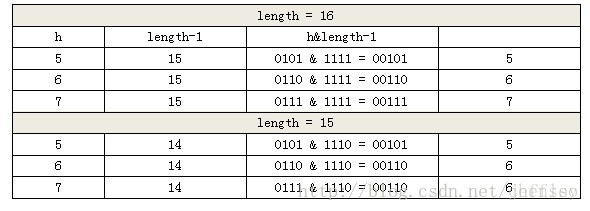
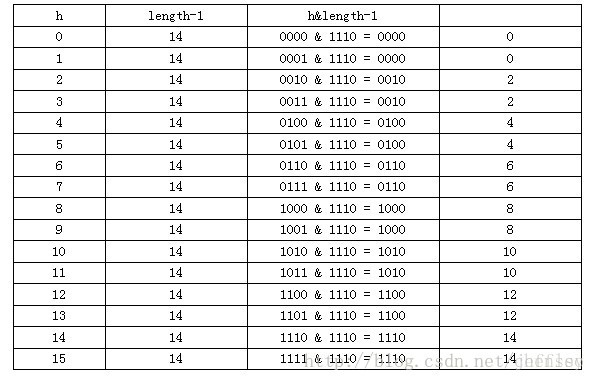

# Interface Iterable

迭代器接口，这是Collection类的父接口。实现这个Iterable接口的对象允许使用foreach进行遍历，也就是说，所有的Collection集合对象都具有"foreach可遍历性"。这个Iterable接口只
有一个方法: iterator()。它返回一个代表当前集合对象的泛型<T>迭代器，用于之后的遍历操作

## 1.1 Collection

Collection是最基本的集合接口，一个Collection代表一组Object的集合，这些Object被称作Collection的元素。Collection是一个接口，用以提供规范定义，不能被实例化使用

## 1) Set

 Set集合类似于一个罐子，"丢进"Set集合里的多个对象之间没有明显的顺序。Set继承自Collection接口，不能包含有重复元素(记住，这是整个Set类层次的共有属性)。
 Set判断两个对象相同不是使用"=="运算符，而是根据equals方法。也就是说，我们在加入一个新元素的时候，如果这个新元素对象和Set中已有对象进行注意equals比较都返回false，　　
 　 则Set就会接受这个新元素对象，否则拒绝。
 因为Set的这个制约，在使用Set集合的时候，应该注意两点：1) 为Set集合里的元素的实现类实现一个有效的equals(Object)方法、2) 对Set的构造函数，传入的Collection参数不能包
　　含重复的元素

### 1.1) HashSet

​     HashSet是Set接口的典型实现，HashSet使用HASH算法来存储集合中的元素，因此具有良好的存取和查找性能。当向HashSet集合中存入一个元素时，HashSet会调用该对象的
　　　　 hashCode()方法来得到该对象的hashCode值，然后根据该HashCode值决定该对象在HashSet中的存储位置。
     值得主要的是，HashSet集合判断两个元素相等的标准是两个对象通过equals()方法比较相等，并且两个对象的hashCode()方法的返回值相等

#### 1.1.1) LinkedHashSet

​         LinkedHashSet集合也是根据元素的hashCode值来决定元素的存储位置，但和HashSet不同的是，它同时使用链表维护元素的次序，这样使得元素看起来是以插入的顺序保存的。
　　　　　　　当遍历LinkedHashSet集合里的元素时，LinkedHashSet将会按元素的添加顺序来访问集合里的元素。
         LinkedHashSet需要维护元素的插入顺序，因此性能略低于HashSet的性能，但在迭代访问Set里的全部元素时(遍历)将有很好的性能(链表很适合进行遍历)

## 1.2) SortedSet

​     此接口主要用于排序操作，即实现此接口的子类都属于排序的子类
         1.2.1) TreeSet
         TreeSet是SortedSet接口的实现类，TreeSet可以确保集合元素处于排序状态
     1.3) EnumSet
     EnumSet是一个专门为枚举类设计的集合类，EnumSet中所有元素都必须是指定枚举类型的枚举值，该枚举类型在创建EnumSet时显式、或隐式地指定。EnumSet的集合元素也是有序的，
　　　　 它们以枚举值在Enum类内的定义顺序来决定集合元素的顺序

## 2) List

 List集合代表一个元素有序、可重复的集合，集合中每个元素都有其对应的顺序索引。List集合允许加入重复元素，因为它可以通过索引来访问指定位置的集合元素。List集合默认按元素
　　 的添加顺序设置元素的索引
     2.1) ArrayList
     ArrayList是基于数组实现的List类，它封装了一个动态的增长的、允许再分配的Object[]数组。
     2.2) Vector
     Vector和ArrayList在用法上几乎完全相同，但由于Vector是一个古老的集合，所以Vector提供了一些方法名很长的方法，但随着JDK1.2以后，java提供了系统的集合框架，就将
　　　　 Vector改为实现List接口，统一归入集合框架体系中
         2.2.1) Stack
         Stack是Vector提供的一个子类，用于模拟"栈"这种数据结构(LIFO后进先出)
     2.3) LinkedList
     implements List<E>, Deque<E>。实现List接口，能对它进行队列操作，即可以根据索引来随机访问集合中的元素。同时它还实现Deque接口，即能将LinkedList当作双端队列
　　　　 使用。自然也可以被当作"栈来使用"

## 3) Queue

 Queue用于模拟"队列"这种数据结构(先进先出 FIFO)。队列的头部保存着队列中存放时间最长的元素，队列的尾部保存着队列中存放时间最短的元素。新元素插入(offer)到队列的尾部，
　　 访问元素(poll)操作会返回队列头部的元素，队列不允许随机访问队列中的元素。结合生活中常见的排队就会很好理解这个概念
     3.1) PriorityQueue
     PriorityQueue并不是一个比较标准的队列实现，PriorityQueue保存队列元素的顺序并不是按照加入队列的顺序，而是按照队列元素的大小进行重新排序，这点从它的类名也可以
　　　　 看出来
     3.2) Deque
     Deque接口代表一个"双端队列"，双端队列可以同时从两端来添加、删除元素，因此Deque的实现类既可以当成队列使用、也可以当成栈使用
         3.2.1) ArrayDeque
         是一个基于数组的双端队列，和ArrayList类似，它们的底层都采用一个动态的、可重分配的Object[]数组来存储集合元素，当集合元素超出该数组的容量时，系统会在底层重
　　　　　　　新分配一个Object[]数组来存储集合元素
         3.2.2) LinkedList

## 1.2 Map

Map用于保存具有"映射关系"的数据，因此Map集合里保存着两组值，一组值用于保存Map里的key，另外一组值用于保存Map里的value。key和value都可以是任何引用类型的数据。Map的key不允
许重复，即同一个Map对象的任何两个key通过equals方法比较结果总是返回false。
关于Map，我们要从代码复用的角度去理解，java是先实现了Map，然后通过包装了一个所有value都为null的Map就实现了Set集合
Map的这些实现类和子接口中key集的存储形式和Set集合完全相同(即key不能重复)
Map的这些实现类和子接口中value集的存储形式和List非常类似(即value可以重复、根据索引来查找)
 1) HashMap
 和HashSet集合不能保证元素的顺序一样，HashMap也不能保证key-value对的顺序。并且类似于HashSet判断两个key是否相等的标准也是: 两个key通过equals()方法比较返回true、
　　 同时两个key的hashCode值也必须相等

### 1.1) LinkedHashMap

​     LinkedHashMap也使用双向链表来维护key-value对的次序，该链表负责维护Map的迭代顺序，与key-value对的插入顺序一致(注意和TreeMap对所有的key-value进行排序进行区
分)

### 2) Hashtable

 是一个古老的Map实现类
     2.1) Properties 
     Properties对象在处理属性文件时特别方便(windows平台上的.ini文件)，Properties类可以把Map对象和属性文件关联起来，从而可以把Map对象中的key-value对写入到属性文
　　　　　件中，也可以把属性文件中的"属性名-属性值"加载到Map对象中

### 3) SortedMap

 正如Set接口派生出SortedSet子接口，SortedSet接口有一个TreeSet实现类一样，Map接口也派生出一个SortedMap子接口，SortedMap接口也有一个TreeMap实现类
     3.1) TreeMap
     TreeMap就是一个红黑树数据结构，每个key-value对即作为红黑树的一个节点。TreeMap存储key-value对(节点)时，需要根据key对节点进行排序。TreeMap可以保证所有的
　　　　 key-value对处于有序状态。同样，TreeMap也有两种排序方式: 自然排序、定制排序

### 4) WeakHashMap

 WeakHashMap与HashMap的用法基本相似。区别在于，HashMap的key保留了对实际对象的"强引用"，这意味着只要该HashMap对象不被销毁，该HashMap所引用的对象就不会被垃圾回收。
　　但WeakHashMap的key只保留了对实际对象的弱引用，这意味着如果WeakHashMap对象的key所引用的对象没有被其他强引用变量所引用，则这些key所引用的对象可能被垃圾回收，当垃
　　圾回收了该key所对应的实际对象之后，WeakHashMap也可能自动删除这些key所对应的key-value对

### 5) IdentityHashMap

 IdentityHashMap的实现机制与HashMap基本相似，在IdentityHashMap中，当且仅当两个key严格相等(key1 == key2)时，IdentityHashMap才认为两个key相等

### 6) EnumMap

 EnumMap是一个与枚举类一起使用的Map实现，EnumMap中的所有key都必须是单个枚举类的枚举值。创建EnumMap时必须显式或隐式指定它对应的枚举类。EnumMap根据key的自然顺序
　　(即枚举值在枚举类中的定义顺序)


## HashMap#indexFor

计算该hash值在table中的下标

```
    static int indexFor(int h, int length) {
        return h & (length-1);
    }123
```

对于HashMap的table而言，数据分布需要均匀（最好每项都只有一个元素，这样就可以直接找到），不能太紧也不能太松，太紧会导致查询速度慢，太松则浪费空间。计算hash值后，怎么才能保证table元素分布均与呢？我们会想到取模，但是由于取模的消耗较大，而HashMap是通过&运算符（按位与操作）来实现的：h  & (length-1)

　　在构造函数中存在：capacity <<=  1，这样做总是能够保证HashMap的底层数组长度为2的n次方。当length为2的n次方时，h&(length -  1)就相当于对length取模，而且速度比直接取模快得多，这是HashMap在速度上的一个优化。至于为什么是2的n次方下面解释。 
 　　我们回到indexFor方法，该方法仅有一条语句：h&(length - 1)，这句话除了上面的取模运算外还有一个非常重要的责任：均匀分布table数据和充分利用空间。 
 　　这里我们假设length为16(2^n)和15，h为5、6、7。 
 　　 
 　　当length-1 = 14时，6和7的结果一样，这样表示他们在table存储的位置是相同的，也就是产生了碰撞，6、7就会在一个位置形成链表，这样就会导致查询速度降低详细地看看当length-1 = 14 时的情况： 
 　　 
 　　可以看到，这样发生发生的碰撞是非常多的，1,3,5,7,9,11,13都没有存放数据，空间减少，进一步增加碰撞几率，这样就会导致查询速度慢， 
 　　分析一下：当length-1 = 14时，二进制的最后一位是0，在&操作时，一个为0，无论另一个为1还是0，最终&操作结果都是0，这就造成了结果的二进制的最后一位都是0，这就导致了所有数据都存储在2的倍数位上，所以说，**所以说当length = 2^n时，不同的hash值发生碰撞的概率比较小，这样就会使得数据在table数组中分布较均匀，查询速度也较快。**