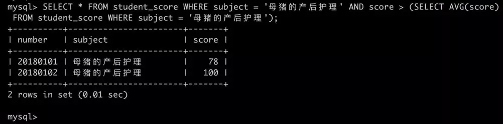

### 总结

1. 数据库底层使用表来存放数据的，一张表有很多列，每个列都有可能存放不同格式的数据，不同格式的数据是不能混用的，所以`MySQL`提出了许多类型来存储不同格式的数据。
2. 用来存储整数的类型有`TINYINT`、`SMALLINT`、`MEDIUMINT`、`INT`、`BIGINT`这几种，它们需要的存储空间不同，所以能表示的整数范围也不同。
3. 用来存储小数的有`FLOAT`、`DOUBLE`、`DECIMAL`类型，前两个属于浮点型，后一个属于定点型，浮点型更省存储空间，而定点型更精确，这些表示小数的类型都可以使用(M, D)来指定小数的有效位数和小数位数。
4. 用来存储字符串的有`CHAR(M)`、`VARCHAR`、`TEXT`、`MEDIUMTEXT`、`LONGTEXT`这几种，它们实际占用的字节存储空间依赖与我们当前使用的字符编码，因为在不同编码下，同一个字符可能被编码成不同长度的字节数据，其中的`CHAR(M)`是固定长度的类型，其余集中都是可变长度的类型，真实长度取决于实际的字符串长度。
5. 用来存储时间的有`YEAR`、`DATE`、`TIME`、`DATETIME`、`TIMESTAMP`这几种类型，需要注意的是，在在`MySQL5.6.4`这个版本之后，`TIME`、`DATETIME`、`TIMESTAMP`这几种类型添加了对小数秒的支持，但是存储小数秒又要使用额外的存储空间。另外，`TIMESTAMP`这种类型存储的是自`1970-01-01 00:00:00`时刻起的秒数，所以在不同时区下会显示不同的时间值。
6. 用来存储二进制数据的有`BIT(M)`、`BINARY(M)`、`VARBINARY(M)`、`TINYBLOB`、`BLOB`、`MEDIUMBLOB`、`LONGBLOB`这几种，除了`BIT(M)`是以二进制位为单位的以外，其余的类型都是以字节为单位的，并且它们的使用类似字符串中的各种类型，只不过一个是以字符为单位，一个以字节为单位而已～

### 总结

1. MySQL的基本运行过程是：客户端程序发送命令给服务器程序，服务器程序按照接收的命令去操作实际的数据，然后把结果返回到客户端。

2. 在MySQL客户端输入命令时有一些注意事项：

3. - `;`、`\g`、`\G`都可以作为命令结束符号。
   - 只要按回车键的时候输入的语句里没有`;`、`\g`或者`\G`就算是语句没结束，可以换行后继续输入命令。
   - 可以一次提交多个命令。
   - 使用`\c`清除本次操作。
   - MySQL默认对命令的大小写并没有限制。
   - 字符串可以被单引号`'`或者双引号`"`引起来，但是我们推荐使用单引号`'`。

4. `MySQL服务器`可以包含若干数据库，每个数据库中可以包含若干个表。

5. 数据库相关操作如下：

6. - 展示数据库：`SHOW DATABASES;`
   - 创建数据库：`CREATE DATABASE 数据库名;`
   - 切换当前数据库：`USE 数据库名`
   - 删除数据库：`DROP DATABASE 数据库名`

7. `IF EXISTS` 和 `IF NOT EXISTS`在创建和删除数据库时使用可以避免`ERROR`产生。

   

   ##### 主键和唯一性约束的区别

主键和唯一性约束都能保证某个列或者列组合的唯一性，但是：

1. ==一张表中只能定义一个主键，却可以定义多个唯一性约束！==
2. ==主键列不允许存放NULL值，而普通的唯一性约束列可以存放NULL值！==

在使用递增属性的时候需要注意这几点：

1. ==一个表中最多有一个递增列。==
2. ==一般只为整数类型的列定义递增属性，浮点数类型基本不用递增属性。==
3. ==具有`AUTO_INCREMENT`属性的列必须建立索引。主键和具有唯一性约束的列会自动建立索引。==
4. 一般递增列都是作为主键的属性，来自动生成唯一标识一个记录的主键值。
5. 因为具有`AUTO_INCREMENT`属性的列是从1开始递增的，所以最好用`UNSIGNED`来修饰这个列，可以提升正数的表示范围。

#### 约束性条件的组合

每个列可以有多个约束性条件，声明的顺序无所谓，各个约束性条件之间用空白隔开就好了～

```
小贴士：
注意，有的约束性条件是冲突的，一个列不能具有两个冲突的约束性条件，比如一个列不能既声明为`PRIMARY KEY`，又声明为`UNIQUE KEY`，不能既声明为`DEFAULT NULL`，又声明为`NOT NULL`。大家在使用过程中需要注意这一点。
```


### 总结

1. 创建表：

   ```
   CREATE TABLE 表名 (
       列名, 列的类型, [列的属性] COMMENT '列的注释',
       ... （若干个列的信息）
   ) COMMENT '表的注释';
   ```

2. 删除表：`DROP TABLE 表名;`

3. 各种约束性条件

4. - 方式一：

     ```
     列名 列的类型 UNIQUE [KEY]
     ```

   - 方式二：

     ```
     UNIQUE [KEY] [约束名称] (列名1, 列名2, ...)
     ```

   - 方式一：

     ```
     列名 列的类型 PRIMARY KEY
     ```

   - 方式二：

     ```
     PRIMARY KEY (列名1, 列名2, ...)
     ```

   - 默认值：在插入语句中没有指定该列的值的情况下，使用默认值，声明语法如下：

     ```
     列名 列的类型 DEFAULT 默认值
     ```

   - 非空约束：声明了该属性的列不允许插入`NULL`值，声明语法：

     ```
     列名 列的类型 NOT NULL
     ```

   - 主键：唯一标识一条记录，并且一个表中最多字能有一个主键，主键值不能为`NULL`，声明语法：

   - 唯一性约束：唯一标识一条记录，一个表中可以有多个唯一性约束，并且值可以为`NULL`，声明语法：

   - 外键：表A的某个列或列组合的值依赖表B的某个列或列组合的值，则成表A为子表，表B为父表，表A的该列或者列组合称为外键，声明外键的方式如下：

     ```
     CONSTRAINT [外键名称] FOREIGN KEY(列1, 列2, ...) REFERENCES 父表名(父列1, 父列2, ...);
     ```

   - 自增：在插入语句没有包含自增列的情况下，该列的值会递增，声明方式如下：

     ```
     列名 列的类型 AUTO_INCREMENT
     ```

## 总结

1. 可以在列信息或者表信息后边用`COMMENT`语句添加注释。

2. 建议大家不要起各种非主流的名称，也不要使用全数字、带有空白字符或者MySQL保留字的名称，如果非要用的话需要用反引号`\`\``引起来，我们鼓励使用小写字母、数字、下划线、美元符号等作为名称，如果有多个单词的话，各个单词之间用下划线连接起来。

3. 可以用下边这些语句查看表结构：

4. - `DESCRIBE 表名`;
   - `DESC 表名`;
   - `EXPLAIN 表名`;
   - `SHOW COLUMNS FROM 表名`;
   - `SHOW FIELDS FROM 表名`;
   - `SHOW CREAETE TABLE 表名`;

5. 如果声明了`ZEROFILL` 属性的整数列的实际值的位数小于显示宽度时，会在实际值的左侧补0，使补0的位数和实际值的位数相加正好等于显示宽度。使用时有一堆注意事项：

6. - 该列必须是整数类型的
   - 该列必须有UNSIGNED ZEROFILL的属性
   - 该列的实际值的位数必须小于显示宽度
   - 在查询时，数据自动补0的条件有这几个：
   - 在创建表的时候，如果声明了ZEROFILL属性的列没有声明UNSIGNED属性，那MySQL会为该列自动生成UNSIGNED属性。
   - 每个整数类型都会有默认的显示宽度。
   - 显示宽度并不会影响实际类型的实际存储空间。
   - 对于没有声明ZEROFILL属性的列，显示宽度没有一毛钱卵用。
   - 只有列的实际值的位数小于显示宽度时才会补0，实际值的位数大于显示宽度时照原样输出。

7. 修改表的相关操作如下：

8. - 方式一：

     ```
     ALTER TABLE 表名 MODIFY 列名 新数据类型 [新属性] [FIRST|AFTER 指定列名];
     ```

   - 方式二：

     ```
     ALTER TABLE 表名 CHANGE 旧列名 新列名 新数据类型 [新属性] [FIRST|AFTER 指定列名];
     ```

   - 方式一：

     ```
     ALTER TABLE 旧表名 RENAME TO 新表名;
     ```

   - 方式二：

     ```
     RENAME TABLE 旧表名1 TO 新表名1, 旧表名2 TO 新表名2, ... 旧表名n TO 新表名n;
     ```

   - 修改表名：

   - 添加列：

     ```
     ALTER TABLE 表名 ADD COLUMN 列名 列的类型 [列的属性] [FIRST|AFTER 指定列名];
     ```

   - 删除列：

     ```
     ALTER TABLE DROP COLUMN 列名;
     ```

   - 修改列信息：

### 总结

1. 我们可以在`SELECT`后边指定要查询的列的列表，然后在`FROM`后边指定要查询的表，可以只查询单个列的值，也可以查询多个列的值，也可以使用`*`简单的代表查询所有列的值。
2. ==如果我们想去除重复结果的话，可以使用`DISTINCT`放在被查询的列前边。==需要注意的是，两条记录重复的意思是，所以使用`DISTINCT`在多个列上会把两条记录的每一个列中的值都相同的重复行去掉，而不能做到不能做到一部分列去重，另一部分不去重。
3. ==使用`LIMIT`语句限制查询结果的行数，`LIMIT`子句可以携带两个参数，其中`开始行`指的是我们想从第几行数据开始查询，`限制条数`是查询结果最多返回的记录条数。==参数`开始行`可以被省略，默认从第0行开始。
4. 如果我们想让返回结果中的记录按照某种特定的规则排序，那我们必须显式的使用`ORDER BY`指定排序规则。其中，`ASC`指按照指定列的值的升序排序，`DESC`指按照指定列的值的降序排序。如果`ORDER BY`子句后有多个列的话，会先按照前边的列进行排序，如果前边的列的值相同，在相同的这些行中再按照后边的列进行排序。

## 总结

1. ==我们需要将搜索条件放到`WHERE`子句中。针对不同的搜索条件，MySQL提供了非常丰富的操作符。==

2. ==如果某一列可以匹配的值有多个，可以使用`IN`或者`NOT IN`操作符。==

3. ==判断某个列的值是不是`NULL`，需要用`IS NULL`或者`IS NOT NULL`操作符。==

4. 我们可以将多个简单的搜索条件合并在一起组成一个更大搜索条件，各个简单的搜索条件可以用下边的几种操作符连接起来：

5. - AND操作符：该操作符两边的搜索条件全部满足后整个搜索条件才算满足。
   - OR操作符：该操作符两边的搜索条件只需要满足一个整个搜索条件就满足了

6. `%`代表任意一个字符串，`_`代表任意一个字符。如果需要把这两个通配符当作pu t不过需要特别注意的是，通配符不能代表`NULL`，如果需要匹配`NULL`的话，需要使用`IS NULL`或者`IS NOT NULL`！

7. `%`代表任意一个字符串，`_`：代表任意一个字符。如果需要把通配符当作普通字符看待的话，需要使用反斜杠`\`进行转义。另外，通配符不能代表`NULL`，如果需要匹配`NULL`的话，需要使用`IS NULL`或者`IS NOT NULL`

##### ==COUNT函数==

==`COUNT`函数使用来统计行数的，它有下边两种使用方式：==

1. ==`COUNT(*)`：对表中行的数目进行计数，不管列中包含的是不是`NULL`值。==
2. ==`COUNT(列名)`：对特定的列进行计数，会忽略掉`NULL`值的行。==

两者的区别是会不会忽略列中的NULL值！


### 总结

1. 可能发生转换的场景有下边这几种：

2. - 把操作数类型转换为适合操作符计算的相应类型。
   - 将函数参数转换为该函数期望的类型。
   - 存储数据时，把某个值转换为某个列需要的类型。

3. 类型转换时需要注意的一些地方：

4. - MySQL会尽量把值转换为表达式中需要的类型，而不是产生错误。
   - 在运算时可能会自动提升操作数的类型。

5. MySQL使用`GROUP BY`子句创建分组，方便我们统计信息。分组的存在仅仅是为了方便我们统计每个分组中的信息，所以我们只需要把分组列和聚集函数放到查询列表处就好。

6. ==对每个分组的统计信息进行过滤使用`HAVING`子句。==

7. ==使用分组注意事项：==

8. - ==如果分组列中含有NULL值，那么NULL也会作为一个独立的分组存在。==
   - ==如果存在多个分组列，也就是嵌套分组，聚集函数将作用在最后的那个分组列上。==
   - ==如果查询语句中存在WHERE子句和ORDER BY子句，那么GROUP BY子句必须出现在WHERE子句之后，ORDER BY子句之前。==
   - ==非分组列不能单独出现在检索列表中(可以被放到聚集函数中)。==
   - ==GROUP BY子句后也可以跟随表达式(但不能是聚集函数)。==
   - ==WHERE子句在数据分组前进行过滤，作用于每一条记录，WHERE子句过滤掉的记录将不包括在分组中。而HAVING子句在数据分组后进行过滤，作用于整个分组。==

9. 简单的查询语句的格式如下：

   ```
   SELECT [DISTINCT] 查询列表
   [FROM 表名]
   [WHERE 布尔表达式]
   [GROUP BY 分组列表 [HAVING 分组过滤条件] ]
   [ORDER BY 排序列表]
   [LIMIT 开始行, 限制条数]
   ```

   其中各个部分的含义如下：

10. - `SELECT 查询列表`：

      指定要查询的对象，可以是任意的合法表达式，不过通常我们都是指定列名为查询对象的。

    - `[DISTINCT]`：

      在查询列表前指定`DISTINCT`，会将结果集中相同的记录去除掉。

    - `FROM 表名`

      指定要查询的表。

    - `WHERE 布尔表达式`

      对表中的记录进行过滤，符合指定布尔表达式的记录将被加入到结果集。

    - `GROUP BY 分组列表 [HAVING 分组过滤条件]`：

      在统计数据的时候，可以按照分组列表中的列或者表达式将结果分成若干组，分组之后可以使用聚集函数对各组数据进行统计。如果有过滤分组的需求，可以使用`HAVING`子句来进行过滤。

    - `ORDER BY 排序列表`：

      查询语句并不保证得到的结果集中记录是有序的，我们可以通过指定`ORDER BY`子句来明确要排序的列。

    - `LIMIT 开始行, 限制条数`：

      如果最后查询的得到的结果集中记录太多，我们可以通过`LIMIT`子句来指定结果集中开始查询的行以及一次查询最多返回的记录条数

      

### 标量子查询


小括号中的查询语句也被称为`子查询`或者`内层查询`，使用`内层查询`的结果作为搜索条件的查询称为`外层查询`。如果你在一个查询语句中需要用到更多的表的话，那么在一个子查询中可以继续嵌套另一个子查询，在执行查询时，将按照从内到外的顺序依次执行这些查询。

在这个例子中的子查询的结果只有一个值(也就是`'杜琦燕'`的学号)，这种子查询称之为`标量子查询`。正因为`标量子查询`单纯的代表一个值，所以它可以作为表达式的操作数来参与运算，它除了用在外层查询的搜索条件以外，也可以作为查询对象放在查询列表处，比如这样：

```
mysql> SELECT (SELECT number FROM student_info WHERE name = '杜琦燕') AS 学号;
+----------+
| 学号     |
+----------+
| 20180102 |
+----------+
1 row in set (0.00 sec)
mysql>
```

因为`标量子查询`单纯的代表一个值，所以外层查询的搜索条件想怎么写就怎么写喽，只要符合布尔表达式的语法就可以，比方说我们来查询学号大于`'杜琦燕'`的学号的学生成绩，可以这么写：


这样查出来的成绩记录中的学号都是大于`'杜琦燕'`的学号。

### IN和NOT IN子查询

有时候子查询的结果并不是单纯的一个值，而是多个值，比如我们想查询`'计算机科学与工程'`专业的学生的成绩，那我们可以拆成下边两个查询：


很显然对于子查询结果是多个值的情况，需要使用`IN`这种多值匹配操作符，所以我们可以把上边两个语句合并成这样：


`NOT IN`和`IN`的使用差不多，就不赘述了。

### 多列子查询

上边例子中出现的子查询的结果集里只有一个列，其实子查询的结果集也可以有多个列的，只不过在子查询的查询列表和外层查询`WHERE`子句的搜索条件要匹配！比如我们可以这么写：


在这个例子中的子查询的查询列表是`number, '母猪的产后护理'`，`number`是列名，`'母猪的产后护理'`是一个常数，所以在外层查询的`WHERE`子句的搜索条件里也需要两个表达式，例子中使用的是``(number, subject)`。需要注意的是，WHERE子句的搜索条件中多个表达式需要用小括号()括住。

### EXISTS和NOT EXISTS子查询

有时候外层查询并不关心子查询中的结果是什么，而只关心子查询的结果是不是为空，这时可以用到下边这两个操作符：


我们来举个例子：

```
mysql> SELECT * FROM student_score WHERE EXISTS (SELECT * FROM student_info WHERE number = 20180108);
Empty set (0.00 sec)

mysql>
```

这个例子的子查询的意思是在`student_info`表中查找学号为`20180108`的学生信息，很显然并没有学号为`20180108`的学生，所以子查询没有结果，`EXISTS`表达式的结果为`FALSE`，所以外层查询也就不查了，直接返回了一个`Empty set`，表示没有结果。你可以自己试一下`NOT EXISTS`的使用。

### 相关子查询

前边介绍的子查询和外层查询都没有依赖关系，也就是说可以独立运行完子查询得到结果之后，再拿结果作为外层查询的搜索条件去执行外层查询，这种子查询称为`不相关子查询`，比如下边这个查询：


子查询中只用到了`student_info`表而没有使用到`student_score`表，这就是一种典型的`不相关子查询`。

而有时候我们需要在子查询的语句中引用到外层查询的值，这样的话子查询就不能当作一个独立的语句去执行，这种子查询方式称为`相关子查询`。比方说我们想查看一些学生的基本信息，但是前提是这些学生有成绩记录，那可以这么写：


首先需要注意的是，`student_info`和`student_score`表里都有`number`列，所以在子查询的`WHERE`语句中书写`number = number`会造成二义性，也就是让服务器懵逼，不知道这个`number`列到底是哪个表的，所以为了区分，在列名前边加上了表名，并用点`.`连接起来，这种显式的将列所属的表名书写出来的名称称为该列的`全限定名`。所以上边子查询的`WHERE`语句中用了列的全限定名：`student_score.number = student_info.number`。

这条查询语句可以分成这么两部分来理解

- 我们要查询学生的一些基本信息。
- 这些学生必须符合这样的条件：`必须在student_score表中有记录`。

所以这个例子中的`相关子查询`的查询过程是这样的：

1. 先执行外层查询获得到`student_info`表的第一条记录，发现它的`number`值是`20180101`。把`20180101`当作参数传入到它的子查询，此时子查询的使意思判断`student_score`表的`number`字段是否有`20180101`这个值存在，子查询的结果是该值存在，所以整个`EXISTS`表达式的值为`TRUE`，那么`student_info`表的第一条记录可以被加入到结果集。
2. 再执行外层查询获得到`student_info`表的第二条记录，发现它的`number`值是`20180102`，与上边的步骤相同，`student_info`表的第二条记录也可以被加入到结果集。
3. 与上边类似，`student_info`表的第三条记录也可以被加入到结果集。
4. 与上边类似，`student_info`表的第四条记录也可以被加入到结果集。
5. 再执行外层查询获得到`student_info`表的第五条记录，发现它的`number`值是`20180105`，把`20180105`当作参数传入到它的子查询，此时子查询的使意思判断`student_score`表的`number`字段是否有`20180105`这个值存在，子查询的结果是该值不存在，所以整个`EXISTS`表达式的值为`FALSE`，那么`student_info`表的第五条记录就不被加入结果集中。
6. 与上边类似，`student_info`表的第六条记录也不被加入结果集中。
7. `student_info`表没有更多的记录了，结束查询。

所以最后的查询结果是上边的4条记录。如果你觉得`相关子查询`还是有点儿绕的话，那就返回去再重新看几遍这个查询过程。需要注意的是，相关子查询通常都用在`EXISTS`和`NOT EXISTS`子查询里，用于匹配在某个表里查找在另一个表里有匹配行或者没有匹配行的行。

### 对同一个表的子查询

其实不只是在查询多表的时候会用到子查询，在单个表中有时也会用到子查询。比方说我们想看看在`student_score`表的`'母猪的产后护理'`这门课的成绩中，有哪些超过了平均分的记录，脑子中第一印象是这么写：

```
mysql> SELECT * FROM student_score WHERE subject = '母猪的产后护理' AND score > AVG(score);
ERROR 1111 (HY000): Invalid use of group function
mysql>
```

需要特别特别特别注意的是：聚集函数不能放到WHERE子句中！！！因为`WHERE`子句是针对每一条记录来进行过滤的，而聚集函数只能用于过滤分组。所以如果我们想实现上边的需求，就需要搞一个`student_score`表的副本，就相当于有了两个`student_score`表，在一个表上使用聚集函数统计，统计完了之后拿着统计结果再到另一个表中进行过滤，这个过程可以这么写：



我们使用子查询先统计出了`'母猪的产后护理'`这门课的平均分，然后再到外层查询中使用这个平均分作为过滤条件来查找大于平均分的记录。这样看上去student_score表就像是有了一个副本一样～。

### 子查询注意事项

1. 标量子查询的结果只有一个值，如果结果有多个值的话会报错，可以在查询语句末尾使用`LIMIT 1`来保证只有一条结果。
2. 子查询的查询列表和外层查询WHERE子句的搜索条件要匹配！如果外层查询的`WHERE`子句中的表达式个数大于1个，需要用小括号`()`扩起来。
3. 在引用的列可能出现二义性时，必须使用列的全限定名(也就是用一个点`.`分隔的表名和列名)来注明该列所属的表。
4. `相关子查询`是涉及外部查询的子查询，一般用在`EXISTS`和`NOT EXISTS`子查询里。


# 数据目录

### 总结

1. 对于`InnoDB`、`MyISAM`这样的存储引擎会把数据存储到文件系统上。

2. 数据目录和安装目录是两个东西！

3. 查看数据目录位置的两个方式：

4. - 服务器未启动时（类Linux操作系统）：

     ```
     mysqld --verbose --help | grep datadir
     ```

   - 服务器启动后：

     ```
     SHOW VARIABLES LIKE 'datadir';
     ```

5. 每个数据库都对应数据目录下的一个子目录。

6. 表在文件系统上表示分两部分

7. - 表结构的定义

     不论是`InnoDB`还是`MyISAM`，都会在数据库子目录下创建一个和表名同名的`.frm`文件。

   - 表中的数据

     针对`InnoDB`和`MyISAM`对于表数据有不同的存储方式。

8. 对于`InnoDB`存储引擎来说，使用`表空间`来存储表中的数据，`表空间`分两种类型：

9. - 系统表空间

     默认情况下，`InnoDB`将所有的表数据都存储到这个系统表空间内，它是一个抽象的概念，实际可以对应着文件系统中若干个真实文件。

   - 独立表空间

     如果有需要的话，可以为每个表分配独立的表空间，只需要在启动服务器的时候将`innodb_file_per_table`参数设置为`1`即可。每个表的独立表空间对应的文件系统中的文件是在数据库子目录下的与表名同名的`.ibd`文件。

10. 由于`MySQL`中的数据实际存储在文件系统上，所以会收到文件系统的一些制约：

11. - 数据库名称和表名称不得超过文件系统所允许的最大长度。
    - 会把数据库名和表名中所有除数字和拉丁字母以外的所有字符在文件名里都映射成 `@+编码值`的形式作为文件名。
    - 文件长度受文件系统最大长度限制。
    - 如果同时访问的表的数量非常多，可能会受到文件系统的文件描述符有限的影响。


# Buffer Pool

### 表空间的编号

我们在唠叨`数据目录`的时候就已经说过，`InnoDB`存储引擎是使用`表空间`来存储`页`的，`表空间`又可以被分为系统表空间和独立表空间。为了方便管理，每个`表空间`都会有一个`4`字节的编号，值得注意的一点是，系统表空间的编号始终为`0`，`InnoDB`也会根据一定规则给其他独立表空间也编上号～

所以，当我们查看或修改某个`页`的数据的时候，实际上需要同时知道表空间的编号和该页的编号，也就是`表空间号 + 页号`的组合才能定位到某一个具体的`页`。如果你有认真看前边唠叨`InnoDB页结构`的那篇文章，肯定记得每个`页`的编号也是占用`4`个字节，而在一个`表空间`内页的编号是不能重复的，`4`个字节是`32`个二进制位，也就是说：一个表空间最多拥有 **2³²** 个页，默认情况下一个页的大小为16KB，也就是说一个表空间最多存储 **64TB** 的数据～

### 缓存的重要性

所谓的`表空间`只不过是`InnoDB`对文件系统上一个或几个实际文件的抽象，我们的数据说到底还是存储在磁盘上的。但是各位也都知道，磁盘的速度慢的跟乌龟一样，怎么能配得上“快如风，疾如电”的`CPU`呢？所以将内存作为缓存也是无奈之举。MySQL服务器在处理客户端的请求时，当需要访问某个页的数据时，就会把完整的页的数据全部加载到内存中，也就是说即使我们只需要访问一个数据页的一条记录，那也需要先把整个页的数据加载到内存中。这是为了不必每次请求都去访问一下磁盘，那得多慢啊～

对某个`页`的访问类型分为两种，一种是只读访问，一种是写入访问。只读访问好办，就是把磁盘上的`页`加载到内存中读而已；而如果需要修改该页的数据就有点尴尬了，首先会把数据写到内存中的页中，然后在某个合适的时刻将修改过的页 **同步** 到磁盘上

### 总结

1. 我们可以通过`表空间号 + 页号`的组合可以定位到某一个具体的`页`。

2. 磁盘太慢，用内存作为缓存很有必要。

3. `Buffer Pool`本质上是`InnoDB`向操作系统申请的一段连续的内存空间，可以通过`innodb_buffer_pool_size`来调整它的大小。

4. `Buffer Pool`由控制块和缓存页组成，每个控制块和缓存页都是一一对应的，在填充足够多的控制块和缓存页的组合后，`Buffer Pool`剩余的空间可能产生不够填充一组控制块和缓存页，这部分空间不能被使用，也被称为`碎片`。

5. `InnoDB`使用了许多`链表`来管理`Buffer Pool`。

6. `Free链表`中每一个节点都代表一个空闲的缓存页，在将磁盘中的页加载到`Buffer Pool`时，会从`Free链表`中寻找空闲的缓存页。

7. 为了快速定位某个页是否被加载到`Buffer Pool`，使用`表空间号 + 页号`作为`key`，缓存页作为`value`，建立哈希表。

8. 在`Buffer Pool`中被修改的页称为`脏页`，脏页并不是立即刷新，而是被加入到`FLU链表`中，待之后的某个时刻同步到磁盘上。

9. `LRU链表`分为`young`和`old`两个区域，可以通过`innodb_old_blocks_pct`来调节`old`区域所占的比例。首次从磁盘上加载到`Buffer Pool`的页会被放到`old`区域的头部，如果在`innodb_old_blocks_time`间隔时间后该页该页没有被淘汰掉并且仍在`old`区域时，会把它放到`LRU`链表的头部，也就是`young`区域的头部。在`Buffer Pool`没有可用的空闲缓存页时，会首先淘汰掉`old`区域的一些页。

10. 我们可以通过指定`innodb_buffer_pool_instances`来控制`Buffer Pool`的个数，每个`Buffer Pool`中都有各自独立的链表，互不干扰。

11. 可以用下边的命令查看`Buffer Pool`的状态信息：

    ```
    SHOW ENGINE INNODB STATUS\G
    ```