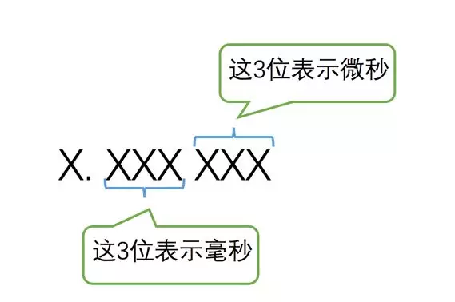

## 数据类型优化

我们知道表是由若干个列组成的，在定义表结构的时候我们必须显式的指定各个列的数据类型。不同数据类型的列可能占用不同大小的存储空间，也可能有不同的性能表现，在选择数据类型上，大家最好遵循下边的原则：

- 选择更小的数据类型

  数据类型的大小指的是它们表示数据范围的大小。比如`INT`比`BIGINT`更小，`MEDIUMINT`又比`INT`小，更小的数据类型在空间和时间上都有好处：

- - 更小的数据类型意味着占用更少的磁盘空间，从而可以减少`I/O`造成的性能损耗，也可以在内存中缓存更多的记录，从而减少与磁盘的交互。
  - 更小的数据类型意味着CPU可以更快的进行计算。

- 当然这是在业务逻辑允许的情况下才去选择更小的数据类型，比如说你必须要存储一个比`127`还大的数，虽然`TINYINT`数据类型更小，但是它存不了比`127`大的数，所以不能使用这个类型，需要选用更大的类型。

- 选择更简单的数据类型

  有时候表示同一个东西既可以用复杂的数据类型，比如字符串类型，也可以用简单的数据类型，比如整数类型。以我们常用的`IP`地址为例，比如这个`IP`地址：`192.168.100.108`，我们可以把每个数字和小数点都当作一个字符，从而用`VARCHAR(15)`来存储它，但实际上一个`IP`地址仅仅相当于一个32位无符号的整数而已，所以我们推荐使用`INT UNSIGNED`来存储这个IP地址。简单的数据类型在时间和空间上都有优势。

- 尽量避免使用`NULL`

  我们在定义表结构的时候可以显式指定某个列是否可以存储`NULL`值，比方说这样：

  ```
  CREATE TABLE null_demo(
      c1 INT,
      c2 INT NULL,
      c3 INT NOT NULL
  );
  ```

  这个表中的三个列，`c1`、`c2`列是允许存储`NULL`值的（列默认是允许存储`NULL`值的），`c3`列由于声明了`NOT NULL`属性，所以是不允许存储`NULL`值的。我们以`InnoDB`的`Compact`记录行格式为例，如果记录中有允许存储`NULL`值的列，那么在记录行的额外信息中就需要一个叫`NULL值列表`的部分来表示哪些列的值为`NULL`，这个特殊构造导致了两个问题：

- - 如果为允许为`NULL`的列建立索引，那么至少需要多占用1字节的空间来存储`NULL值列表`。
  - 在对允许存储`NULL`值的列做比较操作时，都需要先看一下`NULL`值列表的情况，然后再去看真实数据的情况，这比对声明为`NOT NULL`的列做比较操作多一个步骤。也就意味着有一点点性能损耗～

- 所以我们在定义表结构的时候最好把列定义为`NOT NULL`的，那如何表示该列没有值的情况呢？我们可以玩一个小把戏：

- - 假设该列的数据类型是整数类型，可以使用数字`0`来表示该列没有值。
  - 假设该列的数据类型是小数类型，可以使用数字`0.0`来表示该列没有值。
  - 假设该列的数据类型是字符串类型，可以使用空字符串`''`来表示该列没有值。
  - 假设该列的数据类型是日期类型，可以使用`'0000-00-00'`来表示该列没有值。

- 这个小把戏也有玩不下去的时候，比方说对于整数类型来说，数字`0`本身对于业务就是有意义的，那它是表示整数`0`还是代表该列没有值呢？对于这种情况，还是把这个列定义为允许存储`NULL`值吧，虽然有一丢丢性能和存储空间的损耗，还是业务为重哈～

这三个意见是比较通用的，适用于每一种具体的数据类型。至于在选择某种具体的数据类型需要注意的情况，我们慢慢道来～

### 整数类型优化

整数类型包括`TINYINT`、`SMALLINT`、`MEDIUMINT`、`INT`、`BIGINT`几类，它们分别需要占用`1、2、3、4、8`个字节的存储空间，能表示的数值范围也是依次增大的。在为列选择整数类型的时候必须注意：

- 如果某个整数列不需要存储负数，那么最好为该列的整数类型加上`UNSIGNED`属性，这样可以提升一倍的存储范围。

### 小数类型优化

小数类型在MySQL中分为两种：

- `浮点数`类型

  包括占用4字节大小的`FLOAT`和8字节大小的`DOUBLE`。把一个十进制小数存储为`浮点数`类型首先要转为二进制小数，但是大多数十进制小数都不能正好转为二进制小数的，比方说十进制小数`10.3`，转换成二进制小数就成无限小数了，但是我们只能用4字节或者8字节来存储，所以就必须对无限二进制小数进行四舍五入，从而产生误差，所以我们说浮点数可能是不准确的。

- `定点数`类型

  有时候我们需要精确的存储十进制小数，所以我们以小数点为界，将一个小数可以划分为三个部分：

- - 整数部分
  - 小数点
  - 小数部分

- 比如十进制小数`10.3`的`整数部分`和`小数部分`就分别是`10`和`3`，而`整数部分`和`小数部分`又都是一个整数，可以无误差的转为二进制数据，`定点数`就是把一段存储空间分成上边3个部分来存储十进制小数的。但是与`浮点数`比起来，占用的存储空间就大多了，运算起来性能消耗也更大了。

如果我们某个列需要存储小数时，在选择类型时需要注意：

- 我们需要存储非常精确的值么？如果没有十分高的精度要求，还是选择`FLOAT`或者`DOUBLE`吧。对于一些需要十分精确的数据，比方说工资呀，转账数据呀，该用`DECIMAL`还是用`DECIMAL`吧，我们的原则是：业务第一，性能第二。
- 我们真的需要存储小数值么？比方说我的月工资收入是`2000.28元`，其实换种说法就是`200028`分，整数类型的运算可比小数类型的运算节能多了，所以我们可以让工资的单位是`分`，然后用`BIGINT`作为工资收入列的类型，这样不是更好么？

### 字符串类型优化

#### VARCHAR(M)和CHAR(M)

说到字符串类型，就不得不提`VARCHAR(M)`和`CHAR(M)`这一对冤家，不同存储引擎的不同行格式对它们的实际存储方式都可能不同，所以我们这里只用`InnoDB`存储引擎的`Compact`行格式（这个我们之前非常仔细的分析过）为例来介绍它们的区别。

- `VARCHAR(M)`类型的字符串实际占用两部分存储空间，一部分是它的实际数据，另一部分1到2个字节的额外信息，用于存储实际数据占用的字节数。

- `CHAR(M)`类型字符串占用的空间大小与使用的字符集和实际存储的字符串大小都有关，假设我们实际存储的字符串在某个字符集下占用的字节数为`L`，则`CHAR(M)`实际占用的字节数取决于该字符集是否是固定长度编码的以及`M`和`L`的值，具体计算方式如下：

- - 如果`L`小于`M`，则占用的存储空间大小为`M`个字节。

    假设实际存储的字符串为`'我'`，因为它用`utf8`编码后的结果是`0xE68891`，也就是说实际占用空间`L`的值为`3`，又因为`L < M`，所以实际占用的存储空间大小为`5`个字节。

  - 如果`L`大于`M`，则占用的存储空间大小为`L`个字节。

    假设实际存储的字符串为`'我我'`，因为它用`utf8`编码后的结果是`0xE68891E68891`，也就是说实际占用空间`L`的值为`6`，又因为`L > M`，所以实际占用的存储空间大小为`6`个字节。

  - 如果该字符集编码一个字符需要固定长度的字节，假设`W`代表该固定长度的字节数，比方说`ASCII`字符集的`W`的值就是`1`，`ucs2`字符集的`W`的值就是`2`，则`CHAR(M)`占用的存储空间大小与实际存储的数据无关，都是`M×W`个字节。比如说`CHAR(5)`在`ucs2`字符集下占用的空间就是`5×2=10`个字节。

  - 如果该字符集编码一个字符可能需要不同长度的字节，比如`utf8`，还是以类型`CHAR(5)`为例，它占用的存储空间大小分为两种情况：

- 如果`CHAR(M)`实际占用的存储空间大于实际的字符串数据的长度，剩余的空间将以空格填充。比方说在`utf8`字符集下一个类型为`CHAR(5)`的列存储汉字`'我'`，它只需要3个字节，剩下的两个字节将存储`空格`，也就是`0xE68891E688912020`（`utf8`字符集下空格的编码为`0x20`）。

在详细了解了这两种字符串类型的存储格式之后，我们在实际建表的时候该选用哪个也就清晰了。

#### 推荐使用`VARCHAR(M)`的情况

- 该列中存储的数据长短不一，该列中存储的字符串的最大长度比平均长度大很多，使用`VARCHAR(M)`会节省很多空间。

- 对于该列的更新操作比较少。我们知道在表中存储了很多记录后，这些记录在数据页的`User Records`部分中的存储是没有空隙的，假如某个字符串列使用的是`VARCHAR(M)`类型，那么每个记录实际占用的存储空间可能不同，比如这样：

  

  假设我们需要更新`记录1`中的某个字符串列，并且更新后的字符串比原先的长，那原先的空间就不够用了，只能再别的地方找空地，比如这样：

  

  如图所示，那么旧的记录1占用的空间就成为了所谓的`碎片`。如果对某个字符串列的更新操作很频繁的话，数据页中的这种`碎片`将越来越多，极大的浪费存储空间。但是使用固定长度字节编码的字符集的`CHAR(M)`类型却没有这个问题，所以我们建议在对列更新较少的时候使用`VARCHAR(M)`

- `VARCHAR(M)`只会为真实数据和它的长度占用存储空间，也就是说`VARCHAR(1000)`和`VARCHAR(5)`存储字符串`'abc'`占用的存储空间是一样大的，那我们在选择时`M`值越大越好还是越小越好呢？是越小越好的，`M`值越小越好的优势并不是体现在占用的磁盘空间上的，而是`MySQL`有时会为建立一些临时表进行连接或排序操作，在这些临时表中列的长度使用的是`M`的值，`M`的值越大，性能也就越不好。所以鼓励大家在业务允许的条件下，把 **M** 的值声明的越小越好。

#### 推荐使用`CHAR(M)`的情况

- 该列的所有的字符串都一样长，比如学生学号，身份证号什么的。
- 经常更新的列，在使用固定长度字节编码的字符集的`CHAR(M)`时，不会因为更新该列而产生碎片。
- 该列要存储的字符串长度比较小。因为`VARCHAR(M)`除了实际数据占用的空间外还需要1或2个字节的额外空间去存储实际数据的字节长度，如果该列的字符串长度都比较小，比方说只存储一个英文字母，那`CHAR(1)`只需要1个字节的存储空间，而`VARCHAR(1)`却需要2个字节的存储空间。

#### TEXT使用注意事项

如果我们需要往某个列中填入非常大的数据的话，我们可以把该列定义成各种`TEXT`类型，包括`TINYTEXT`、`TEXT`、`MEDIUMTEXT`、`LONGTEXT`这几种类型，它们也都是变长类型，实际存储空间由实际数据和数据占用的字节长度两部分组成。

- 如果对某个`TEXT`类型的列建立索引的话，只能对实际字符串的前缀建立索引。因为可能有的字符串非常非常长，一个数据页都放不下，这样也就起不到索引的效果了（在一个页中使用`Page Directory`的二分法快速查找）。

- 对于`TEXT`列的排序与其他类型不同，只能根据列中字符串的前缀进行排序，而不是整个字符串进行排序，因为为全部字符串进行排序太消耗性能了。

  大家可以通过设置系统变量`max_sort_length`的值来控制为`TEXT`列进行排序操作时排序的前缀字节数。

#### 其他二进制串类型优化

每个二进制串类型都对应一个字符串类型，比方说`BINARY`对应`CHAR`，`VARBINARY`对应`VARCHAR`，`BLOB`对应`TEXT`，它们的优化方案和字符串类型的优化方案是一样一样的，这里就不赘述了。不过需要注意一点的是，二进制串在比较的时候不用考虑字符集和比较规则，直接按照字节比较就好，字符串在比较的时候需要参考相应的字符集和比较规则，所以二进制串的比较效率要高于字符串

### 时间和日期类型优化

`MySQL`提供了`YEAR`、`DATE`、`TIME`、`DATETIME`、`TIMESTAMP`这几个类型来保存时间和日期值。而且在`MySQL5.6.4`这个版本之后，`TIME`、`DATETIME`、`TIMESTAMP`这几种类型添加了对毫秒、微秒的支持。由于毫秒、微秒都不到1秒，所以也被称为`小数秒`，`MySQL`最多支持6位小数秒的精度，各个位代表的意思如下：


所以这些类型与它们占用的存储空间和取值范围的关系就如下表所示：

| 类型        | 存储空间要求           | 取值范围                                                     | 含义         |
| ----------- | ---------------------- | ------------------------------------------------------------ | ------------ |
| `YEAR`      | 1字节                  | 1901~2155                                                    | 年份值       |
| `DATE`      | 3字节                  | '1000-01-01' ~ '9999-12-31'                                  | 日期值       |
| `TIME`      | 3字节+小数秒的存储空间 | '-838:59:59[.000000]' ~ '838:59:59[.000000]'                 | 时间值       |
| `TIMESTAMP` | 4字节+小数秒的存储空间 | '1970-01-01 00:00:01[.000000]' ～ '2038-01-19 03:14:07'[.999999] | 时间戳       |
| `DATETIME`  | 8字节+小数秒的存储空间 | '1000-01-01 00:00:00[.000000]' ～ '9999-12-31 23:59:59'[.999999] | 日期加时间值 |

这里我们重点关注一下`TIMESTAMP`和`DATETIME`的用法。

- `TIMESTAMP`类型存储的是自`1970年1月1日`午夜以来的秒数，它只占用4个字节来存储这个秒数，所以只能保存到`1970~2038`年之间的时间。因为它表示的是一个秒数，所以我们可以通过设置系统变量`time_zone`的值，来查看该秒数在不同时区中代表的时间值。

  我们知道当我们在定义表结构时，如果某个列没有定义`NULL`或者`NOT NULL`属性，那默认该列具有`NULL`属性，也就是允许存储`NULL`值。但是`TIMESTAMP`类型比较特殊，这个类型的列默认具有`NOT NULL`属性。

- `DATETIME`最少使用8字节来保存日期和时间值，这种类型保存的时间值与时区无关。

从两种类型需要的存储空间来说，我们最好使用`TIMESTAMP`来存储日期和时间值，如果需要存储更大范围的日期和时间值，那就换用`DATETIME`吧～ 另外多说一句，我们在很多场景下都要记录一下某条记录的插入时间和更新时间，比方说这个表结构定义语句：

```
CREATE TABLE time_demo(
    id INT UNSIGNED NOT NULL AUTO_INCREMENT PRIMARY KEY,
    c1 INT,
    c2 INT,
    create_time timestamp DEFAULT CURRENT_TIMESTAMP,
    update_time timestamp DEFAULT CURRENT_TIMESTAMP ON UPDATE CURRENT_TIMESTAMP
);
```

其中的`create_time`和`update_time`就分别表示记录的创建时间和更新时间，这种写法很常用，对我们排除问题非常有帮助。