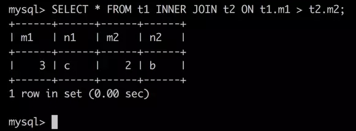

### 连接查询

#### 再次认识关系表

我们分别使用`student_info`和`student_score`两个表来存储学生的基本信息和学生的成绩信息，其实合并成一张表也不是不可以，假设这种将两张表合并后的新表为`student_merge`，那它应该长这样：

**student_merge表**


有了这个合并后的表，我们就可以在一个查询语句中既查询到学生的基本信息，也查询到学生的成绩信息，比如这个查询语句：

```
SELECT number, name, major, subject, score FROM student_merge;
```

其中查询列表处的`name`和`major`属于学生的基本信息，`subject`和`score`属于学生的成绩信息，而`number`既属于成绩信息也属于基本信息，我们可以在一个对`student_merge`表的查询中很轻松的把这些信息都查询出来。但是别忘了一个学生可能会有很多门学科的成绩信息，也就是说每当我们想增加一个学生某门学科的成绩信息时，我们必须把他的基本信息再抄一遍，这种同一个学生的基本信息被冗余存储会带来下边的问题：

- 问题一：浪费存储空间。
- 问题二：当修改某个学生的基本信息时必须修改多处，很容易造成信息的不一致，增大信息维护的困难。

所以为了尽可能少的存储冗余信息，我们把表拆分成了`student_info`和`student_score`表，但是这两张表之间有某种`关系`作为纽带，这里的`关系`指的可以通过`student_score`表的中的`number`值去`student_info`表中找到该条成绩记录对应的学生的基本信息。

#### 内连接

拆分之后的表的确解决了数据冗余问题，但是查询数据却成了一个问题。截至目前为止，在我们介绍的查询方式中，查询结果只能是一个表中的一个列或者多个列，也就是说到目前为止还没有一种可以在一条查询语句中把`number`、`name`、`major`、`subject`、`score`这几个信息都查询出来的方式。

```
小贴士：
虽然我们前边介绍的子查询可以在一个查询语句中涉及到多个表，比如这个查询语句：
`SELECT * FROM student_score WHERE number = (SELECT number FROM student_info WHERE name = '杜琦燕');`
但是子查询中对于`student_info`表的查询结果只是作为外层查询的一个搜索条件，换句话说，子查询的结果只是整个查询的一个中间状态，最后的查询结果中的列还是外层查询的查询列表上填写的列，本例中的外层查询列表是`*`，也就是`student_score`表中的所有列，所以整个查询语句的最后结果中只有`student_score`表中的所有列。
```

所以为了在一个查询语句中的结果中的到多个表的信息，我们需要引入一种全新的查询方式 --- `连接`。为了以更简单的方式让大家理解表的`连接`，我们先建立两个简单的表并给它们填充一点数据：

```
mysql> CREATE TABLE t1 (m1 int, n1 char(1));
Query OK, 0 rows affected (0.02 sec)
mysql> CREATE TABLE t2 (m2 int, n2 char(1));
Query OK, 0 rows affected (0.02 sec)
mysql> INSERT INTO t1 VALUES(1, 'a'), (2, 'b'), (3, 'c');
Query OK, 3 rows affected (0.00 sec)
Records: 3  Duplicates: 0  Warnings: 0
mysql> INSERT INTO t2 VALUES(2, 'b'), (3, 'c'), (4, 'd');
Query OK, 3 rows affected (0.00 sec)
Records: 3  Duplicates: 0  Warnings: 0
mysql>
```

我们成功建立了`t1`、`t2`两个表，这两个表都有两个列，一个是`INT`类型的，一个是`CHAR(1)`类型的，填充好数据的两个表长这样：

```
mysql> SELECT * FROM t1;
+------+------+
| m1   | n1   |
+------+------+
|    1 | a    |
|    2 | b    |
|    3 | c    |
+------+------+
3 rows in set (0.00 sec)
mysql> SELECT * FROM t2;
+------+------+
| m2   | n2   |
+------+------+
|    2 | b    |
|    3 | c    |
|    4 | d    |
+------+------+
3 rows in set (0.00 sec)
mysql>
```

其实在一个查询语句中同时得到`t1`、`t2`这两个表中的数据的方式十分简单，直接把两个表名放到`FROM`语句之后，用逗号`,`分隔开就好了，就是这样：


查询列表处的`*`代表从FROM语句后列出的表中选取每个列，上边的查询语句其实和下边这几种写法都是等价的：

- 写法一：

  ```
  SELECT t1.m1, t1.n1, t2.m2, t2.n2 FROM t1, t2;
  ```

  这种写法是将`t1`、`t2`表中的列名都显式的写出来，也就是使用了列的全限定名。

- 写法二：

  ```
  SELECT m1, n1, m2, n2 FROM t1, t2;
  ```

  由于`t1`、`t2`表中的列名并不重复，所以并不会造成让服务器懵逼的二义性，在查询列表上直接使用列名也是可以的。

- 写法三：

  ```
  SELECT t1.*, t2.* FROM t1, t2;
  ```

  这种写法意思就是查询`t1`表的全部的列，`t2`表的全部的列。

知道了`*`号的意思后，我们再来看查询结果是怎么产生的。由于`t1`、`t2`是两个独立的表，而展示结果的时候又需要展示到一起，所以在展示结果的时候谁都不能偏袒，只好把每个表中的记录全部都组合一遍，所以这个查询过程就是：

1. 将`t1`表中的三条记录与`t2`表的第一条记录依次组合一遍，产生的效果就是这样：

   

2. 继续将`t1`表中的三条记录与`t2`表的第二条记录依次组合一遍，产生的效果就是这样：

   

3. 继续将`t1`表中的三条记录与`t2`表的第三条记录依次组合一遍，产生的效果就是这样：

   

这种把一个表中的记录和另一个表中的记录连起来的过程称为`表的连接`，一个表中的每一条记录与另一个表中的每一条记录得到全部可能的组合的过程称之为生成`笛卡尔积`。就像上边`t1`表中有3条记录，`t2`表中有3条记录，那这两个表连接而生成的`笛卡尔积`就有`3×3=9`行数据。

想连接两个表，除了像`SELECT * FROM t1, t2`这种在`FROM`语句后将各个表名用逗号`,`隔开的方式，下边这几种方式产生的效果是一样的：

- 方式一：

  ```
  SELECT * FROM t1 INNER JOIN t2;
  ```

- 方式二：

  ```
  SELECT * FROM t1 CROSS JOIN t2;
  ```

- 方式三：

  ```
  SELECT * FROM t1 JOIN t2;
  ```

这些连接方式统统都被称为`内连接`，我们在之后说`外连接`的时候再详细唠叨`内`和`外`的区别。虽然`内连接`有很多种书写方式，我们熟悉一种就好了。

如果我们乐意，我们可以连接任意数量张表，但是如果没有任何限制条件的话，这些表连接起来产生的`笛卡尔积`可能是非常巨大的。比方说3个100行记录的表连接起来产生的`笛卡尔积`就有`100×100×100=1000000`行数据！所以在连接的时候过滤掉特定组合是有必要的，比方说我们只想要`t1`表的`m1`列的值和`t2`表的`m2`列的值相同的记录组合，可以把这个限制条件直接加到`WHERE`子句中：


这个带有`WHERE`条件的连接操作可以这么理解：

1. 选取`t2`表中的第一条记录，这条记录的`m2`列的值是`2`，从`t1`表中查找`m1`列的值是`2`的记录，在`t1`表中只有一条记录符合这个条件，将这两条记录组合起来，效果就是这样：

   

2. 继续选取`t2`表中的第二条记录，这条记录的`m2`列的值是`3`，从`t1`表中查找`m1`列的值是`3`的记录，在`t1`表中只有一条记录符合这个条件，将这两条记录组合起来，效果就是这样：

   

3. 继续选取`t2`表中的第三条记录，这条记录的`m2`列的值是`4`，从`t1`表中查找`m1`列的值是`4`的记录，在`t1`表中没有任何记录符合这个条件，所以这个步骤不会有任何记录的组合加入到结果集，所以结果并不变：

   

这个过程中，由于我们指定了`t1`表的`m1`列的值和`t2`表的`m2`列的值必须相同的条件，所以极大的减少了最后记录组合的条数。这种一个表中列的值和另一个表中列的值的关系也可以被称为`连接条件`，这两个列也可以被称为`连接列`。本例中展示的`连接条件`为两个`连接列`相等，我们也可以指定诸如`>`、`>=`、`<`、`>`、`!=`等等合法的布尔表达式，比如这样：



不过我们最常用的`连接条件`就是两个`连接列`相等，所以后边的例子中都会用`连接列`相等作为`连接条件`。对于`INNER JOIN`、`CROSS JOIN`、`JOIN`这几种`内连接`的书写格式来说，除通过`WHERE`语句指定连接条件以外，还可以通过下边的这两种方式指定（以`INNER JOIN`为例）：

- 方式一：

  ```
  SELECT * FROM t1 INNER JOIN t2 ON t1.m1 = t2.m2;
  ```

- 方式二：

  ```
  SELECT * FROM 表1 INNER JOIN 表2 USING 相同的列名
  ```

  这种方式表示的连接条件也是两个连接列相等，但是比较特殊的是，用于两个表中的连接列必须是同名的。我们上边`t1`、`t2`表中由于没有用同名的列来做`连接条件`，所以暂时还不能使用这种方式举例子，等遇到了再说哈～

理论知识介绍完了，再回到我们现实中的`student_info`和`student_score`表，我们希望在一条语句中同时把`number`、`name`、`major`、`subject`、`score`这几个信息都查询出来，所以需要把`student_info`和`student_score`表连接起来，连接的条件就是两个表的`number`列相等，所以我们可以这么写：


你如果有疑惑的话可以翻上去对照着`t1`和`t2`表的连接过程来理解这个查询的连接过程，这里就不赘述了。

连接查询产生的结果集就好像把散布到两个表中的信息被重新粘贴到了一个表，这个粘贴后的结果集可以方便我们分析数据，就不用两个老是两个表对照的看了。

##### 多表连接

上边说过，如果我们乐意的话可以连接任意数量的表，我们再来创建一个简单的`t3`表：

```
mysql> CREATE TABLE t3 (m3 int, n3 char(1));
Query OK, 0 rows affected (0.02 sec)
mysql> INSERT INTO t3 VALUES(3, 'c'), (4, 'd'), (5, 'e');
Query OK, 3 rows affected (0.01 sec)
Records: 3  Duplicates: 0  Warnings: 0
mysql>
```

与`t1`和`t2`表的结构一样，`t3`表也是一个`INT`列，一个`CHAR(1)`列，现在我们看一下把这3个表连起来的样子：


其实上边的查询语句也可以写成这样，用哪个取决于你的心情：

```
SELECT * FROM t1 INNER JOIN t2 ON t1.m1 = t2.m2 INNER JOIN t3 ON t1.m1 = t3.m3;
```

这种3个表的连接就相当于`t1`表和`t2`表连接之后的结果集再和`t3`表进行连接，所以我们可以分这么两个步骤理解这个过程：

1. 先把`t1`表和`t2`表按照指定的`t1.m1 = t2.m2`连接条件连接起来的结果就是：

   

2. 然后把`t1`表和`t2`表的连接产生的结果与`t3`表按照`t1.m1 = t3.m3`的连接条件进行连接，由于`t3`表的`m3`字段的值是`2`或者`3`的只有1条，所以最后整个查询的结果就是：

   

其实不管是多少个表的`连接`，本质上就是各个表的记录在符合连接条件下的自由组合。

##### 表的别名

我们前边曾经为列命名过别名，比如说这样：


我们可以把别名用在`ORDER BY`、`GROUP BY`等子句上，比如这样：


与列的别名类似，我们也可以为表来定义别名，格式与定义列的别名一致，都是用空白字符或者`AS`隔开，这个在表名特别长的情况下可以让语句表达更清晰一些，比如这样：


这个例子中，我们在`FROM`子句中给`student_info`定义了一个别名`s1`，`student_score`定义了一个别名`s2`，那么在整个查询语句的其他地方就可以引用这个别名来替代该表本身的名字了。

##### 连接中的普通搜索条件

在表的连接过程中，除了指定一个表中列的值和另一个表中列的值必须相同的`连接条件`以外，我们还可以指定普通的搜索条件，比方说我们在查询`number`、`name`、`major`、`subject`、`score`这几个信息的时候，需要限制只查询及格(也就是`score`值不小于60分)并且专业为`'软件工程'`的记录，那我们可以这么写：


其中的`s1.major = '软件工程'`和`s2.score >= 60`就是我们指定的普通搜索条件，这个过程可以这么理解：

1. 首先对于`s1`(也就是`student_info`)表来说按照搜索条件`s1.major = '软件工程'`过滤掉不符合条件的记录，所以剩下这些记录：

   

2. 然后再使用这些`s1`表中符合条件的记录与`s2`(也就是`studnet_score`)表中的记录逐一进行匹配，并且要求符合`s1.number = s2.number`和`s2.score >= 60`这两个条件，所以最后整个查询的结果就是：

   

其实`连接条件`本质上也是一个搜索条件，所以如果有多个搜索条件的话，它们在`WHERE`子句中的摆放顺序没有要求，也就是说我们把`连接条件`放在`WHERE`子句的最后也可以，就像这样：


在连接查询中，也可以不指定`连接条件`，仅仅指定普通的搜索条件也可以，比方说这样：


不过不指定`连接条件`的连接查询通常没啥意义～

#### 自连接

我们上边说的都是多个不同的表之间的连接，其实同一个表也可以进行连接，准确的说是该表的副本之间也可以进行连接。比方说我们可以对两个`t1`表来生成`笛卡尔积`，就像这样：

```
mysql> SELECT * FROM t1, t1;
ERROR 1066 (42000): Not unique table/alias: 't1'
mysql>
```

咦，报了个错，这是因为不允许`FROM`子句中出现相同的表名，`MySQL`服务器会把名称一样的表当作是一个表处理。我们这里需要的是两张一模一样的`t1`表进行连接，所以为了把两个一样的表区分一下，需要为表定义别名。比如这样：


这里我们为`t1`表定义了两个副本，一个是`table1`，另一个是`table2`，这里的连接过程就不赘述了。由于被链接的表其实是源自同一个表，所以这种连接也称为`自连接`。我们看一下这个`自连接`的现实意义，比方说我们想查看与`'史珍香'`相同专业的学生有哪些，那我们可以这么写：


`s1`、`s2`都是`student_info`表的一份副本，这个查询大致如下：

1. 根据`s1.name = '史珍香'`搜索条件过滤`s1`表，最后的结果是这样(为节省篇幅，只保留重要的行)：

   

2. 将过滤后的`s1`表中的记录与`s2`表中的记录逐一组合，并且要遵循`s1.major = s2.major`的条件，所以两个表连接后的样子就是：

   

   而我们只需要`s2`表的`number`、`name`、`major`这3个列的数据，所以最终的结果就长这样：

   

#### 左(外)连接和右(外)连接

我们重新看一下之前举过的这个例子：


不知道你有没有发现，`student_info`表中一共记录了6名学生的基本信息，但是在连接查询之后只剩下了4名学生的信息，为啥呢？因为有2名学生可能由于他们的专业并没有考试或者他们缺考了之类的原因，在`student_score`表中并没有记录关于他们的成绩信息。即使他们没有成绩信息，我们也想在连接查询的时候把他们的基本信息打印出来，这该肿么办？

这时就需要正式的介绍一下`外连接`的概念了。为了简单起见，我们还是用之前介绍的`t1`、`t2`表做例子，先看一个`外连接`查询的示例：


我们知道`t1`一共有3条记录，但是由于第一条记录的`m1`列的值是`1`，无法在`t2`表中找到任意一条符合`t1.m1 = t2.m2`连接条件的记录，但是它仍然被加到了最后的结果集当中，由于在`t2`表中并没有与其匹配的记录，所以`m2`、`n2`列的值都是`NULL`。这种即使某条记录在另一个表中没有任意一条记录与它匹配，它也可以被加入结果集中的连接查询被称为`外连接`。我们常用的`外连接`类型有下边这两种：

- `左外连接`：

  基本结构如下：

  ```
  SELECT 查询列表 FROM 表1 LEFT JOIN 表2 ON 连接条件
  ```

  由于这种连接方式会保留`表1`出现在`表2`的左边，所以`左外连接`的意思就是保留中`表1`中所有待匹配的记录。上边的例子中使用的就是`左外连接`的语法，由于`t1`表在左边，所有最后的查询结果里保留了所有`t1`表中的记录。对于`表1`中匹配失败的记录，如果查询列表处有`表2`的字段，那么这些字段的值将用`NULL`值代替。

- `右外连接`两种，格式如下：

  ```
  SELECT 查询列表 FROM 表1 RIGHT JOIN 表2 ON 连接条件
  ```

  与`左外连接`类似，只不过这种连接方式会保留`表2`中的所有带匹配的记录，比如这样：

  

  这个列子中由于`t2`表在右边，所以保留`t2`表中所有待匹配的记录。

为了图个方便，对于`左外连接`和`右外连接`，我们也可以省略名称中的`外`字，也就是直接称呼为`左连接`和`右连接`。

知道了`外连接`的意思，`内连接`也就懂了，就是对于两个用于连接的表，任何一方的记录和另外一个表中任意一条记录的组合都不符合连接条件，那这条记录就不会被加入到最后的结果集。

理论知识又唠叨完了，返回到我们查询学生信息的问题，使用`外连接`就可以查看到所有学生的基本信息和成绩信息了：


##### 使用外连接注意事项

1. 必须使用 ON 来明确连接条件。

   我们知道在`内链接`查询方式中，可以将连接条件写入`WHERE`子句，但是`外连接`中是万万不允许的，比如这样是错误的：

   ```
   mysql> SELECT * FROM t1 LEFT JOIN t2 WHERE t1.m1 = t2.m2;
   ERROR 1064 (42000): You have an error in your SQL syntax; check the manual that corresponds to your MySQL server version for the right syntax to use near 'WHERE t1.m1 = t2.m2' at line 1
   mysql>
   ```

2. 普通搜索条件优先级更高。

   如果`外连接`语句中除连接条件外还有普通搜索条件，比如这样：

   

   虽然这个查询中是`左外连接`查询，但是由于有普通搜索条件`t1.m1 != 1`，所以在进行连接之前，`t1`表中`m1`列的值是`1`的记录就被过滤掉了并不参与连接，所以该记录不会出现在最后的结果中。

#### 连接查询与子查询的转换

有的查询需求既可以使用连接查询解决，也可以使用子查询解决，比如

```
SELECT * FROM student_score WHERE number IN (SELECT number FROM student_info WHERE major = '计算机科学与工程');
```

这个子查询就可以被替换：

```
SELECT s2.* FROM student_info AS s1 INNER JOIN student_score AS s2 WHERE s1.number = s2.number AND s1.major = '计算机科学与工程';
```

两种查询方式虽然都可以解决问题，但是效率上可能有差别，具体的差别我们在说查询优化的时候详细唠叨，现在我们知道如何转换这两种查询方式就好了。

### 总结

`连接`本质上就是各个表的记录在符合连接条件下的自由组合。一个表中的每一条记录与另一个表中的每一条记录得到全部可能的组合的过程称之为生成`笛卡尔积`，这个`笛卡尔积`非常庞大，没有什么意义，我们在连接表的时候通常都会指明`连接条件`，也就是一个表中列的值和另一个表中列的值的关系。

有两种非常重要的连接类型：

- `内连接`：对于两个用于连接的表，任何一方的记录和另外一个表中任意一条记录的组合都不符合连接条件，那这条记录就不会被加入到最后的结果集。

- `外连接`：即使某条记录没有在另一个表中任意一条记录与它匹配，它也可以被加入结果集中。通常`外连接`分为这两种类型：

- - `左外连接`
  - `右外连接`